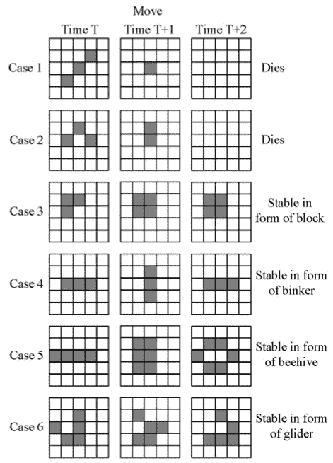
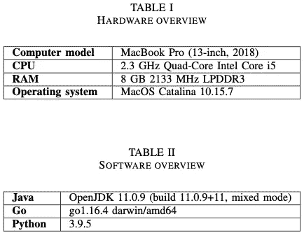
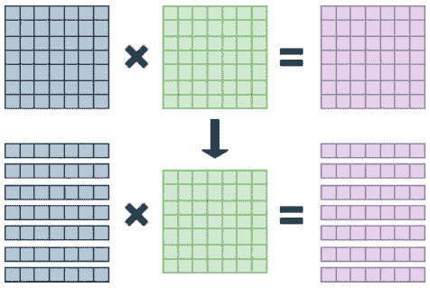
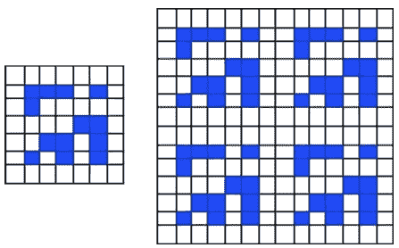
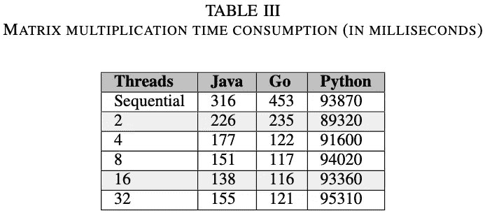
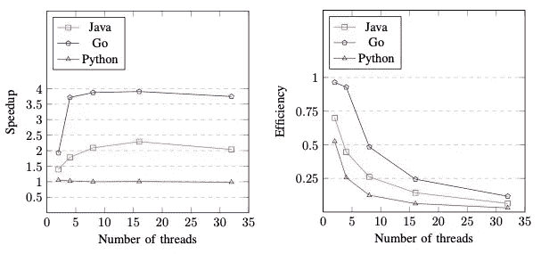
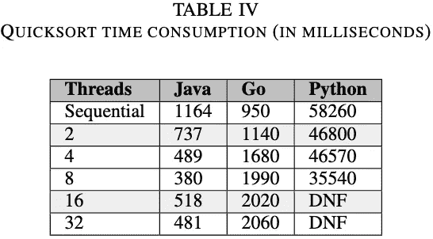
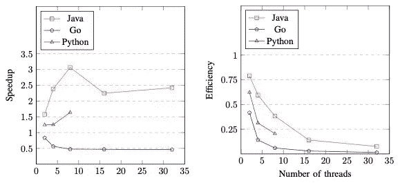
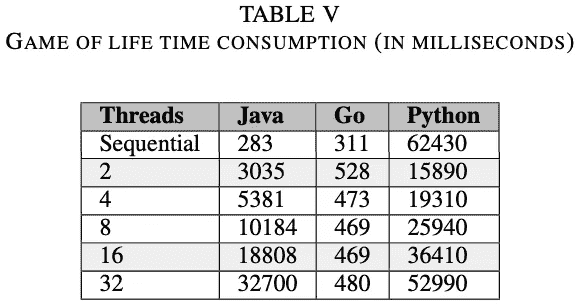
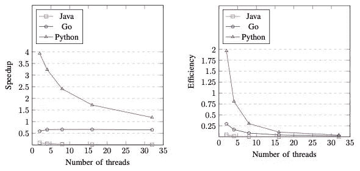

# Java、Go 和 Python:多线程性能比较

> 原文：<https://levelup.gitconnected.com/java-go-and-python-a-multi-thread-performance-comparison-28e942cb73e6>

来自[https://www . education s . es/study-overseas/font ys-school-of-fine-and-performance-arts/学士-of-circus-and-performance-art-1395880](https://www.educations.es/study-abroad/fontys-school-of-fine-and-performing-arts/bachelor-of-circus-and-performance-art-1395880)

# 介绍

在计算机中，线程是可以由处理器独立执行的一小段指令序列。多线程在一个进程中是可能的，其中它们共享资源，例如指令和上下文。

新的编程语言正在开发，或者旧的编程语言正在改进，以允许软件更好地利用线程和并行性。因此，比较这些语言来确定它们处理多线程进程的能力是一个好主意。

发现在运行多线程进程时具有最佳效率的编程语言是非常重要的，因为它可以帮助软件开发人员选择最有利的语言来实现他们的系统。

本文的目的是分析和比较 Java、Go 和 Python 的性能，使用它们的并行工具解析几种算法，例如:Java 和 Python 中的线程，以及 Go 中的 goroutines。为了评估性能，我们编写了经典矩阵乘法算法、快速排序算法和康威生命游戏的并行实现。

# 背景

**Java** :它是一种面向对象的编程语言，通过*线程*类、 *Runnable* 接口以及 *java.util.concurrent* 包中包含的其他功能，内置了对并发的支持。

**Go** :是 Google 在 2012 年发布的一种编程语言。它是一种类似 C 的过程化语言，具有垃圾收集器和对并发的内置支持。对于并发性和并行性，Go 使用名为 *goroutines* 的线程实现。它使用一个内置的调度程序在幕后处理线程，并试图向用户隐藏日常线程管理的大部分复杂性，只需指定要运行的函数，并以 *go* 命令开始。Go 在幕后使用操作系统(OS)线程。

**Python** :标准库*线程*，这个模块封装了线程，提供了一个干净的接口来处理它们。在这种方法中，操作系统实际上知道每个线程，并可以在任何时候中断它，开始运行不同的线程。使用被称为*多处理*的其他标准库，可以在 Python 中获得并行性，而*多处理* Python 创建了新的进程。*线程*模块使用线程，*多处理*模块使用进程。其中一个区别是线程运行在同一个内存空间，而进程有独立的内存。

**矩阵乘法**:这是线性代数中一个重要而简单的数学运算，经典的矩阵乘法算法(CMMA)可以很容易地在任何编程语言中实现。CMMA 在 *O(N^3)* 中运行，其中 *N* 是矩阵的维数。

**快速排序**:是分治算法。最初，它将数组分成两个子数组:较低的项和较高的项。然后递归排序这些子数组。其算法可以描述为:

1.  从数组中选取一个透视元素。
2.  对数组进行分区，使透视左侧的所有元素的值都小于透视值，透视右侧的所有元素的值都大于透视值。
3.  对生成的子数组递归地执行上述步骤，直到获得完全排序的子数组。

它的平均排序复杂度为 *O(n log(n))* ，但在极少数情况下会退化为 *O(n^2)* 。

康威的生命游戏:它是由剑桥大学冈维尔和凯厄斯学院的数学家约翰·何顿·康威在 60 年代发明的。规则是:

1.  生存法则 1:如果一个活细胞有两个或三个活邻居，它就能存活。
2.  规则 2 死亡:如果一个活细胞的活邻居少于两个或多于三个，它就会死亡。
3.  规则 3 出生:如果一个死细胞正好有三个活的邻居，它就出生了。

下一张图展示了从时间 *T* 到时间 *T + 2* 康威生命游戏的几个场景。该算法的一个新实现将在步骤上检查每个单元，其时间复杂度为 *O(M × N )* ，其中 *M* 表示网格的行数，而 *N* 表示网格的列数。

康威生活游戏的例子

# 解决办法

所有的基准测试都在同一台计算机和同一环境中执行。表 1 显示了我们运行实验的硬件规格，表 2 显示了每种语言编程编译器的版本

硬件和软件(编程语言)概述

对于每个基准，我们计算其各自的加速和效率。加速比定义为最佳顺序时间与使用 *p* 个处理器的并行时间之比: *S = T1/Tp* 。那么效率定义为:并行系统中各处理器的整体利用率: *E = S/p* 。

**矩阵乘法**:在这个实验中，我们使用简单的矩阵乘法，通过 *C = AB* 来计算。矩阵的大小为 512 × 512。我们正在运行一个顺序场景，然后是几个多线程场景，线程池大小为:2、4、8、16 和 32 个线程。相同的矩阵 *A* 和 *B* 用于运行 Java、Go 和 Python 中的代码。这些矩阵将具有从 0 到 1000(包括 0 和 1000)的整数值。线程池将接收到代表矩阵 *A* 中的行数的 *n* 个工作，然后每个线程将执行该特定行的乘法，并用获得的结果更新 *C* 中的相应行。每次一个线程完成它的工作，它将从线程池接收一个新的任务，直到所有的工作都完成。下图说明了矩阵 *C* 的计算。

矩阵乘法

快速排序:我们对 10^7 整数值数组进行排序，从 0 到 10^7，包括 0 和。我们使用 *ForkJoinPool* 方法来处理这个实验。执行一个顺序运行，然后多线程测试从 2 到 32 个线程(2 的幂)。这 3 个实现对相同的数组进行排序。在快速排序的并行实现中，分区后新子序列的排序可以并行执行，因为没有冲突。

康威的人生游戏:在康威的人生游戏中，有几个已知的初始模式会产生预期的结果，其中一个会无限增长，下一张图片的左侧显示了它的初始设置。在这个基准测试中，我们定义了一个 28 × 28 的 2D 网格，其中 4 个先前的模式彼此相邻，并在 20，000 代中执行该游戏，该网格看起来像下一个图形的右侧。

无限增长模式

对于这个实验，我们重复线程池方法，它将处理 2、4、8、16 和 32 个线程。此外，我们运行一个顺序实现。我们将决定细胞在每一代中是生存、死亡还是再生的规则并行应用。此外，为了得到一个细胞的邻居，我们不是把网格作为一个无限的网格，如果一个细胞的邻居在世界的界限之外，它被认为是死的。

# 贡献

**矩阵乘法**:表 III 显示了运行矩阵乘法基准后得到的结果。Java 是顺序执行中最好的，它在 316 ms 内运行 512 × 512 矩阵乘法，而 Go 消耗了 453 ms，这表示在顺序运行中多了 43.35%的时间。Python 的性能最差，用时 93，870 毫秒(93.87 秒)，相差约 29，600%。

此外，从表 III 中可以看出，当使用 2 个线程执行基准测试时，Java 的性能更好，但是当实验在 4、8 和 16 个线程中运行时，Go 的性能优于 Java 和 Python。我们可以在 32 个线程的阈值处检测到性能下降，这可能是由于创建过多线程的开销超过了 CPU 中的物理内核；即使在这种恶化的情况下，Go 也比其他两种语言表现得更好。

矩阵乘法时间消耗(毫秒)。越低越好。

下一张图的左侧反映出，对于 Go，2 到 4 个线程的性能差异是显著的(大约 92%的改进)，而从 8 到 16 个线程的性能差异是微不足道的，因为图中的曲线几乎保持不变，这告诉我们 8 个线程对于这个特定的场景是一个很好的数字。另一方面，Java 的性能从 2 个线程稳步增加到 16 个线程；从这个图中，我们可以选择 16 个线程作为在 Java 中具有良好性能的线程数量。从下图的右侧可以看出，Python 的资源利用率最低，而 Go 的资源利用率最高。

矩阵乘法的加速和效率。

**快速排序**:在表 4 中，我们可以看到在测试的连续运行中，Go 的性能最好，Python 的性能最差。Python 实现的一般行为非常糟糕，在 16 线程和 32 线程的场景中，应用程序无法完成执行(DNF 代表没有完成)，从而卡住并阻塞了计算机。Go 给出了有趣的结果，因为多线程运行的性能从差到最差。对于这一措施，Java 获得了最好的多线程结果，但是在运行 16 和 32 个线程时，我们可以发现性能下降，其中 16 个线程的性能最差。

快速排序耗时(毫秒)。越低越好。

下图左侧的加速表明，当 quicksort 算法在 Java 中实现时，使用 8 个以上的线程来运行它是没有意义的。此外，我们可以看到，32 个线程的运行比 16 个线程的运行稍好，但比 8 个线程的运行差。该图反映出 Go 多线程实现不如顺序实现好。即使 Python 的性能很差，2、4 和 8 线程的运行也比顺序运行要好。

下图右侧反映的效率证实了我们在表 IV 中看到的最佳结果，但不是最差结果，因为该图可能会让我们认为 Python 比 Go 更好，然而时间消耗告诉我们不同的历史:Go 优于 Python。

快速排序的加速和效率。

**康威的人生游戏**:Python 再次得到了所有 3 个实现中最差的结果，然而正如我们在表 V 中看到的，它是唯一一个从顺序实现到多线程实现有所改进的实现；然而，随着线程数量的增加，时间消耗也会增加。在 Java 和 Go 的例子中，顺序实现的性能最好。在 Java 场景中，从顺序版本到 32 线程版本的时间差是 11，455%，这代表了两者之间的巨大差距。在 Java 实现中，每生成一个线程池就释放一个线程池，并创建一个新的线程池，这会产生相当大的开销。Go 行为不稳定，时间利用率从顺序增加到 2 个线程的版本，然后在 4、8 和 16 个线程的版本中略有减少，最后在 32 个线程时再次增加。

康威的生命时间消耗游戏(毫秒)。越低越好。

下图中的加速图证实了 Conway 的生命游戏的多线程实现的总体性能很差。围绕加速曲线的期望是，它应该遵循一个增加的行为，而这并没有发生。所报告的效率表明资源没有得到适当的开发。Java 的效率非常接近于零，Go 和 Java 只是有一点点的差别。

康威生命游戏的加速和效率。

# 结论

创建线程的开销会直接影响应用程序的性能。从表 III 中可以看出，在达到某个阈值后继续创建线程是没有意义的，因为性能会下降。

如表 V 所示，使用多线程来解决问题并不能保证我们将获得更好的性能，有时顺序实现是最好的选择。

处理并发和并行的 Python 标准库不如 Java 和 Go 等其他编程语言实现的标准库好。

很难说 Java 和 Go 哪个更好，因为 Java 在矩阵乘法基准测试中表现优于 Go，但 Go 在快速排序实验中超过了 Java。

**未来工作**

这项工作仅限于每种算法的基本实现，下一步很好的做法是复制这项研究引入的场景，但使用每个基准的最佳实现。

用 Python 实现并行代码有几种选择，比如:MPI for Python、CharmPy、Numba 等等。一个很好的实验是使用这个库用更有效的实现来代替编写的代码。

扩展这项研究的一个方法是考虑其他技术方面，如编译时间、文件大小和编写的代码行数。

# 参考

[1] S. Majumdar、I. Jain 和 A. Gawade。"使用线程池模式的并行快速排序."载于:*《国际计算机应用杂志》* 136 期(2016 年 2 月)，第 36–41 页。DOI: 10.5120/ijca2016908495。

[2] T. Andersson 和 C. Brenden，“Go 和 Java 中的并行性使用矩阵乘法的性能比较”，学位论文，2018。

[3]李“线程的问题”。载于:*计算机* 39 期(2006 年 6 月)，第 33–42 页。DOI: 10.1109/MC

[4] J. Carl，《Go 和 Scala 中的并行编程:性能比较》，学位论文，2015。

[5]“关键 Java 里程碑的时间线。”Oracle.com。[https://www . Oracle .](https://www.oracle.)com/Java/moved-by-Java/(访问时间:2021 年 6 月 19 日)。

[6]“Oracle Java SE 支持路线图。”Oracle.com。[https://www . Oracle .](https://www.oracle.)com/Java/technologies/Java-se-support-roadmap . html(访问时间:2021 年 6 月 19 日)。

[7] R. Buyya，“Java 面向对象编程”，第 14 章，第 367–368 页，2009。塔塔麦格劳希尔教育私人有限公司。

[8] N. Togashi 和 V. Klyuev，“web 开发的新方法:使用 GAE/Go 的进度管理系统”， *2015 IEEE 第七届国际认知科学与技术大会(iCAST)* ，2015 年，第 55–59 页，doi:10.1109/icawst . 2015.314020

[9]“下载。”Golang.org。[https://golang.org/dl/](https://golang.org/dl/)(访问时间:5 月。21,2021).

[10]“常见问题”Golang.org[https://golang.org/](https://golang.org/)文档/常见问题#goroutines(访问时间:5 月。21, 2021).

[11]“Go 调度器源代码。”Github.com。[https://github.com/golang/](https://github.com/golang/)go/blob/master/src/runtime/proc . go(访问时间:五月。21, 2021).

[12] A. A. A. Donovan 和 B. W. Kernighan，“共享变量的并发性”，见*Go 编程语言*，第 1 版。美国纽约州纽约市:艾迪森-卫斯理出版社，2015 年，第 280-283 页。

[13] J. J. Galvez，K. Senthil 和 L. Kale，“CharmPy:一个 Python 并行编程模型”， *2018 IEEE 集群计算国际会议(CLUSTER)* ，2018，第 423–433 页，doi:10.1109/CLUS-ter . 2018.00059。

[14] V .谢罗莫娃，“Python 简史”，Exyte.com。 [https://exyte。com/blog/a-brief-history-of-python(访问时间:2021 年 6 月 19 日)。](https://exyte.)

[15]“下载 Mac OS X 的最新版本。”Python.org。https://www.python.org/downloads/(访问时间:2021 年 6 月 19 日)。

[16] J. Anderson，“Python 中的线程介绍”RealPython.com。https://realpython.com/intro-to-python-threading/[(访问时间:2021 年 6 月 19 日)。](https://realpython.com/intro-to-python-threading/)

[17] J. Anderson，“用并发性加速您的 Python 程序”重新 alPython.com。https://realpython.com/python-concurrency/[(访问时间:2021 年 6 月 19 日)。](https://realpython.com/python-concurrency/)

[18] K. Khankasikam，“通过使用 Conway 的生命游戏识别印刷体 Lanna 字符”，*第七届数字信息管理国际会议(ICDIM 2012)* ，2012 年，第 104–109 页，doi:10.1109/ICDIM . 2012 . 636364866