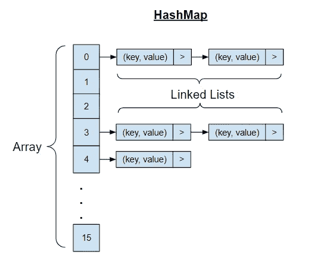
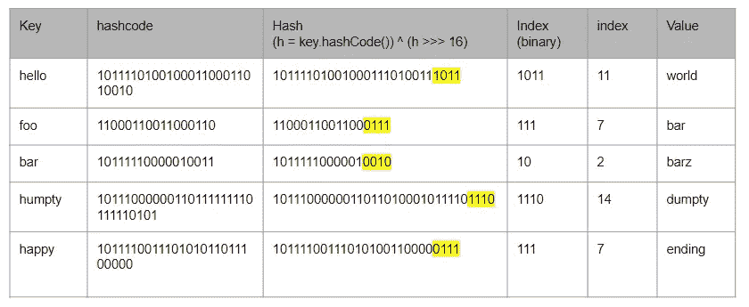
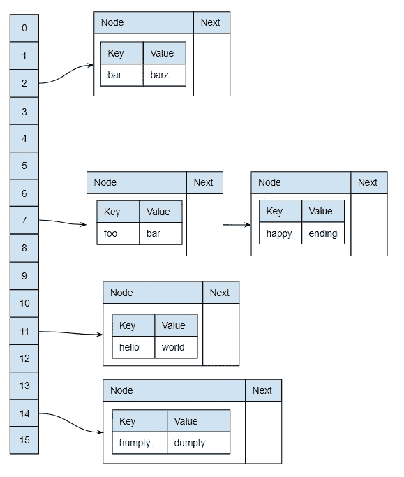

# Java HashMap 解释

> 原文：<https://levelup.gitconnected.com/java-hashmap-explained-a601c48ddc44>

java hashmap 的实现细节对于 java 开发人员来说是一个非常常见的面试问题，尽管我强烈反对在面试中问这样的问题(因为这就像在驾驶测试中问汽车发动机如何工作一样)，我在这里试图尽可能简单地解释它，因为我在网上找不到最简单准确的解释。这篇文章是写给有基本编程知识，能够使用数组、链表和散列表的人的。

**TLDR；** *这是一个链表数组。理想情况下，数组中的每一项都是一个只有 1 个节点的链表。所以你可以通过哈希 hashmap 的* `*key*` *来计算数组的* `*index*` *从而得到* `*O(1)*` *复杂度来执行*`*get*`*`*put*`*，并得到链表中的单项。但是，因为散列函数不必为不同的值创建唯一的散列码，所以当不止一个键具有相同的散列码时，它们被添加到链表中。因此，为了得到正确的键，您需要遍历链表并逐个比较键，因此对于那些具有相同散列码的键，复杂性为* `*O(n)*` *。**

*为了理解 hashmap 是如何工作的，我们首先需要理解我们想要达到的目标。然后，我们利用现有的资源来实现目标。*

***目标:**通过使用一个尽可能简单的非数字键来存储和检索数据列表。*

*什么是可用的:数组，链表，集合，树*

*一种简单的方法是将键值对存储在上面的任何数据结构中，并逐个迭代和比较节点中的键。但是这样效率不高，导致复杂度为 O(n)。复杂度最低的可能是 O(1)，可通过使用数组来实现。我们只需要知道数组中确切的索引。然而，因为我们想要一个非数字的键作为散列表，这并不简单。*

*我们可以通过将密钥转换成整数来实现。怎么会？ [hashCode()](https://docs.oracle.com/en/java/javase/11/docs/api/java.base/java/lang/Object.html#hashCode()) 。每个 java 对象都有一个 hashcode()函数，将对象散列成一个整数。但是一定要注意合同。*

1.  *hashcode 函数必须为应用程序中相同的未修改对象返回相同的值。尽管相同的对象在不同的应用程序中运行时不需要返回相同的值。*
2.  *如果两个对象用`[equals()](https://docs.oracle.com/en/java/javase/11/docs/api/java.base/java/lang/Object.html#equals(java.lang.Object))`函数返回 true，它们必须有相同的 hashCode 值。*
3.  *不同的对象可以返回相同的 hashcode，即使它们不相等。*

*因此，使用 hashCode 函数，我们可以从任何类型的键生成一个整数。然而，这个整数会非常大，比如 99162322。我们不能创建一个最大整数大小的数组，而只使用几个槽。事实上，默认情况下，java hashmaps 只使用大小为 16 的数组创建。但是它有一个内置的机制，当数组填充 75%时，它会将数组的大小加倍。所以对散列执行一个简单的具有当前数组大小的`bitwise AND operation`来确定索引。*

*举个例子，假设你有一个键`hello`，hash 是`99162322`，位值会是`101111010010001100011010010`，当前数组的大小正好是 16。所以我们要做一个按位 AND 运算`101111010010001100011010010 & 1111`，得到`0010`，也就是 2。所以我们将把键`hello`分配给数组的索引 2。*

> *注意我们`bitwise AND` 15 也就是`1111`，而不是 16 因为程序员从 0 开始计数，所以第 16 个索引实际上是 15。*

*Tada！但是你不认为不同的键可以有相同的 hashCode 吗，因为我们只取最后几个字节？是的，但这没关系，因为数组中的每一项都是一个链表。所以当这种情况发生时，我们只需将它添加到链表中。在链表的每个节点中，我们存储 hashmap 条目的`key`和`value`。因此，如果链表中有 1 个以上的节点，我们需要遍历链表并逐个比较`key`。*

*以上是 hashmap 如何工作的一般概念，有很多调整可以使它更有效，例如:*

1.  *hashmap 不直接使用键的散列作为索引，而是在按位 AND 操作之前对键应用另一个散列函数`(key == null) ? 0 : (h = key.hashCode()) ^ (h >>> 16)`,以减少冲突的可能性(多个键具有相同的索引)。*
2.  *当一个链表中有超过 8 个节点时，它将转换为使用树。*

*但是上面的信息应该足够了，毕竟，编写软件是关于重用可用的东西，你不应该为了使用它们而需要知道所有的节点依赖是如何工作的。*

*为了进一步说明这一点，假设一个 hashmap 包含以下键值对，下表显示了从键生成的 hashCode、hash 和 index。*

**

*数组和链表组合的结果 hashmap 就是这样。*

**

*生成密钥的代码可以在我的 [github gist](https://gist.github.com/thecodinganalyst/caa2830f4d6a96f08afb84f85b0d3df2) 上找到*