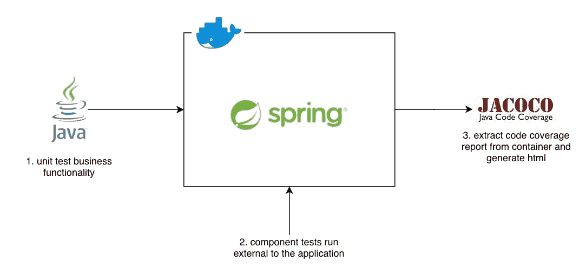
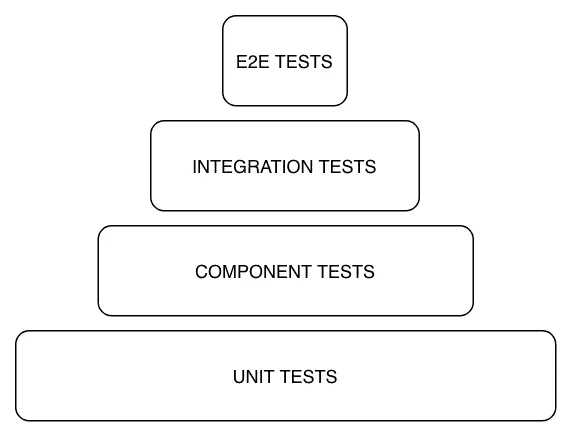
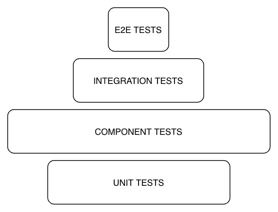
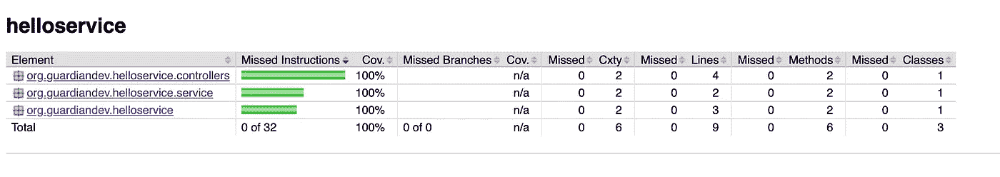

# Java:如何使用 Gradle 和 Docker 运行代码覆盖的组件测试

> 原文：<https://levelup.gitconnected.com/java-how-to-run-component-tests-with-code-coverage-using-gradle-and-docker-47fc023969a4>

> 技术栈:Java 14，Spring，Docker，Gradle



图 1:指南完成的解决方案。从单元测试业务功能开始，收集代码覆盖率。之后，在 docker 中启动应用程序，并启用 Jacoco 报告。运行组件测试，从应用程序中收集代码覆盖率。一旦测试通过，提取覆盖率报告。这意味着我们现在可以获得组件测试的所有好处，同时保持覆盖率和报告单元测试的提供。

当谈到现代基于微服务的架构的测试方法时，我经常感觉脱离了常规。在大多数项目中，我发现大量的单元测试方法被采用，产生了类似于图 2 的测试金字塔。



图 2:一个测试金字塔显示了单元测试是如何形成最常见的测试基础的，接下来是组件测试，然后是集成和端到端测试。

这确实有它的好处，单元测试可以:

*   对变更引起的错误或问题提供快速反馈。
*   提供一个结构来帮助你编写可维护和可测试的代码。例如，你可以孤立地测试一个类的事实意味着它的依赖关系是清晰的和分离的。
*   提供易于监控的代码覆盖度量，允许您识别您在测试中遗漏的边缘案例。

然而，当我们转向基于微服务的架构时，这些好处有多现实呢？

微服务允许交付隔离良好的功能的独立部分，提供一个众所周知的公共契约来与它们交互(想想 REST 和 OpenAPI、gRPC 和 Protobuf 等)。使用这种方法，我们希望每个服务包含最少的业务逻辑，许多服务只是在一些数据存储上提供一个清晰的抽象。这意味着大多数微服务要么花时间:

*   组合对其他服务的请求/响应，以便将一组服务组合在一起，形成完整的业务流程。
*   将数据存储到某个数据层，例如在数据库上提供 CRUD 抽象。

在参与了许多基于微服务的项目之后，我经常观察到大多数 bug 都发生在集成和存储方面，而不是业务功能的单个部分。让我举几个我发现的最常见问题的例子:

*   将服务组合在一起时，会发送错误的请求结构。即缺少必填字段。
*   服务给出一个调用服务不知道如何处理的响应。也就是说，我们忽略了下游服务可以返回 400 的事实，并且没有考虑这种情况。
*   该服务在数据库中存储了错误的内容。我知道这听起来很武断，而且不一定是微服务独有的，当你在一个只存储数据的服务上工作时，它会变得更加普遍。
*   该服务未正确配置，无法与下游服务或数据库进行实际对话。例如，缺少连接字符串，没有正确配置库(即 JPA 存储库)，导致服务在启动时失败。

考虑到这一点，让我们想想为什么单元测试可能无法正确地解决这些问题。单元测试通常在类级别测试，模拟依赖类。当你把大部分时间花在业务流程上时，这通常没什么问题，因为没什么好嘲笑的。然而，我们的大多数问题都是在这个新的微服务世界中的集成点上。因此，我们不再获得相同级别的价值，因为我们的测试花费更多的时间来模拟事物，而不是断言产品代码行为正确。

例如，一个单元测试断言我们称之为一个模拟的“保存到数据库函数”,与将数据实际存储到一个真实的数据库中，并断言我们可以检索它相比，它几乎没有任何价值。模拟测试不会捕捉到任何与连接细节、库设置或假设有关的错误，或者我们调用的方法是否做了我们想要它做的事情！

那么，我们怎样才能从测试中获得最好的价值，同时还能保持单元测试的好处呢？

## 组件测试。

就本指南而言，组件测试将被定义为:

> 针对服务的公共 API 的外部测试。如果需要，应该使用真实的数据层。对下游应用程序的调用应该被发送到外部服务，这些服务可以通过测试来控制，从而为特定的用例提供正确的响应。

使用这种方法，组件测试允许服务以类似生产的模式运行，使我们的测试套件能够针对服务的公共 API 提供最准确的保证级别。这带来了一些很大的好处:

*   您的测试证明您的服务的库、依赖项、配置和部署是正确且可重复的。
*   您的测试有助于指导您的消费者如何调用您的服务，以及对每个请求/响应的期望，因为测试的行为与任何其他消费者一样。
*   如果在集成过程中发现了一个 bug，您可以在请求中添加一个组件测试，并断言预期的响应。然后，在您开始查看代码库以确定问题可能出在哪里之前，您就可以证明您所做的任何修复，就像 bug 的报告者所做的那样。
*   自动化服务的配置和运行成为每个人的工作，因为现在每次运行组件测试时都需要这样做。
*   假设不改变公共 API，您可以轻松地在服务中重构代码，而无需重写所有测试。我已经记不清有多少次我改变了一个类，却发现它包含在数百个单元测试的测试设置中，现在甚至无法编译。使用组件测试，您是从一个外部点来验证行为。因此，用来满足该行为的类变得无关紧要。
*   如果您确实重构了某个东西，并且一个组件测试失败了，您知道您已经破坏了您的消费者当前所依赖的一个假设。这意味着您可以准确地查看更改的效果，以及是否需要在更改到达部署环境之前通知消费者。

组件测试听起来确实解决了很多问题，那么为什么我们传统上做的比单元测试少呢？

嗯，这又回到了单元测试的好处。直到最近，以一种可靠的方式启动一个服务和它的数据库还是很困难的，而且通常很慢。你不想依赖一个测试包，它需要 10 分钟才能启动，只在一些人的机器上工作，而且测试不可靠。然而，随着容器的引入，我们现在可以在本地以可控和可靠的方式一起部署多个服务。不仅如此，Docker 还提供网络和流程编排，这意味着我们可以控制整个服务环境。这有助于使组件测试更容易、更快地实现。考虑到这些好处，我个人现在认为，本指南开头所示的原始测试金字塔应该进行自我改造，如图 3 所示。



图 3:显示了变更后的测试金字塔。组件测试现在形成了测试方法的基础。然而，当需要确保纯粹的业务功能时，我们仍然会退回到单元测试。

正如你所看到的，我们极大地减少了单元测试的数量，但是我们并没有完全删除它们。单元测试仍然非常有价值，但是只用于测试服务的业务流程元素，而不是服务所做的一切。例如，您可能会发现有一些核心计算非常适合进行单元测试，但是结果存储在数据库中，在组件级别进行测试会更好。

有了这种想要更多地关注组件测试的驱动力，我们需要找到一种可靠地实现和执行组件测试以及单元测试的方法。

本指南的其余部分将使用 Gradle、Docker 和 Spring 展示一个简单 rest 服务的组件测试的实现。

# 所需的技术

为了运行项目，需要在您的计算机上安装以下软件:

*   **Java 14** :撰写本文时最新最好的 Java 版本(尽管您可以根据应用程序的需要调整 Java 的版本)。
*   [**Gradle**](https://gradle.org/) :项目需要使用 Gradle 包装器。
*   **Docker** :运行服务需要最新版本的 Docker 和 docker-compose。

这篇文章扩展了下面的[指南](https://medium.com/@JoeHonour/java-developing-a-spring-service-using-an-openapi-contract-first-approach-37dfd6422a9c)关于构建一个契约的第一个 Spring 服务。说明书将会期望这个项目的设置，但是你也可以很高兴地将代码片段添加到你自己的 Gradle 项目中，在需要的地方填充之前[指南](https://medium.com/@JoeHonour/java-developing-a-spring-service-using-an-openapi-contract-first-approach-37dfd6422a9c)中的任何空白。如果你想跳到完成的代码示例，你可以在这里找到它[。](https://github.com/Guardian-Development/contract-first-service)

# 1.添加组件测试

让组件测试在服务上运行的第一步是为它们提供一个存储位置。我们最终得到的项目结构是:

*   **src/main** :生产源代码
*   **src/test** :单元测试
*   **src/componentTest** :组件测试。

## 步骤 1:添加初始组件测试

如果您有上一篇指南中的代码库，我们将有一个返回 Hello World 字符串的 GET 端点。为了测试这一点，添加以下类:

**/src/component test/Java/hello world component test . Java**

本课程内容应包含以下内容:

```
import org.junit.jupiter.api.Test;

import java.io.IOException;
import java.net.URI;
import java.net.http.HttpClient;
import java.net.http.HttpRequest;
import java.net.http.HttpResponse;

import static org.junit.jupiter.api.Assertions.*assertTrue*;

public class HelloWorldComponentTest {

    @Test
    public void shouldReturnHelloWorld() {
        // Arrange

        // Act
        var result = makeGetRequest("http://localhost:4000/hello");

        // Assert
        *assertTrue*(result.contains("Hello World!"));
    }

    private String makeGetRequest(String uri) {
        HttpClient client = HttpClient.*newHttpClient*();
        HttpRequest request = HttpRequest.*newBuilder*()
                .uri(URI.*create*(uri))
                .build();

        try {
            return client
                    .send(request, HttpResponse.BodyHandlers.*ofString*())
                    .body();
        } catch (IOException | InterruptedException e) {
            e.printStackTrace();
            throw new RuntimeException(e);
        }
    } 
```

该测试发送一个 GET 请求，期望服务正在运行，将响应解析为一个字符串，然后断言响应包含“Hello World”。

您会注意到，如果您使用的是 IntelliJ 或另一个 IDE，这个文件就不能被正确拾取或运行。这是因为我们没有将**/src/component test/Java**目录添加到项目中。为此，我们需要将以下内容添加到 **build.gradle** 文件中:

```
sourceSets **{** componentTest **{** java.srcDir "$projectDir/src/componentTest/java"
      resources.srcDir "$projectDir/src/componentTest/resources"
      compileClasspath += main.output + test.output
      runtimeClasspath += main.output + test.output
   **}
}**
```

componentTest 源集指定了 Gradle 在构建过程中要包含的目录。您可以看到，我们将其配置到新创建的 **src/componentTest/java** 目录。由于目录现在是项目源代码的一部分，我们需要确保它可以访问它需要的任何依赖项:

```
configurations {componentTestImplementation.extendsFrom testImplementation
   componentTestRuntime.extendsFrom testRuntime
**}**
```

这允许组件测试执行目标扩展等价的测试目标，给予它们与单元测试相同的依赖关系。现在我们可以构建组件测试了。最后要添加的是运行测试的任务本身:

```
// run the componentTest/** tests
task componentTest(type: Test) **{** description = 'Runs component tests'
   group = 'verification'
   testClassesDirs = sourceSets.componentTest.output.classesDirs
   classpath = sourceSets.componentTest.runtimeClasspath
   outputs.upToDateWhen **{** false **}
}** // print tests out to console as they run
def testLogging = **{** afterTest **{** desc, result **->** logger.quiet "Test $**{**desc.name**}** [$**{**desc.className**}**] with result: $**{**result.resultType**}**"
   **}
}** test **{** configure testLogging
   useJUnitPlatform()
**}** componentTest **{** configure testLogging
   useJUnitPlatform()
**}**
```

这增加了一个 **componentTest** 任务，它在搜索测试时使用组件测试源集。作为一个额外的补充，我还为两个测试目标添加了一些日志记录，以帮助调试任何失败的测试。

有了这些对 **build.gradle** 文件的补充，如果你刷新你的 IntelliJ 配置，或者运行:

```
./gradlew clean build
```

现在您将看到 componentTest 目录被正确导入并且可用。

## 步骤 2:运行测试

为了运行组件测试，我们需要启动应用程序。为此，从命令行运行以下命令:

```
./gradlew bootRun
```

您应该看到 Spring 开始记录到 stdout，服务现在将在端口 4000 上监听。

在服务运行的情况下，从另一个命令提示符运行:

```
./gradlew componentTest
```

这将执行我们添加的组件测试任务，在日志中，您应该会看到类似于以下内容的消息:

```
Test shouldReturnHelloWorld() [org.guardiandev.helloservice.HelloWorldComponentTest] with result: SUCCESS
```

在这一点上，我们有办法通过 Gradle 运行组件测试。然而，我们不希望每次运行服务时都自己手动启动和停止它们。在理想的情况下，我们希望组件测试的执行也包含任何需要的设置和拆卸。为了实现这一点，我们将把 Docker 集成到构建中。

## 2.使用 Gradle 在 Docker 中运行服务

为了给应用程序提供 docker 支持，我们需要将以下文件添加到项目的根目录中:

*   **Dockerfile** :包含 Docker 构建指令
*   **。env** :包含我们可以在 docker 合成文件中使用的环境变量。
*   docker-compose.yml :将包含应用程序需要的任何依赖项，例如数据库。
*   **docker-compose . override . yml**:将包含运行服务的配置。

我们将服务放在覆盖文件中，而不是全部放在 **docker-compose.yml** 文件中的原因是，我们可以在不打开服务的情况下启动依赖项。这意味着如果需要，我们可以在 IntelliJ 中运行/调试服务，同时仍然使用 docker 来运行服务所依赖的任何外部内容。

由于应用程序目前不需要任何外部依赖关系， **docker-compose.yml** 文件只需要包含:

```
version: '3.7'

networks:
  default:
    name: contract-first-service
```

这将简单地命名默认网络，如果我们需要调试任何 Docker 编写问题，可以更容易地识别这个服务。

实现了初始 docker-compose 文件后，让我们添加**docker-compose . override . yml**文件，我们用它来启动应用程序。

```
version: '3.7'

services:
  contract-first-service:
    image: ${SERVICE_GROUP}/${SERVICE_NAME}:${SERVICE_TAG}
    ports:
      - 4000:4000
    environment:
      - SPRING_PROFILE=${SPRING_PROFILE}
```

运行 docker-compose up 时默认选择的这个覆盖文件引用环境变量来获取 docker 图像名称、标记和配置文件。这意味着下面的**。env** 文件是必需的:

```
SERVICE_TAG=latest
SERVICE_GROUP=com.guardiandev
SERVICE_NAME=helloservice
SPRING_PROFILE=default
```

您可以看到，我们目前有想要在 docker-compose 中引用的变量的默认值。但是，我们即将添加 Gradle 任务来与 Docker 交互，这些变量将被替换。

为了支持用 Docker 高效地构建东西，我们需要一种方法来下载应用程序需要的所有依赖项。首先，将以下配置添加到您的 **build.gradle** 文件中:

> 注意:对于像 configurations 块这样的东西，您应该将代码片段的内容添加到现有的配置中(不要定义配置两次)。我只是向您展示当前任务所需的一些配置，而不是每次都展示整个配置。

```
configurations **{** downloadDependenciesConfig.extendsFrom implementation, testImplementation, testRuntime
**}** // pull dependencies needed by the application
task downloadDependencies (type: Exec) **{** configurations.downloadDependenciesConfig.files
   commandLine 'echo', 'Downloaded all dependencies'
**}**
```

这为我们提供了一个名为 **downloadDependencies** 的任务，当我们执行它时，将强制解析实现、测试实现和测试运行时依赖。

下一步是在 Docker 中添加一个任务来构建服务:

```
task buildDockerimage(type: Exec) **{** workingDir "$projectDir"
   commandLine 'docker', 'build', '.', '-t', "$serviceGroupId/$serviceApplicationName:$serviceVersion"
**}**
```

这将获取 Dockerfile(我将在本指南的下一部分向您展示)并构建应用程序映像。我们用与 JAR 相同的 groupId、名称和版本来标记图像，这样很容易确定容器中运行的代码版本。

下一步是添加对向上和向下组合应用程序及其依赖项的支持:

```
task composeUp(type: Exec) **{** dependsOn buildDockerimage
   workingDir "$projectDir"
   environment << [ SERVICE_TAG: "$serviceVersion", SERVICE_GROUP: "$serviceGroupId", SERVICE_NAME: "$serviceApplicationName", SPRING_PROFILE: "docker" ]
   commandLine 'docker-compose', 'up', '-d'
**}**task composeDependenciesUp(type: Exec) **{** workingDir "$projectDir"
   commandLine 'docker-compose', '-f', 'docker-compose.yml', 'up', '-d'
**}**task composeDown(type: Exec) **{** workingDir "$projectDir"
   commandLine 'docker-compose', 'down', '-t', '60', '-v'
**}**
```

这 3 个任务使用我们在项目根目录中的 docker-compose 文件来:

*   **composeUp** :打开服务，确保我们已经首先构建了它，以及它的依赖项。
*   **composeDependenciesUp** :仅打开服务运行所需的依赖项。
*   **composeDown** :关闭 docker compose 中当前运行的所有资源。

这样，我们现在可以使用 Gradle 来协调服务的开启和关闭。我们需要做的最后一步，是将它与组件测试任务挂钩，这样我们就可以:

*   启动服务及其依赖项
*   等待服务准备就绪
*   运行组件测试
*   清理我们启动的任何资源

为此，我们添加了最后一项配置:

```
task waitForService **{** doLast **{** def responseCode = null

      while(responseCode != 200) {
         *sleep* 1000
         try {
            def req = "http://localhost:4000/actuator/health".toURL().openConnection()
            responseCode = req.getResponseCode()
            logger.log(LogLevel.*INFO*, "Response returned from service $responseCode")
         }
         catch(Exception) {
            logger.log(LogLevel.*INFO*, "Failed to connect to service")
         }
      }
   **}
}**task componentTestDocker **{** dependsOn componentTestClasses, composeUp, waitForService
   doLast **{** componentTest.executeTests()
   **}** finalizedBy composeDown
**}**
```

在这个代码片段中，我们添加了一个继续轮询服务的任务，等待来自健康端点的 200 响应。然后，我们将所有任务连接到一个 **componentTestDocker** 任务中，该任务:

*   编译组件测试
*   调用 **composeUp** 来打开服务和依赖项
*   调用 **waitForService** 来确保我们不会在服务启动之前执行测试
*   执行组件测试
*   一旦测试完成，通过调用 **composeDown** 进行整理

这些都是我们需要添加到 **build.gradle** 文件中的更改，以便使用 docker。

我们剩下要做的最后一步是实现如下所示的 **Dockerfile** :

```
*# build custom JRE* FROM openjdk:14-alpine AS jre-build
WORKDIR /app

RUN jlink --verbose \
--compress 2 \
--strip-java-debug-attributes \
--no-header-files \
--no-man-pages \
--output jre \
--add-modules java.base\
,java.logging\
,java.xml\
,jdk.unsupported\
,java.sql\
,java.naming\
,java.desktop\
,java.management\
,java.security.jgss\
,java.instrument

*# start from gradle build image* FROM jre-build AS build
WORKDIR /app

*# copy gradle only files over* COPY gradlew gradlew
COPY gradle/ gradle/
RUN ./gradlew --version

*# copy project build files over* COPY build.gradle build.gradle
COPY settings.gradle settings.gradle
COPY gradle.properties gradle.properties

*# download dependencies only* RUN ./gradlew downloadDependencies

*# copy full solution and build* COPY . .
RUN ./gradlew build

*# take a smaller runtime image for the final output* FROM alpine:latest

COPY --from=jre-build /app/jre /jre
COPY --from=build /app/build/libs/helloservice-0.0.1.jar /app.jar

ENV SPRING_PROFILE=default
ENV JAVA_TOOL_OPTIONS=

EXPOSE 4000
ENTRYPOINT /jre/bin/java -Dspring.profiles.active=$SPRING_PROFILE -jar app.jar
```

docker 构建的工作方式如下:

1.  **jre-build** 使用新的 java 模块特性来构建一个更小的 jre，只包含运行 Spring 应用程序所需的部分。
2.  下一步是在运行 **downloadDependencies** 任务之前，将 Gradle 配置文件复制到映像中。这将在映像中创建一个可以缓存的层，并下载所有的依赖项。因此，如果我们不编辑 Gradle 文件，我们就不必在重建映像时下载任何包。
3.  下载完依赖项后，下一步将复制解决方案中的所有文件，并构建 JAR。
4.  最后，我们采用 alpine 运行时环境(创建尽可能小的运行时映像)，复制 JRE 和应用程序 JAR，并设置启动时运行应用程序的入口点。

实现了这些之后，您现在应该能够运行下面的任务来运行组件测试了:

```
./gradlew componentTestDocker
```

如果你在这里遇到了什么困难，请参考参考[实现](https://github.com/Guardian-Development/contract-first-service)，因为我知道我刚刚概述了很多配置:)

鉴于你有这个工作，你现在有:

*   一种既能运行单元测试又能运行组件测试的测试方法
*   在 docker 中运行的应用程序，docker-compose 用于编排本地开发和测试的依赖关系。
*   Gradle 被用作控制整个服务构建过程的工具，将 config 保存在一个地方。

当交付 REST base 微服务时，这是一个很好的点，如果您就此打住，我不会责怪您。然而，为了真正为服务提供最佳的测试方法，我们还可以做最后一件事:向组件和单元测试添加代码覆盖报告。

# 3.用 Jacoco 收集代码覆盖率

Jacoco 是一个插件，我们可以用它来捕获正在运行的 JVM 的代码覆盖率，然后生成一个报告。为了收集 Jacoco 的代码覆盖率，我们需要收集单元测试和组件测试的覆盖率报告。单元测试非常简单，当我们添加 Jacoco 插件时，我们将免费得到它。然而，当我们运行组件测试时，从 docker 映像中获取代码覆盖率会稍微棘手一些。

在我们陷入实现之前，让我给你一个 Jacoco 如何工作以及我们将如何利用它的快速概述。

Jacoco 分为两部分:

1.  Jacoco 提供了一个 Java 代理，它附加到正在运行的应用程序的 JVM 上，并记录所有执行的类/行。一旦 JVM 终止，代理将生成一个 exec 文件，该文件包含 JVM 生命周期中执行的所有内容的覆盖率报告。
2.  Jacoco 插件获取覆盖报告并生成一个人类可读的报告，使用过滤器排除任何库或依赖项。

因此，为了从运行的应用程序中收集覆盖率，当我们执行组件测试时，我们将:

*   提供一个 Gradle 任务，将 Jacoco 代理下载到一个已知的位置，这样我们就可以将它挂载到 docker 容器中。
*   提供一个新的**docker-compose . jacoco . override . yml**文件，以便启动附加了 Jacoco 代理的应用程序。这意味着当我们运行容器时，Jacoco 代理将收集所有执行的代码。
*   使用新的 docker compose override 文件，添加 Gradle 任务以在此覆盖模式下运行服务。随着服务的运行，我们将执行组件测试。一旦它们完成，我们将通过阅读 Jacoco 覆盖报告生成一个报告。

那么……有了 Jacoco 如何工作的知识，让我们开始吧。首先，让我们将新的**docker-compose . ja coco . override . yml**文件添加到项目的根目录:

```
version: '3.7'

services:
  contract-first-service:
    image: ${SERVICE_GROUP}/${SERVICE_NAME}:${SERVICE_TAG}
    ports:
      - 4000:4000
    volumes:
      - type: bind
        source: ./build/jacoco
        target: /jacoco
    environment:
      - JAVA_TOOL_OPTIONS=-javaagent:/jacoco/org.jacoco.agent-runtime.jar=destfile=/jacoco/componentTest.exec
      - SPRING_PROFILE=${SPRING_PROFILE}
```

这个覆盖文件打开了服务，和以前一样。但是，您可以看到我们做了两件新的事情:

1.  我们将**构建/jacoco** 文件夹绑定到容器中的 **/jacoco** 位置。这意味着，如果我们将 Jacoco 代理放在 **build/jacoco** 位置，我们可以在启动应用程序时访问它。此外，如果我们将覆盖报告写到这个位置，我们将可以在容器外部访问它。
2.  我们覆盖 **JAVA_TOOL_OPTIONS** 来将 Jacoco 代理附加到应用程序 JVM，并将覆盖报告输出到**/Jacoco/component test . exec**。这意味着当测试停止时，由于步骤 1 中的卷绑定，覆盖率报告将在 **build/jacoco** 中结束。

现在我们有了一个在启用 Jacoco 的情况下运行服务的方法，让我们看看我们需要向 **build.gradle** 文件添加什么来启用它。

首先，我们需要一种下载 Jacoco 代理的方法。

```
configurations {
   downloadJacoco
**}**dependencies {downloadJacoco "org.jacoco:org.jacoco.agent:0.8.5:runtime"
**}**task copyJacocoAgent(type: Copy) **{** from configurations.downloadJacoco
   into "$buildDir/jacoco"

   // strip version number out of agent jar
   configurations.downloadJacoco.allDependencies.each **{** rename "-$**{**it.version**}**", ""
   **}
}**
```

从上面的代码片段中可以看到，我们添加了一个名为**downloadjaco**的新配置。然后，我们将 Jacoco 代理注册为这个配置的依赖项。当执行时， **copyJacocoAgent** 任务简单地从 Maven 下载并复制代理 JAR 到 **build/jacoco** 目录，同时去掉其名称中的任何版本号。

有了下载 Jacoco 代理的能力，接下来我们需要做的是用 docker 启动服务，但是使用覆盖覆盖配置。

```
task composeUpJacoco(type: Exec) **{** dependsOn buildDockerimage, copyJacocoAgent
   workingDir "$projectDir"
   environment << [ SERVICE_TAG: "$serviceVersion", SERVICE_GROUP: "$serviceGroupId", SERVICE_NAME: "$serviceApplicationName", SPRING_PROFILE: "docker" ]
   commandLine 'docker-compose', '-f', 'docker-compose.yml', '-f', 'docker-compose.jacoco.override.yml', 'up', '-d'
**}**task componentTestCoverageDocker **{** dependsOn componentTestClasses, composeUpJacoco, waitForService
   doLast **{** componentTest.executeTests()
   **}** finalizedBy composeDown
**}**
```

使用上面的配置， **composeUpJacoco** 下载 Jacoco 代理，如果您还记得的话，我们在 docker compose override 文件中挂载了这个代理。然后，**componentestcoverageDocker**任务使用这个 docker 配置来打开服务，对容器运行组件测试，然后清理环境。

> 注意:由于 Jacoco 只生成关于 JVM 正常关闭的完整报告，所以在编写关闭调用时需要留出时间。这就是为什么，如果您查看 composeDown 任务，我们会提供 1 分钟的超时。

在运行了**componentestcoveragedocker**之后，您应该会在 **build/jacoco** 目录中看到一个 **componentTest.exec** 报告，其中包含了所有组件测试运行之后服务的覆盖率统计数据。

最后一步是现在获取这个报告，将它与单元测试报告相结合，并生成一个人类可读的输出，让我们完全看到服务的代码覆盖率。

```
// adding jacoco test reporting
jacoco **{** toolVersion = "$jacocoToolVersion"
**}** 
task fullCoverageReport(type: JacocoReport) **{** dependsOn test, componentTestCoverageDocker
   executionData tasks.withType(Test)
   sourceSets sourceSets.main
   reports **{** html.enabled = true
      html.destination file("$buildDir/jacoco-reports")
   **}
}**
```

上面的片段是拼图的最后一块。它添加了一个运行单元测试和组件测试的任务。然后，该任务查找两个测试任务的 executionData(生成的 exec 文件)。最后，它过滤报告，只包含主源集中的类，并生成 html 格式的输出(图 4)。

```
./gradlew fullCoverageReport
```



图 4:由 Jacoco 生成的全覆盖报告。这结合了单元测试和组件测试的覆盖率。您可以点击任何一个类来查看精确的逐行覆盖范围。

该报告位于:**build/jacoco-reports/index . html .**

如果你想看一个工作的，完全实现的例子，你可以去我的 [github](https://github.com/Guardian-Development/contract-first-service) 。

# 结论

在本指南结束时，假设一切顺利，我们现在有能力:

*   可靠地对服务进行单元测试。
*   可靠地对服务进行组件测试，使用 docker 来编排应用程序及其依赖项的运行。
*   从单元和组件测试中收集代码覆盖率，生成一个统一的报告。

我希望你可以看到在基于微服务的环境中优先考虑组件测试的好处，并且，通过少量的前期工作，你可以使它们像单元测试一样快速有效地工作。

如果您对这种方法有任何疑问，请随时联系我。

[](https://www.linkedin.com/in/joe-honour-8693029a/) [## Joe Honour -高级软件工程师-和数字| LinkedIn

### 查看 Joe Honour 在全球最大的职业社区 LinkedIn 上的个人资料。乔有 6 份工作列在他们的…

www.linkedin.com](https://www.linkedin.com/in/joe-honour-8693029a/)