# 终端中的 Java

> 原文：<https://levelup.gitconnected.com/java-in-the-terminal-8888310a16ae>

## 学习如何仅使用命令行运行 Java


照片由[玛丽莎·安德森](https://www.flickr.com/photos/mpa/)拍摄，并带有使用所需的[许可证](https://creativecommons.org/licenses/by/2.0/)

我不知道这是否是我学习 Java 的方式，但我运行它的方法是通过终端。我喜欢那种“黑客氛围”,你可以用键盘上的键来控制程序的执行。

在本文中，我将分享如何在命令行中运行 Java 程序。

## 要求:

*   Java —必须安装，并且应该设置为环境变量。

**注意:本演示将在 windows 机器上进行。**

# 在终端中运行程序

从命令行运行 Java 程序可以让您了解执行 Java 程序时发生的整个编译和执行过程。

# 我们开始吧！

我们将从运行一个 Java 文件开始，但是首先，让我们创建这个文件。要创建一个单独的 Java 文件，所需要的就是文件名加上扩展名`.java`，如下面的`DemoTerminal.java`所示。

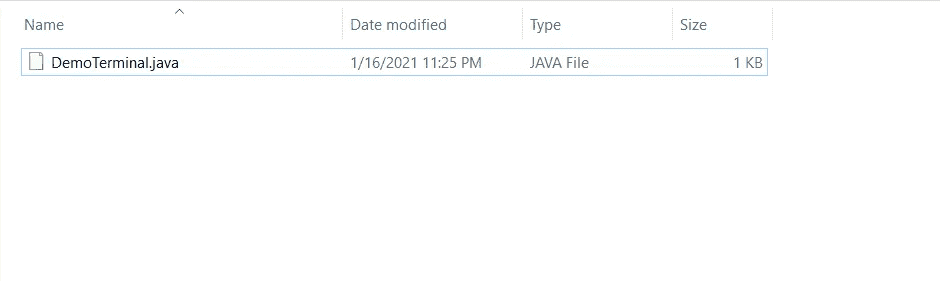

作者截图

好了，我们刚刚创建了一个`DemoTerminal.java`文件

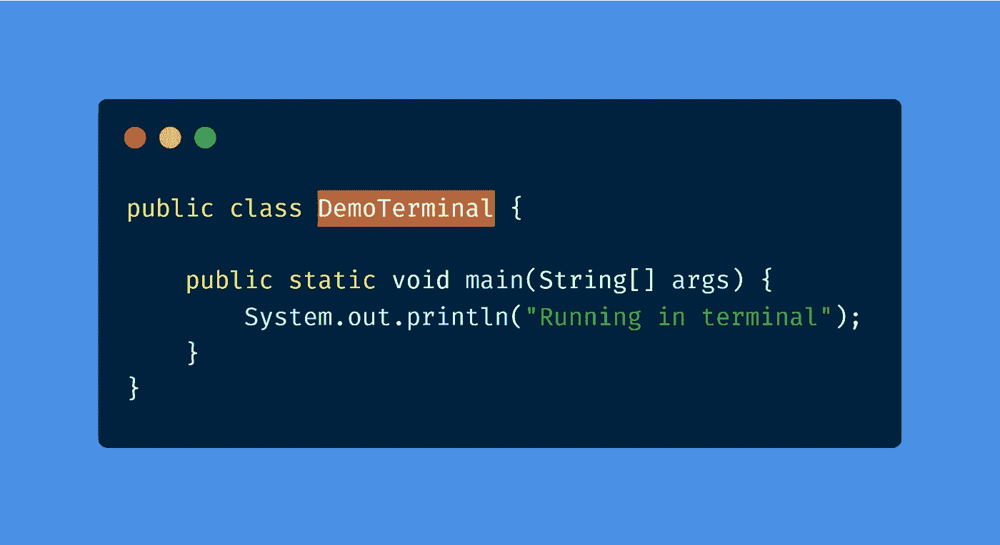

作者照片由[碳](https://carbon.now.sh/)生成

我们的`DemoTerminal.java`由上面的代码片段组成。如果运行成功，程序将执行`Running in terminal`。

现在让我们打开`DemoTerminal.java`在我们终端的位置。

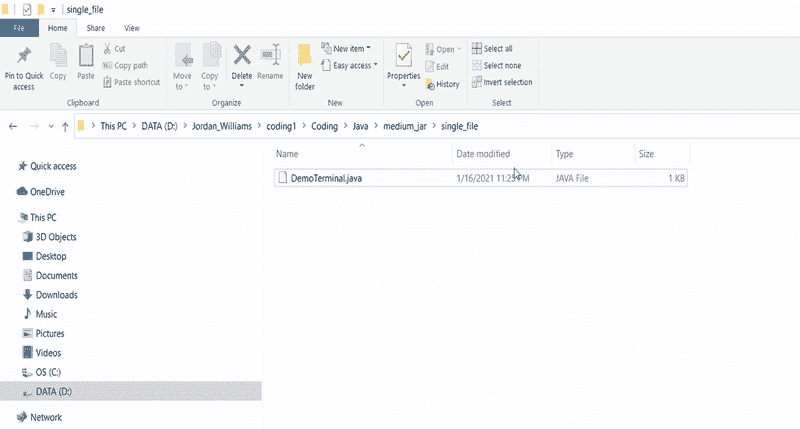

作者截图

通过在地址栏中键入`cmd` ，可以在当前所在的目录中打开命令行。

通过键入`dir`，您可以确认当前目录中的文件。

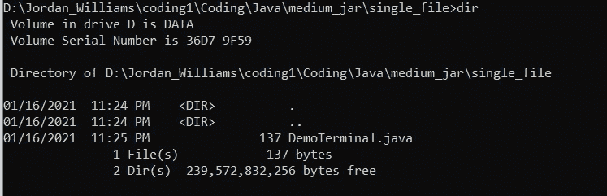

作者截图

从上面的截图可以看出，`DemoTerminal.java`在当前目录下。

**注意:这只是查看和确认文件是否在目录中的一个好习惯。**

执行 Java 程序需要两个步骤。编译和执行。

让我们使用下面的代码片段在终端内部编译我们的代码。

```
javac DemoTerminal.java
```

这就是我们编译代码的方式。把`javac`想象成 java + compile (c)。它获取源代码(本例中是`DemoTerminal.java`)并将它们转换成`.class` 文件。这些`.class`文件是被 Java 理解的称为字节码的中间标准。

如果您键入另一个`dir`命令或者查看您的文件浏览器，您会注意到我们的类文件在编译后出现了。

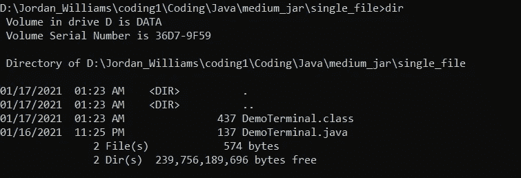

作者截图

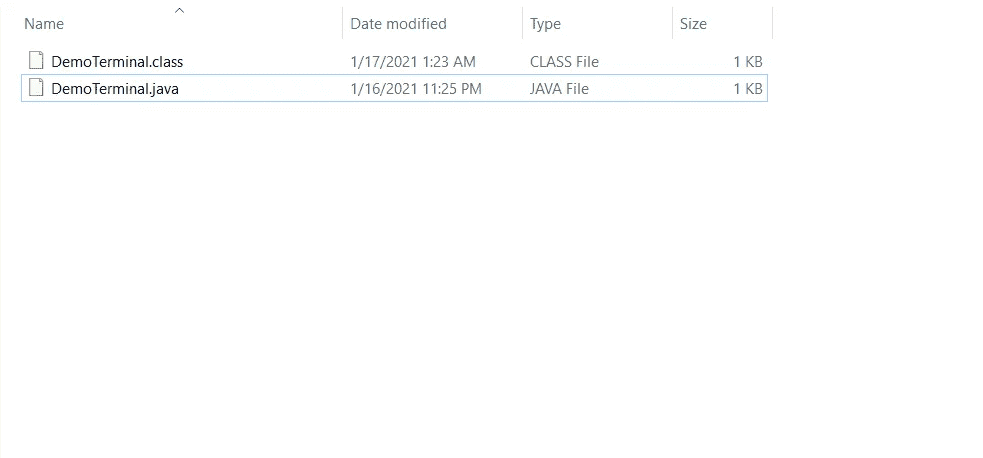

作者截图

如您所见，`DemoTerminal.class`文件是从我们的`javac`命令生成的。

我们现在需要做的就是运行`DemoTerminal`类文件。

```
java DemoTerminal
```

我们使用`java`命令来运行我们的代码。您会注意到我们不需要将`.class`扩展字段放入我们的文件中。这是因为它不是必需的。`java`命令获取您想要运行的实际类(`public class **DemoTerminal**` )。

输出:

```
Running in terminal
```

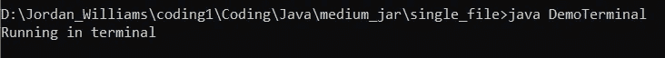

作者截图

我们的代码现在正在终端中运行。

# 从标准目录结构运行 Java 文件

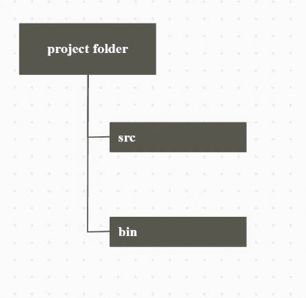

作者生成的图像

这是我们正在努力实现的文件夹结构:

*   src——保存我们所有的源代码。
*   bin —保存编译生成的所有类文件(`javac`)。

这种结构提供了一种更有组织的方法，将类文件放在一个文件夹中，而将源代码放在另一个文件夹中。

让我们看一个例子。

让我们在项目文件夹中创建一个`src`和`bin`文件夹。

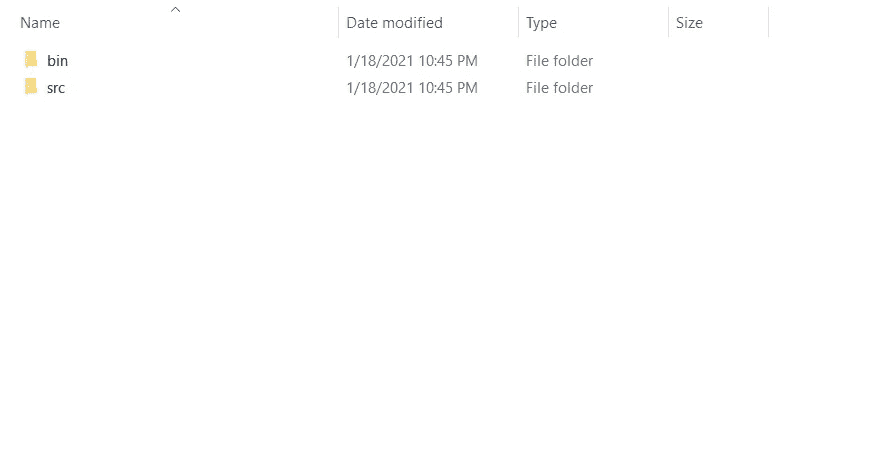

作者截图

在`src`文件夹中，我们将创建 2 个`.java`文件。

*   `DemoTerminal.java`
*   `AnotherClass.java`

`DemoTerminal.java`代码如下:

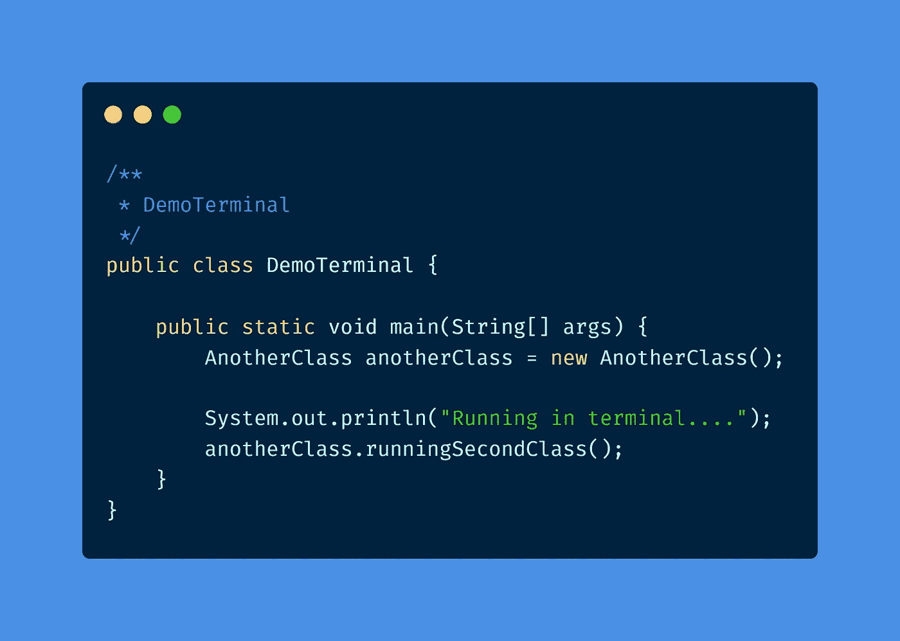

作者照片由[碳](https://carbon.now.sh/)生成

`AnotherClass.java`代码如下:

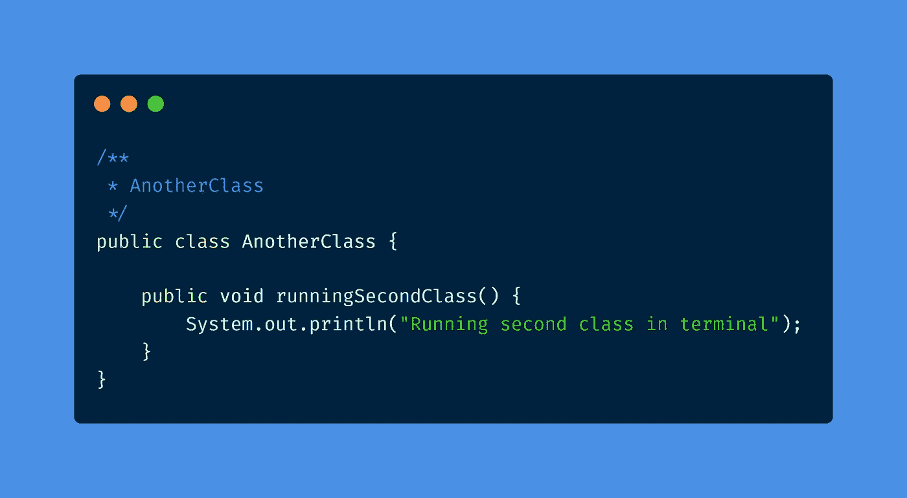

作者照片由[碳](https://carbon.now.sh/)生成

现在，让我们试着运行这些文件。

在你的终端中导航到项目的根目录——在这里你可以看到`src`和`bin`文件夹。

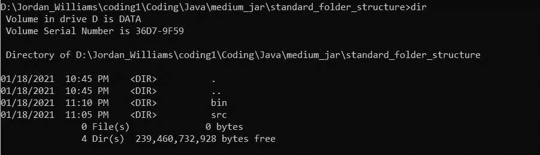

作者截图

我们这里的计划是将`src`文件夹中的所有代码编译到`bin`文件夹中。

我们将使用以下命令:

```
javac -d bin src/*.java
```

上面的命令类似于我们之前运行的命令。然而，`-d`的存在指定了您希望编译后的`.class`文件进入的目录。在这种情况下，我们指定了`bin`文件夹，在那里我们有源代码(`.java`)文件，我们将使用`src/*.java`进行编译。

**注:** `**src/*.java**` **。这是我们源代码的位置。** `***.java**` **中的** `*****` **是通配符。意思是“所有文件”。但是，通过添加** `**.java**` **扩展名，这意味着文件夹内的所有** `**.java**` **文件。因此** `**src/*.java**` **将在** `**src**` **文件夹中查找所有 Java 文件。**

运行该命令后，我们现在可以检查我们的`bin`文件夹。

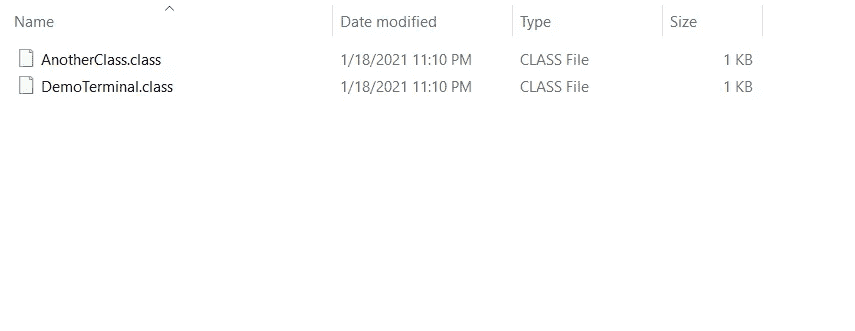

作者截图

您会注意到，这是我们所有的类文件现在被添加的地方。同样，这允许更好的结构，我们的源代码在一个目录中，而我们的类文件在另一个目录中。

您应该已经知道，我们的下一步是运行我们编译的代码。类似于我们上次的执行，我们将使用`java`命令。

```
java -cp bin DemoTerminal
```

注意，这一次我们使用了`-cp`标志。这是 classpath 的缩写。Java 的类路径指定了用户定义的类(`.class`文件)和包的位置。在使用类路径`-cp`时，我们可以指定`.class`文件的位置，这些文件是为执行我们的程序而构建的。我们的`.class`文件位于`bin`文件夹中。

我们使用`DemoTerminal`是因为这是我们的 main( `public static void main`)所在的位置。

输出:

```
Running in terminal....
Running second class in terminal
```

我们的代码现在正在运行！

# 使用包

大多数情况下，您会在 Java 代码中使用包。为了允许使用包，我们将对如何运行代码做一点小小的修改。

让我们将之前创建的`src`代码放入一个包中，但是也让我们删除`bin`文件夹中之前生成的`.class`文件，这样我们就可以从“新鲜”开始。

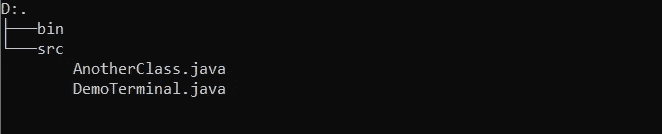

作者截图

这是我们代码的项目文件夹目前的样子。回想一下，我们已经删除了`bin`文件夹中的内容。

现在，我们将把`AnotherClass.java`和`DemoTerminal.java`都添加到一个名为`terminal`的包中。

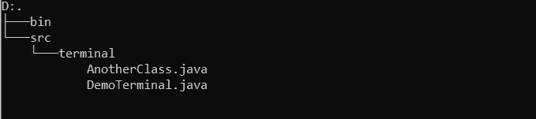

作者截图

我们还没有完成。我们现在需要在各自的文件中添加包的定义。

```
package terminal;
```

上面的代码片段应该在两个`.java`文件的顶部。

现在，让我们运行我们的代码。

转到我们项目的根目录——在这里您可以看到`src`和`bin`文件夹。运行下面的命令:

```
javac -d bin src\terminal\*.java
```

与我们之前运行的非常相似。但是，我们现在正在编译终端文件夹中的所有文件。

现在，让我们再次运行我们的代码。

```
java -cp bin terminal.DemoTerminal
```

与上面的命令唯一不同的是，我们现在必须追加包。所以它的`<Package>.<Main Class>`。

输出:

```
Running in terminal....
Running second class in terminal
```

**注意。包中有包是可能的。因此，您必须添加所有指向您想要的文件的包。于是有了** `**<Package 1>.<Package 2>.<Package X>.<Main Class>**` **。**

最终代码如下:

[](https://github.com/jordan-medium/Terminal-Java) [## 约旦-中型/终端-Java

### 通过在 GitHub 上创建帐户，为 jordan-medium/Terminal-Java 开发做出贡献。

github.com](https://github.com/jordan-medium/Terminal-Java) 

# 结论

> 你有它！

您刚刚学习了如何使用 windows 操作系统从终端运行自己的 Java 程序。从终端运行您的程序只会增加您对命令行导航的信心和知识。永远记得利用你的软件包，因为它们对你的计划的组织和连贯性非常有用。