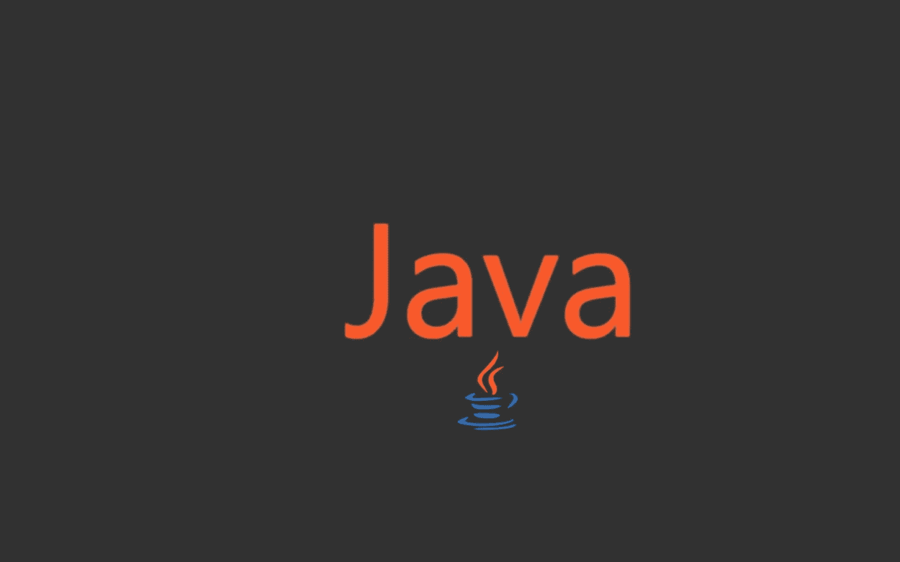
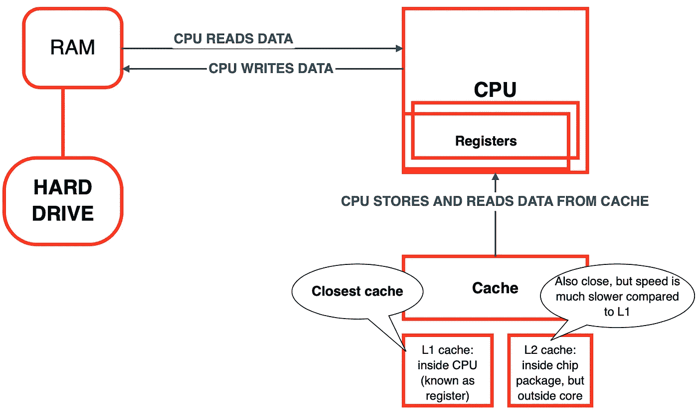
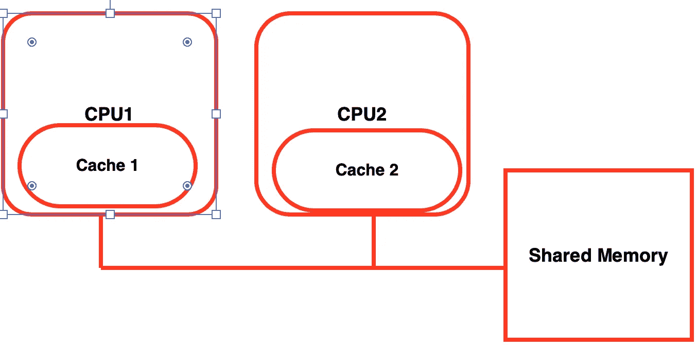
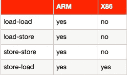
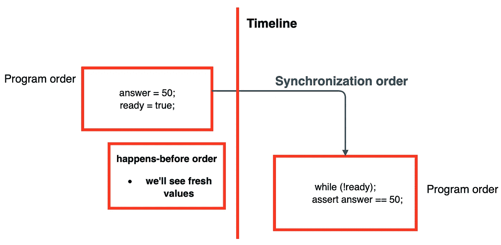
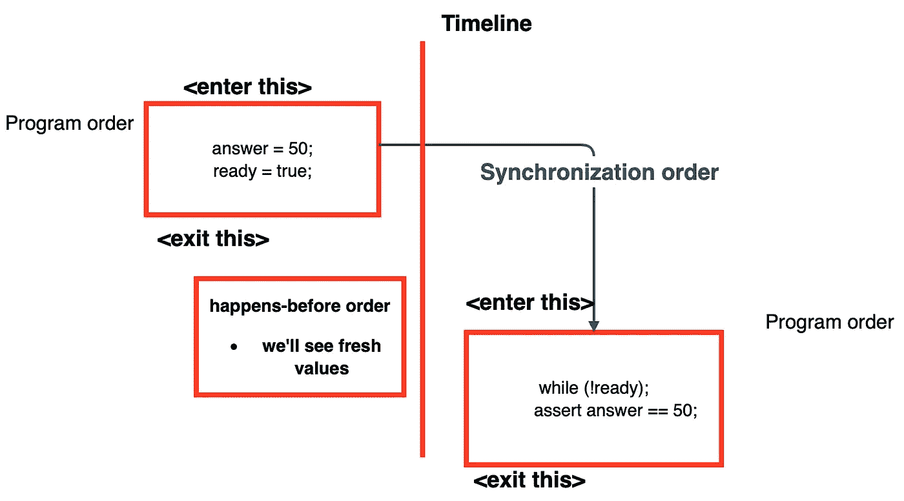

# Java 内存模型:实用指南

> 原文：<https://levelup.gitconnected.com/java-memory-model-practical-guide-java-1cbdccc3e3b1>

JVM 的家伙们！✌️:你想了解更多关于 Java 内存模型的知识(从这里开始— **JMM** )并查看它的实用指南吗？然后深入研究这篇文章😁。

> **免责声明:**我已经搜索了很多资源，在整篇文章和文章末尾都可以找到这些资源的链接。尽管如此，我不是布莱恩·戈茨或阿列克谢·希皮列夫那样的大师。这就是为什么如果你有任何问题，偶然发现错误或什么的，请随时发表评论或给我发电子邮件。

文章结构👓：

*   介绍
*   CS 理论
*   出版
*   内存模型概述:开始
*   硬件图片
*   总订单与部分订单
*   内存模型概述:读写素材
    -易失性
    -同步
    -线程开始
    -最终
*   更多关于 volatile
*   结尾部分

强大而可爱的爪哇👻

## 介绍

许多人会回避 JMM 和与它相关的一切，因为在各种文章中很难解释😥然而，就我个人而言，我研究了各种文章、书籍的章节、视频，发现……理解起来非常困难，但如果我们从实践者的角度来说，并非不可能🙌。由于对这个问题的实际方面更感兴趣，我决定强调它，然后在本文中纪念它，以便其他人理解它。

## CS 理论

首先，当我们谈论处理器和与之相关的一切时，让我们来看看我们的电脑中的核心概念。我不会在这里深入讨论细节，但是给出一个大概的概述，这对于现在来说已经足够了。

我创建了一个图表，非常简单明了🤯。

表示数据和处理器之间关系的图表

因此，处理器将数据从 RAM 加载到缓存中。它不能直接对来自 RAM 的数据进行操作，即使可以，也太慢了。处理器做出更改后，会将其写回 RAM。因此，JVM 将通过组合或转换变量来优化代码。在**内存模型概述**部分有更多相关信息。

但是，如果多个处理器获取了同一个变量，在本地缓存中对其进行了更改，并需要将其写回，会发生什么情况呢？对于这样的问题，有**缓存一致性**。

> 共享内存多处理器体系结构:每个处理器都有自己的缓存，与主内存相协调。

有 3 种类型的**高速缓存一致性** ➿:

*   立即写入
*   看到一系列操作数
*   无粘聚力的

阅读下面的文章，了解有关高速缓存一致性的更多信息:

 [## 缓存一致性- GeeksforGeeks

### 先决条件-高速缓冲存储器高速缓冲存储器一致性:在多处理器系统中，相邻的高速缓冲存储器之间可能发生数据不一致

www.geeksforgeeks.org](https://www.geeksforgeeks.org/cache-coherence/) 

❗️ **请，非常仔细地读台词直到画面。我会告诉你下来线回到这里** ❗️ **:**

处理器放松内存一致性=提高性能

当在多个处理器之间共享数据时，我们需要协调数据:

*   架构的内存模型指定了*内存屏障/栅栏*以在共享数据时获得数据协调(JVM 减少了我们对所有这些东西的关心，但有些情况将在**硬件图片**块中查看)
*   ***顺序一致性*** —程序执行的单一顺序。每次读取都会看到最后一次写入。没有什么(甚至 JMM)不能保证这一点。但是我们可以试着用… **达到它的某些部分，阅读下一个项目符号**
*   如果不使用*内存屏障* - >共享内存多处理器&编译器可以做各种事情。在 Java 中我们不需要使用*内存屏障*，而是识别*共享状态*和**杠杆同步**。
*   ***排序***——操作可能延迟或出现无序的情况。也就是说，对于两个线程，JMM 可以允许以不同的顺序执行操作= >使用**同步**来防止编译器、运行时、硬件对违反*可见性保证*的操作进行重新排序。

我们将进一步了解同步关闭器**内存模型概述:读写内容**

显示缓存关系的图表

如果你想深入了解，请阅读下面的文章:

 [## 计算机组织中的高速缓存

### 高速缓冲存储器是一种特殊的超高速存储器。它用于加速和与高速 CPU 同步。缓存…

www.geeksforgeeks.org](https://www.geeksforgeeks.org/cache-memory-in-computer-organization/) 

## 🛠出版物

什么是出版？这是一个允许在当前范围之外访问对象的过程。有什么问题吗？请务必记住，如果您执行以下操作:

那么值`states`已经被**转义**。这意味着由于`private`修饰符，它不应该在类的范围之外使用，但是`public`方法修饰符完成了它的脏工作。所以，任何人都可以修改`states`变量。

> 阅读第 3.2 章*发布和转义***《Java 并发实践》。**

让我们进一步了解*出版物*:

说到**不可变对象**，有特别的要求**(都必须完成才能达到真正的不可变状态)**:

*   不可修改的状态。阅读此处了解更多信息:

 [## 如何在 Java 中创建不可变类？- GeeksforGeeks

### java 中的不可变类意味着一旦一个对象被创建，我们就不能改变它的内容。在 Java 中，所有的包装器…

www.geeksforgeeks.org](https://www.geeksforgeeks.org/create-immutable-class-java/) 

*   所有的领域都是`final`
*   安全初始化。看看这个 SO 帖子:

 [## 请解释 Java 内存模型中的初始化安全

### 初始化安全提供了一个外部线程可以看到的完全构造(初始化)的对象…

stackoverflow.com](https://stackoverflow.com/a/11307418/16543524) 

= >我们可以创建没有任何`synchronized`关键字的对象。

但是，有些事情会破坏安全初始化，因此我们需要使用同步:❗️

*   状态是非`final`
*   除构造函数之外的任何方法都会修改其内容

= >如果你允许其他线程(或者只是类之外的范围)访问非`final`字段，一定要使用同步。

*   一个好的做法是返回对象的深层副本，而不是对象本身。此外，在设置时，设置一个新对象也是一个好主意:

现在针对**可变对象**。下面写的其中一个一定是 accomplished❗️:

*   从静态初始化器初始化对象引用:`public static Example ex = new Example(32);`
*   将对对象的引用存储在`volatile`或`atomic`字段引用中
*   将对对象的引用存储到一个`final`字段中，或者用锁来保护它

**但是为什么要对初始化之类的事情大惊小怪呢？我们将在** `**final**` **字段解释中查看。**

如何安全的分享对象？

*   **线程受限:**对象被一个线程拥有，并且被它修改
*   **共享只读:**对象可以被多个线程访问，不需要额外的同步，但是不能被任何线程修改。它适用于不可变的和实际上不可变的对象(技术上不是不可变的，但实际上是不可变的)
*   **共享线程安全:**对象内部有同步(即`atomic`变量。我们稍后将回到他们身上)
*   **受保护:**由特定锁保护的对象(即`synchronized)`

## 内存模型概述🙌🏽

首先，看完我的文章后，一定要查一下 Oracle 关于并发的教程。它可能看起来很长，但绝对值得一读:

 [## 课程:并发

### Java 教程是为 JDK 8 编写的。本页中描述的示例和实践没有利用…

docs.oracle.com](https://docs.oracle.com/javase/tutorial/essential/concurrency/index.html) 

在这一部分中，我们将看看它是如何工作的核心概念，以及你可以使用哪些工具来防止自己犯下严重的错误。

编译器可能不按照 written⚙️:的顺序执行代码

*   处理器可以并行执行指令(我们已经看到了上面的例子)
*   缓存改变了变量写入提交到主内存的顺序
*   本地处理器缓存中的变量可能对其他处理器缓存不可见(向**缓存一致性**问好)
*   将变量存储在寄存器中，而不是内存中(同样，你好 **L1 缓存**

***线程内 as-if-serial:*** 写在高级程序中的指令，不保证在低级中以相同的顺序运行。但是结果是一样的。**单线程程序为真**。对于并发程序，**不为真**。这是什么意思？让我们看得更远:

**我们的代码流程** 🪢 **:**

1.  Java 源代码
2.  将它编译成字节码
3.  JVM 优化字节码(转换它等等)。我们以后会看这个例子。
4.  JVM 用**解释器**解释部分代码，并借助 **JIT 编译器**将字节码编译成机器码。

阅读以下文章了解更多信息:

 [## JVM 如何把字节码转换成机器码？程序员海湾

### JVM 如何把字节码转换成机器码？JVM ( Java 虚拟机)接收生成的字节码…

programmerbay.com](https://programmerbay.com/how-does-jvm-convert-bytecode-into-machine-code/) 

我上面谈到的转变是什么？JVM 很聪明，如果我们在不同的地方使用相同的变量或者类似的东西，它可以发现。

**顺序不一致**

让我们先看看我们源代码的第一个例子，然后看看优化版本:

如你所见，我们的代码被修改了。但听起来不像是坏事，对吧？唉，如果我们谈论单线程——一切都很好，但是如果我们谈论多线程呢？在这里，我们可能会掉进陷阱，得不到我们想要的价值。这是一个非常简单的例子，如果我们谈论高负载服务，会发生什么？

**最终一致性**

这不是关于 NoSQL 数据库，而是 Java。是的，我们的代码里有一些。让我们看看下面的例子:

正如你所看到的，JVM 优化了部分代码，在这些代码中，它看不到在*方法*的作用域中使用的变量(尽管这可能不仅仅发生在方法的作用域中)。

为了确保没有类似的事情发生，我们需要遵循 ***发生——先于*** 的咒语。我们将在**内存模型概述:读写材料**部分中查看它。

## 硬件图片🦾

虽然 JVM 让我们不用考虑我们的应用程序运行在什么架构上，就像我们不需要考虑 L1 缓存或任何与之相关的东西，但我们仍然需要记住我们的应用程序运行在什么架构上。

看下表。ARM 和 x86 是两种不同的架构。它展示了**各种系统如何优化操作**(或者根本不优化)。

*   负载==读取
*   存储==写入

因此，在 X86 上流畅运行的应用程序可能会在 ARM 上出现问题。

## 总订单与部分订单

我不是给你数学公式的数学专家，而是对问题的实际方面更感兴趣的工程师。我将向您概述这两个东西，并进一步向您展示它们的用途。

**总顺序:**小于——*集合()*中的任何数字都可以与之相关

**偏序:**可除数——不能应用任何数字

> 线程程序—部分订单，而串行程序—全部订单

看看这个 SO 帖子，获得更多的学术解释:

 [## “同步操作是完全有序的”是什么意思？

### 分析“同步动作是完全有序的”这句话:“同步动作”是一组程序…

stackoverflow.com](https://stackoverflow.com/a/59909382/16543524) 

JMM 定义了**偏序** — ***发生在*** 之前(在下一章，我们会更仔细地研究它)。没有它——JVM 可以随意重新排序。没有 ***数据竞争*** —即 2 个线程读取，1 个线程写入。

> **数据竞争** —称为**竞争条件**(或**螺纹干涉**)。当 2 个以上的线程读/写同一个变量时，结果变量值变得混乱(回想一下我谈到缓存的第一部分)
> 
> 正确同步的程序表现出*顺序一致性*。
> 
> 同步动作— `lock`获取和释放，`volatile`变量的读取和写入被**完全排序**

## 内存模型概述:读写 stuff🖊📃

Java 中有一些特殊的词可以帮助我们告诉 JVM 在某些问题可能发生时不要进行优化。Ta-dam:引入引入总订单的附加**同步动作**。如果没有这样的关键字，可能会出现数据竞争(弱记忆模型)。

**同步动作**代表什么，有哪些关键词？**看下面:**

**字段范围:** `final`，`volatile`

**方法作用域:** `synchronized`，`java.util.concurrent.*`

> 请注意，像`volatile`、`synchronized`这样的词会降低性能。明智地应用它们

现在，回来重读以*“处理器放松内存……”*开头的单词。

> 记住，JMM 转换代码来优化它。并且可能存在平台差异。

其实， ***是怎么回事——之前*** 文章中多次提到？

> **发生在**之前——定义**一个字段**的写和读操作之间顺序的规则。如果这样的规则适用，JMM 保证返回特定的/正确的值(没有内存不一致的问题)

*   线程看到由它/另一个线程写入的实际数据
*   只有在这个/另一个线程释放了对象上的监视器锁之后，才能获取该对象上的监视器锁

嗯？监视器锁定？实际上，每个对象都有锁，它会告诉其他线程这个对象是否空闲。

阅读以下文章了解更多信息:

 [## 锁和监视器的区别——Java 并发性

### 你可能在面试中面对过这个问题，锁和显示器有什么区别？嗯，为了…

howtodoinjava.com](https://howtodoinjava.com/java/multi-threading/multithreading-difference-between-lock-and-monitor/) 

> 在多线程环境中，每个线程做自己的事情。如果不需要的话，我们不需要让它们互相协调，因为这会显著降低应用程序的速度。只有在共享数据的情况下，我们才需要通过使用**同步**来协调线程
> 
> 注意:**处理器**有缓存，但是**线程**没有

**易变**

所有写在`volatile`之前的变量都被持久化。`volatile`之后的所有读数都是最新的。这是一个著名的**发生在**之前的顺序。

**同步顺序** —写入和读取之间。

用**最终一致性(！！！从上面回忆一下！！！)** —线程在写入易失性字段时，将所有数据从缓存刷新到主存储器。读取易失性字段的线程也是如此，但顺序相反。

看看下面的例子。无挥发物

为什么`volatile`会营救我们？如果应用于`ready`字段，我们将:

*   参见`threadOne()`中的`ready`，读取它，更新值(当`volatile`域被读取时，所有数据从缓存中刷新)
*   在`threadTwo()`中，我们首先写入非易失性存储器，然后写入`volatile`。这样，我们也将所有数据从缓存中刷新到内存中。

**因此，先写入非易失性，然后写入易失性，再从易失性读取非易失性**

> 如果应用于相同的领域，以前发生的情况将会发生

不要忘记性能:

> 易失性字段滥用问题—降低处理器速度

然而，如果你创建一个数组`volatile`，它不会在数组`volatile`中创建变量。这是很多人都会犯的一个常见错误。使用像`AtomicIntegerArray`这样的`atomic`变量。检查:

 [## 原子访问

### 在编程中，原子动作是一次有效发生的动作。原子动作不能停止在…

docs.oracle.com](https://docs.oracle.com/javase/tutorial/essential/concurrency/atomic.html) 

**同步(也称为互斥)**

只需将`synchronized`添加到方法或代码块中

**！！在下面的例子中，第二个线程必须首先获得锁，否则可能会导致死锁！！**

请看下面的例子:

它也是有秩序的(我会在图片上展示)。并且当退出该块时，高速缓存还将数据刷新到主存储器。

数据的相同规则:仅适用于相同的字段。更准确地说，是同一监视器上具有解锁-锁定关系的两个线程。

即使变量在 synchronized 块**中重新排序，它们仍然在一个块**中。所以，另一个线程不会中断。因此，它也解决了前面描述的重新排序问题。

它也有**发生在**之前。我们来看下图:

确信它可能导致死锁。当两个线程相互锁定时。**看这里:**

 [## 僵局

### Java 教程是为 JDK 8 编写的。本页中描述的示例和实践没有利用…

docs.oracle.com](https://docs.oracle.com/javase/tutorial/essential/concurrency/deadlock.html) 

**线程开始**

线程 1 —当前正在运行的线程。在 Java 中，我们至少有一个线程来运行整个程序。线程 2 是由第一个线程启动的另一个线程

*   线程 1 启动线程 2 ->保证线程 2 看到来自线程 1 的所有数据
*   线程 1 **加入**线程 2 - >线程 1 看到来自线程 2(加入的线程)的所有数据

**决赛场地**

现在，重读关于 publication plz 的块，因为我们现在将非常依赖它。

首先，我们来谈谈**初始化过程:**

这是一个分为两步的过程:

*   首先:在堆中为对象分配位置
*   *其次:*调用构造函数放值，结束新对象的创建

**当你有 2 个线程和对象初始化时会发生什么:**

1.  第一个线程开始初始化。发生初始化的第一步
2.  第二个线程检查对象是否不是`null`。眼见不是- >一把抓住它。但是它还没有完全初始化。= >容易出错，因为第二步初始化在第一个线程中尚未结束。

= >我们只有部分的**发生——在**在这里工作之前，因为我们没有得到完整的对象。

解答—使用`final`关键字。

`final`字段使变量冻结——在将该字段设置为它在构造函数中接收的值之前，JVM 不允许**向另一个线程发布**实例。

## 什么时候挥发就够了？

根据 Jenkov 教程:

> 如果只有**一个线程**读写可变变量的值，而其他**线程**只读取该变量，那么保证读取线程看到写入可变变量的最新值。如果不使变量变得不稳定，这是无法保证的。

 [## Java 挥发性关键字

### Java volatile 关键字用于将 Java 变量标记为“存储在主内存中”。更准确地说，这意味着…

jenkov.com](https://jenkov.com/tutorials/java-concurrency/volatile.html) 

我对 Brian Goetz 的“实践中的 Java 并发性”的重新表述是:

`Locking`(又名**同步**)可以同时保证:可见性和原子性，`voltile`只能保证可见性。您可以在以下情况下自由使用`volatile`:

*   只有单线程写入变量或写入值不依赖于它的当前值
*   访问变量时不需要锁定
*   变量不参与任何具有其他状态变量的**不变量**

阅读这里关于**不变量**:

 [## 什么是类不变量

### 概述:面向对象编程中的不变量指的是一些需要保持…

www.geeksforgeeks.org](https://www.geeksforgeeks.org/what-is-class-invariant/) 

也可以看看 StackOverflow 上的这篇好文章:

 [## Java 中 volatile 和 synchronized 的区别

### 理解线程安全有两个方面很重要。执行控制和内存可见性…

stackoverflow.com](https://stackoverflow.com/a/3519736/16543524) 

## 结尾部分👋🏼

希望这篇文章对你有所帮助！查看我在[媒体](https://medium.com/u/504c7870fdb6?source=post_page-----1cbdccc3e3b1--------------------------------)上的其他文章

欢迎发表评论或联系我💪：

*   领英:[www.linkedin.com/in/sleeplesschallenger](http://www.linkedin.com/in/sleeplesschallenger)
*   GitHub:【https://github.com/SleeplessChallenger 
*   leet code:[https://leetcode.com/SleeplessChallenger/](https://leetcode.com/SleeplessChallenger/)
*   电报:@无眠挑战者

用于创建这篇文章的所有资源👨🏻‍💻：

1.  Brian Goetz 的“实践中的 Java 并发”
2.  https://youtu.be/XgiXKPEILoc
3.  不可修改状态:[https://www.geeksforgeeks.org/create-immutable-class-java/](https://www.geeksforgeeks.org/create-immutable-class-java/)
4.  关于安全初始化的 StackOverflow 帖子:【https://stackoverflow.com/a/11307418/16543524
5.  极客归极客:关于缓存[https://www . Geeks forgeeks . org/cache-memory-in-computer-organization/](https://www.geeksforgeeks.org/cache-memory-in-computer-organization/)
6.  关于部分和全部订单的 StackOverflow 帖子:[https://stackoverflow.com/a/59909382/16543524](https://stackoverflow.com/a/59909382/16543524)
7.  锁与监视器:[https://howtodoinjava . com/Java/多线程/多线程-锁与监视器之间的差异/](https://howtodoinjava.com/java/multi-threading/multithreading-difference-between-lock-and-monitor/)
8.  Oracle doc:deadlock[https://docs . Oracle . com/javase/tutorial/essential/concurrency/deadlock . html](https://docs.oracle.com/javase/tutorial/essential/concurrency/deadlock.html)
9.  Oracle doc:atomic[https://docs . Oracle . com/javase/tutorial/essential/concurrency/atomic . html](https://docs.oracle.com/javase/tutorial/essential/concurrency/atomic.html)
10.  极客的极客:缓存一致性[https://www.geeksforgeeks.org/cache-coherence/](https://www.geeksforgeeks.org/cache-coherence/)
11.  StackOverflow 关于同步和易变的帖子:[https://stackoverflow.com/a/3519736/16543524](https://stackoverflow.com/a/3519736/16543524)
12.  Oracle 关于并发的教程:[https://docs . Oracle . com/javase/tutorial/essential/concurrency/index . html](https://docs.oracle.com/javase/tutorial/essential/concurrency/index.html)
13.  JVM 如何解释代码:[https://programmer bay . com/how-does-JVM-convert-bytecode-into-machine-code/](https://programmerbay.com/how-does-jvm-convert-bytecode-into-machine-code/)

# 分级编码

感谢您成为我们社区的一员！在你离开之前:

*   👏为故事鼓掌，跟着作者走👉
*   📰查看[升级编码出版物](https://levelup.gitconnected.com/?utm_source=pub&utm_medium=post)中的更多内容
*   🔔关注我们:[Twitter](https://twitter.com/gitconnected)|[LinkedIn](https://www.linkedin.com/company/gitconnected)|[时事通讯](https://newsletter.levelup.dev)

🚀👉 [**加入升级达人集体，找到一份惊艳的工作**](https://jobs.levelup.dev/talent/welcome?referral=true)