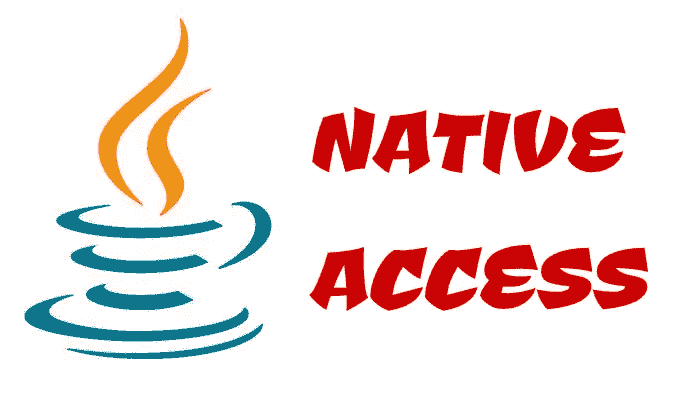
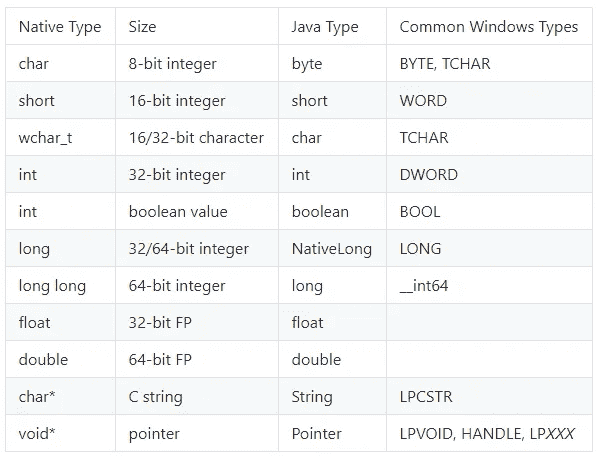

# Java 本地访问:JNI 的更干净的替代方案？

> 原文：<https://levelup.gitconnected.com/java-native-access-a-cleaner-alternative-to-jni-954b53b77398>

最近，我写了一篇关于[**【JNI】(Java 本地接口)**](https://medium.com/swlh/introduction-to-java-native-interface-establishing-a-bridge-between-java-and-c-c-1cc16d95426a) 的文章，演示了如何使用它从 Java 中调用本地代码。虽然 JNI 是一种流行的选择，但它有点难以使用，并且每次对本机代码稍作改动时都需要生成它的存根(绑定所需的 JNI 头文件)。更重要的是，您可能无法访问想要使用的共享库的源代码。在这种情况下，除非该库是为了支持 JNI 而编写的，否则您无法让它工作。假设您可以访问本机方法签名，JNA 实际上可以让您做到这一点。

JNA 是一个开源项目，它让你只使用 Java 代码就能使用本地库，几乎没有 C 编程经验。你可以在这里 **找到它的源代码[。](https://github.com/java-native-access/jna)**

我在 JNI 的文章中创建了一个示例应用程序，名为 **TemperatureSampler。在本文的第一部分，我将用一个简单的例子来演示 JNA。之后，我们将尝试编写一个相当于 JNA 温度采样器的演示应用程序。最后，我将谈谈使用 JNA 而不是 JNI 的优势和劣势。当然，你可以在这里** **找到完整的源代码 [**。让我们开始吧！**](https://github.com/yigitpirildak/SimpleJNADemo)**

# **使用 JNA 标准库访问 C 函数**

为了测试 JNA，我们实际上不需要任何外部共享库。JNA 自己提供了一个名为“C”的库，可以访问很多 C 语言的功能。

如你所见，我们创建了一个接口并扩展了属于 JNA 的**库**类。然后，我们可以将需要使用的本地方法的签名映射到 Java 方法，以便访问它们。以下是类型映射列表:

src—[https://github . com/Java-native-access/jna/blob/master/www/mappings . MD](https://github.com/java-native-access/jna/blob/master/www/Mappings.md)

Native.load()用于加载一个本地库，但是因为我们使用的是默认库，所以只需传递“c”就可以了(在其他平台中命名可能会有所不同)。

加载本机库后，我们可以访问 printf 和 scanf 方法。当然，上面的程序输出:

> 请工作？你的留言[PleaseWork？]是印刷感谢 JNA 图书馆 5.5.0 版！

# 装载/使用你自己的东西

JNA 提供的例子很好，但这几乎不是我们想要的。现在我们将看看如何加载自己的本地库并映射它的方法。正如我之前提到的，我们将重新实现 TemperatureSampler 以使用 JNA。

让我们从创建我们需要的界面开始。如果你还记得温度采样器，它有两个方法， **getTemperature()** 和 **getDetailedTemperature()** 。

我们使用相同的方法加载共享对象，但是现在我们将提供本地库的完整路径。我的存储在项目根目录下的**本地/输出**文件夹中。如果您想下载示例代码并测试应用程序，我在 **native** 文件夹下提供了一个 Makefile 来构建共享库，因为它是特定于平台的。

**getTemperature()** 方法返回一个简单的原始类型，所以我们不需要做其他任何事情。然而，getDetailedTemperature 需要一些额外的东西来使它工作。

如您所见，我们需要扩展 Structure class，它将本机 c 结构映射到 Java 类。我们将通过它的值返回 struct，struct 假定它是通过引用返回的，所以我们也将实现 struct。通过值接口来解决这个问题。

与 JNI 示例相比，我们的字段声明略有变化。我们将使用字节数组，并使用 Native.toString()方法将它们转换为字符串，而不是使用字符串。据我所知，使用 String 来映射 **const char 数组**可能没问题，但是建议使用 byte 数组来避免字符串编码错误。

最后，我们定义我们的字段顺序来匹配本机结构字段声明顺序。覆盖 getFieldOrder 来返回我们的字段顺序就可以了。这个方法是必要的，因为使用反射 API 获取这些字段并不能保证任何排序。

在前面的例子中，我们为**刻度**字段使用了 TemperatureScale 枚举。据我所知，不像 JNI，没有办法自动将返回值映射到枚举。如果需要，您需要做额外的工作来获取值并将其转换为 Java 枚举。为了方便起见，我简单地将 scale 声明为一个字节数组，如果您愿意，可以在读取其值后将其映射为一个枚举。

现在，让我们执行我们的主要方法，看看它是如何工作的！

瞧啊。我们得到了与 JNI 示例相同的输出！

> 返回简单温度…
> 采样温度= 27.8
> 返回详细温度…
> 时间戳= 02–03–2020 17:30:48
> 温度= 27.799999
> 刻度=摄氏度

如果我们看一看我们正在调用的本地库，你会意识到它没有嵌入 JNI 的东西要简单得多。它基本上是普通的 C 语言，代码不知道某一天某个 Java 开发人员可能会调用它！

我在打印前禁用了输出缓冲，否则您可能会得到不正确的打印顺序。您也可以在 Windows 平台上使用 fflush 来清除输出缓冲区。

# JNI 对 JNA

现在是关键时刻了！你应该用 JNA 而不是 JNI 吗？嗯，看情况。我会通过分解它们来帮你决定哪一个更适合你的需求。

## JNI 相对于 JNA 的优势

*   允许您通过其丰富的 API 访问 Java 内容，使您能够创建 Java 类和调用方法。
*   在 Java 端，除了从源代码生成 JNI 头文件之外，不需要做任何额外的事情，这可以在编译时完成，而且(希望)很少发生。大部分工作是在本地完成的。另外值得一提的是，如果您已经知道如何定义 JNI 本地方法(或者生成它，然后将其转换为 C/C++文件并填充方法，但这是额外的工作)，那么可以跳过存根生成。在 AOSP 通常是这样做的。
*   JNI 要快得多，因为 JNA 需要在运行时进行一些动态生成(不需要提供预先生成的存根在这里成为一个缺点)。
*   可以与 C++一起使用，而不需要做任何额外的工作(JNI 通过在自动生成的头文件中使用**Extern“C”**来告诉编译器使用 C 的命名和调用约定)。默认情况下，JNA 不会处理这个问题，所以要让它工作就要靠你了。
*   调用本机函数的最常用方法，所以它是更安全的选择(毕竟是标准的 Java 特性)。

## **JNA 对 JNI 的优势**

*   编译后不需要接触本机代码。您所需要做的就是在 Java 代码上修改您的 JNA 访问接口，以便访问您需要的任何内容。
*   本地代码不需要被 Java 调用。因此，您可以使用 JNA 轻松导入标准的 C 库。
*   不需要你了解 C 语言和编译过程(也可能是交叉编译)。你是一个 Java 开发者，你想写 Java 代码，这就是适合你的方法。
*   更容易习惯，需要更少的麻烦使其工作。您只需获取所需的原生库，将 JNA 依赖项添加到您的 Maven/Gradle 项目中，就万事大吉了。

# 包裹

这两者之间的主要区别在于，JNI 的实现大部分是在本机端完成的，而 JNA 是在 Java 层自动为您处理本机的事情。

总的来说，JNI 提供了一些你在 JNA 可能做不到的事情。如果你在 **AOSP (Android 开源项目)**处理 Android Framework/SystemServer 绑定层，在那里用 JNA 就没道理了(我自己没见过有人用，谷歌更喜欢 JNI，其他人也是)。AOSP 用例通常需要一些从本机到框架的反向函数调用，这是使用 JNA 无法完成的。如果我们认为 AOSP 是一个利基市场，那么 JNA 对你来说是完美的，尤其是如果你需要做的只是使用一个已经为你编写的本地库。最终，您需要权衡每种技术的利弊，选择最适合您需求的技术。记住，保持技术不可知论的心态很重要。

**参考文献:**

 [## Java 本地访问

### 此时您不能执行该操作。您已使用另一个标签页或窗口登录。您已在另一个选项卡中注销，或者…

github.com](https://github.com/java-native-access)  [## 使用本地库开发

### 有时，您可能希望使用不作为 Java 组件提供的第三方库，而只是作为本机…

imagej.net](https://imagej.net/Developing_using_native_libraries)  [## Java 本地访问

### 原作者托德·法斯特、蒂莫西·沃尔、梁晨初版 2007 年 5 月 9 日稳定版 5 . 5 . 0/2019 年 7 月…

en.wikipedia.org](https://en.wikipedia.org/wiki/Java_Native_Access)