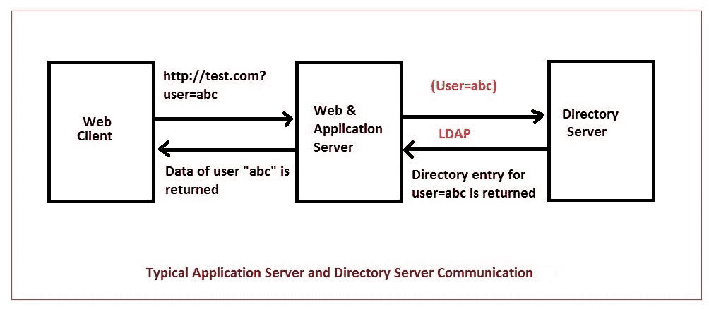
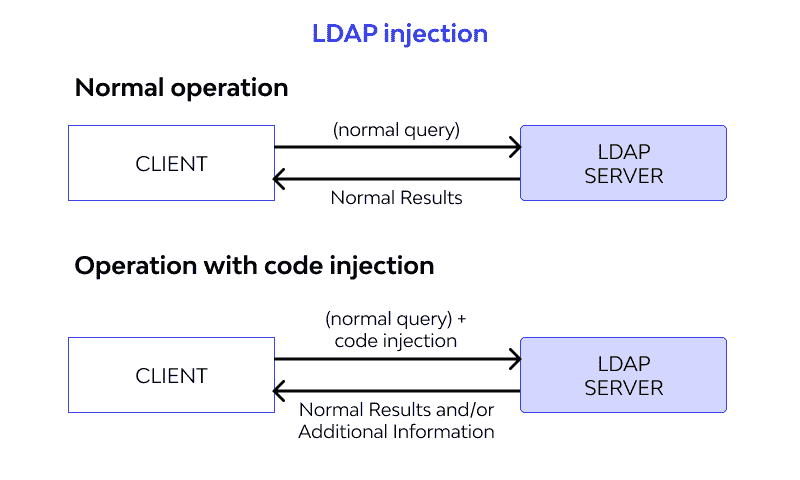
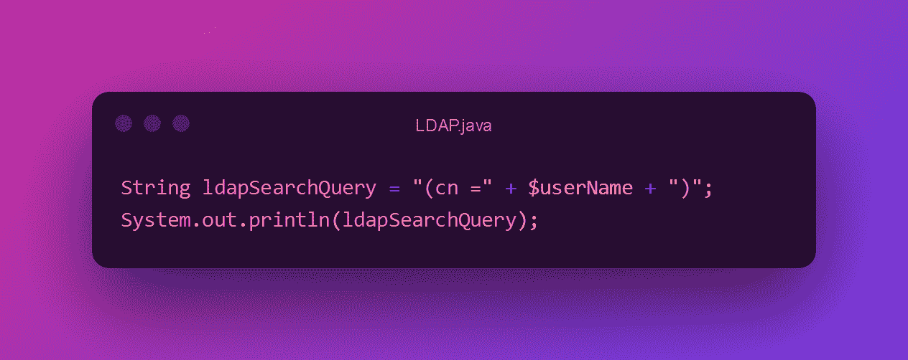
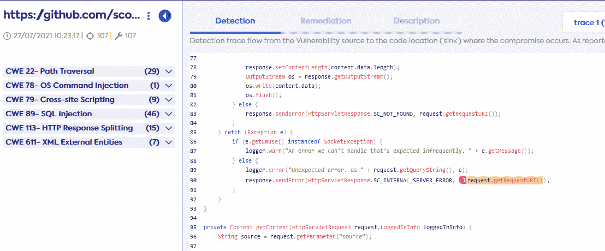
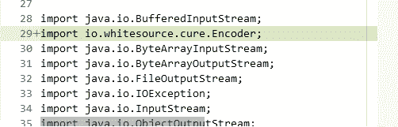
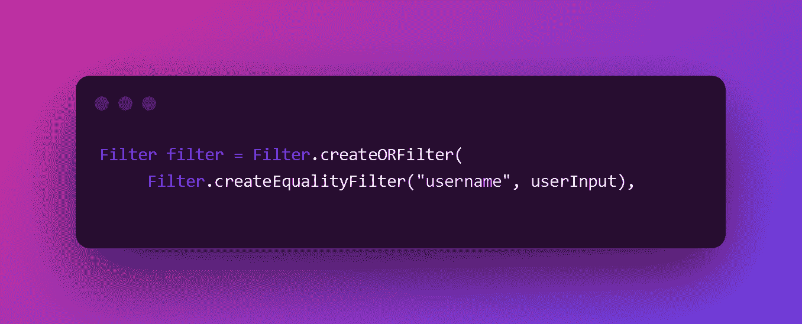

# Java 安全基础:避免 CVE-90 LDAP 注入

> 原文：<https://levelup.gitconnected.com/java-security-basics-avoiding-cve-90-ldap-injection-be653d6f6271>

[照片](https://unsplash.com/photos/HAq24cfcdLg)由[静止不动](https://unsplash.com/@stillnes_in_motion?utm_source=unsplash&utm_medium=referral&utm_content=creditCopyText)在 Unsplash 上拍摄

注入缺陷是一个漏洞，它允许攻击者通过使用输入字段或开发人员指定之外的任何方式，通过应用程序向另一个系统发送恶意代码。这不仅会危及单个在线应用程序，还可能危及整个组织。

对于许多在线应用程序，需要不同的组件来处理用户数据，包括使用数据库和集群的其他组件。在将信息从 HTTP 请求传递给用户之前，web 应用程序必须验证输入。如果输入包含任何危险字符，应该通知用户这个问题。这将实际上解决大量不同的漏洞，这些漏洞通常是由于使用了不正确的输入验证而导致的。

# 什么是 LDAP 漏洞？

[来源](https://compsecurityconcepts.wordpress.com/tag/ldap-injection/)

轻量级目录访问协议( [LDAP](https://www.okta.com/identity-101/what-is-ldap/) )是使用最广泛的软件协议之一，旨在使网络上的每个人更容易找到资源，如各种用户及其文件，以及其他设备。

[LDAP 注入](https://www.synopsys.com/glossary/what-is-ldap-injection.html)是一个注入漏洞，其中的查询是由不可信的输入构建的，这些输入在使用前没有经过清理。LDAP 查询是从不可信的输入中创建的，这些输入包含大量特殊字符，如括号、星号、与号和引号等。这些元字符改变了查询的含义。

例如，如果提供了星号，它表示选择所有内容并显示出来。这进而会影响从底层目录中提取的对象的类型和数量。通过提供包含这些控制字符的输入，攻击者除了进行恶意操作(如逃避身份验证和检索敏感信息)之外，还能够改变查询和预期行为。

# 为什么会发生 LDAP 注入？

[来源](https://www.wallarm.com/what/a1-injection-2017-owasp)

LDAP 的客户机和服务器实现是支持该协议的应用程序架构的一部分。查询完成后，在提交给服务器之前会向其中添加输入，然后服务器会处理信息并显示结果。下面提供了一个 LDAP 搜索过滤器的示例:

查找((&(cn=" +用户名+"))

构建类似于下面的查询[的代码:](https://theitbros.com/ldap-query-examples-active-directory/)

[来源](https://ray.so/?title=LDAP.java&theme=breeze&spacing=64&background=true&darkMode=true&code=U3RyaW5nIGxkYXBTZWFyY2hRdWVyeSA9ICIoY24gPSIgKyAkdXNlck5hbWUgKyAiKSI7ClN5c3RlbS5vdXQucHJpbnRsbihsZGFwU2VhcmNoUXVlcnkpOw&language=php)

当使用这种前缀过滤符号时，查询被指示寻找具有指定用户名的 LDAP 节点。用户名通常由用户提供，然后插入到查询中以获取共享该用户名的用户。考虑以下场景:这个查询是通过将用户提供的输入中的用户名附加到查询的末尾而生成的。攻击者可以传递任意输入，例如星号(*)，这将列出系统中的所有用户。发生这种情况是因为用户决定将哪些输入附加到 LDAP 搜索过滤器，并且因为它们是在没有任何验证和清理的情况下插入的。

可以使用*字符以外的特殊字符创建恶意查询。如果用户名值设置为' *)(cn = *)(|(cn = * ')

find("(&(cn = *)(cn = *)(|(cn = *)")

上述查询中的条件始终计算为 true。如果在身份验证流中使用该查询，攻击者可以通过在查询中发送上述有效负载来简单地规避身份验证措施。

有太多的 LDAP 注入漏洞可被用来攻击易受攻击的服务器，所有这些都在下面描述。另外，许多组织利用 LDAP 服务器来存储敏感信息，如用户名、角色、权限和提供给他们的相关对象，如果这些信息遭到破坏，后果将是灾难性的。

# 怎么打补丁？

要修补代码中的这一漏洞和其他漏洞，可以结合使用多种技术。通常，开发人员会花费大量精力来纠正代码中的这些漏洞。

免费的补救软件 [WhiteSource Cure](https://www.whitesourcesoftware.com/whitesource-cure/) 工具可用于在短时间内修补该漏洞，并且免费提供。如果你给 SARIF 文件，Cure 可以用来扫描 GitHub 库。或者，可以使用 Cure 的 IDE 插件在代码发布前检测漏洞。

让我们看看它是如何工作的，以及我们可以做些什么来使用它来修补这个和其他安全缺陷。

要使用 Cure 应用程序，您必须首先导航到[网站](https://cure.whitesource.io/)，并在两个输入框中填写您的 GitHub 库的 URL 和您从 lgtm.com 下载的 SARIF 文件。

一旦你提供了这两个，它将检测和显示所有的漏洞，以及他们的补丁。

它包含三个选项卡:一个显示发现漏洞的位置，另一个显示漏洞的修补程序或补救措施，第三个显示漏洞的描述。

它使用了几个文件。例如，它使用如下所示的包:

然后提供修改，以看起来像软件工程师修补的方式修补代码。

我们可以使用用户输入中的 sanizition 来修补 LDAP:

[来源](https://ray.so/?title=&theme=breeze&spacing=64&background=true&darkMode=true&code=RmlsdGVyIGZpbHRlciA9IEZpbHRlci5jcmVhdGVPUkZpbHRlcigKICAgICBGaWx0ZXIuY3JlYXRlRXF1YWxpdHlGaWx0ZXIoInVzZXJuYW1lIiwgdXNlcklucHV0KSwKICAgIA&language=powershell)

因此，WhiteSource Cure 可以帮助修补所有漏洞，无论它们是在 [GitHub](https://github.com/) repo 中还是在您的 IDE 中。您将拥有所有的修补程序，并且可以选择要部署的修补程序。因此，对于在代码中执行漏洞评估和补救来说，这是一个很好的解决方案。

# 结论

LDAP 注入攻击与 SQL 注入攻击相似，都是通过修改合法查询来实施攻击。这些攻击利用用于生成 LDAP 查询的参数来获取对敏感信息的访问权限。

在大多数情况下，应用程序不会正确地过滤和验证参数，而是直接使用它们来准备查询。这可能会创建一个易受攻击的环境，黑客可以在其中插入恶意代码并检索大量敏感信息，绕过身份验证或提升系统权限。

使用像 Cure 这样的工具修补这样的漏洞可以极大地提高代码的质量，使其更加安全和健壮。