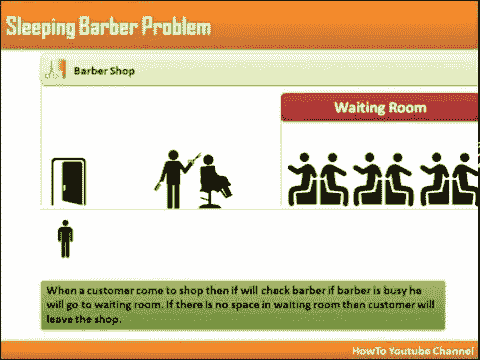
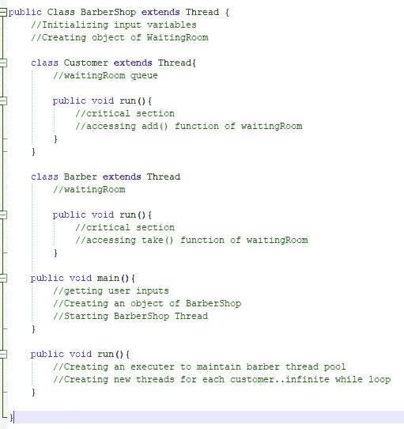
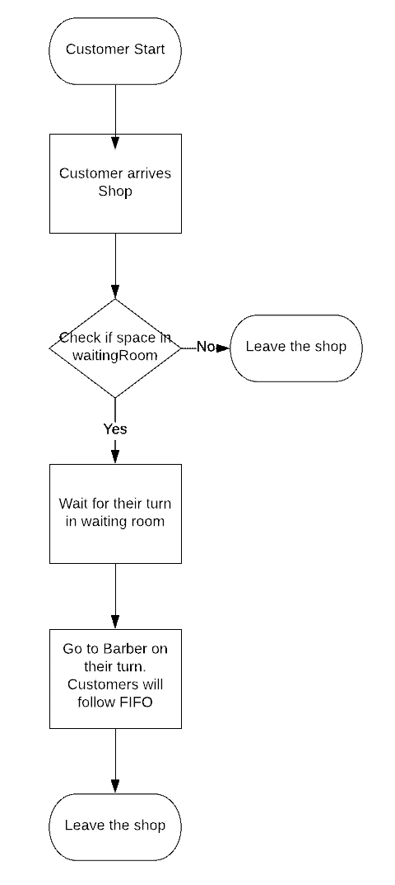
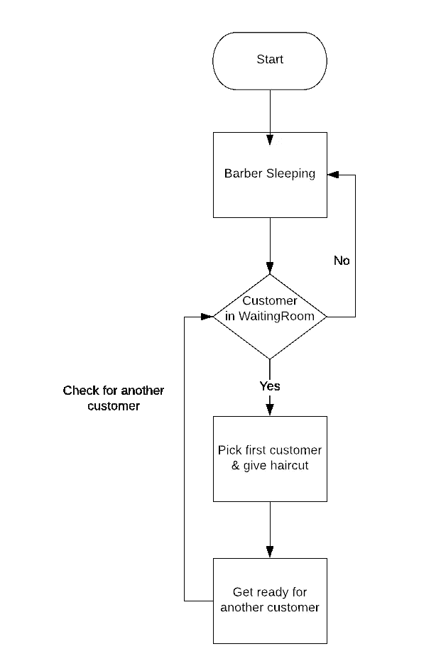
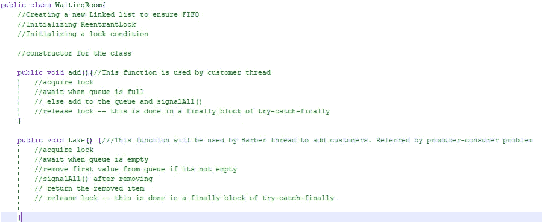
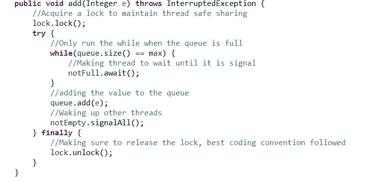

# Java 线程——沉睡的理发师问题

> 原文：<https://levelup.gitconnected.com/java-threads-sleeping-barber-problem-184653e2a00e>

## **一、场景介绍:**

一家小理发店有两扇门，一个入口和一个出口。里面是一组 *M* 理发师，他们一生都在为顾客服务，一次一个。每个理发师都有一把椅子，顾客在理发时坐在上面。当店里没有顾客等着理发时，理发师就在椅子上睡觉。客户以随机间隔到达，均值 *mc* ，标准差 *sdc* 。如果顾客到达时发现理发师在睡觉，他会叫醒理发师，坐在理发店的椅子上，在理发的时候睡觉。为顾客理发所需的时间有平均值 *mh* 和标准差 *sdh* 。如果顾客来了，所有的理发师都在忙着理发，顾客就会在等候的椅子上睡着。当理发师剪完顾客的头发后，他叫醒顾客并为他打开出口门。如果有顾客在等，他就叫醒一个，等顾客坐到理发店的椅子上，否则就去睡觉。[1]

> 场景的假设:
> 
> 顾客在短暂的延迟后不断到达，首先去等候室。
> 
> 理发师检查等候室，即使只有一个顾客，理发师也会开始理发。
> 
> 剪完顾客的头发后，理发师会花很短的时间为下一位顾客做准备。(这种假设是为了处理这样的场景:理发师为一位顾客理发，而此时又有一位新顾客到来)

## **二。此解决方案的代码依赖关系:**

1.  **导入** java.util.Random:用于生成随机数
2.  **import**Java . util . scanner:用于获取用户的输入
3.  **导入**Java . util . concurrent . executorservice:一个执行器，提供了维护线程池的方法
4.  **导入**Java . util . concurrent . executors:上述库的实用方法。这个执行器用于维护这个模拟的线程池
5.  **导入** java.util.LinkedList:生成支持 FIFO 的等候室
6.  **导入**Java . util . concurrent . locks . condition:用于 await()和 singalAll()其他线程
7.  **导入**Java . util . concurrent . locks . reentrant lock:用于防止死锁和交叉存取的互斥锁。

## **三世。设计实施:**

这个代码中给出的睡眠理发师问题解决方案是一个多线程和多核场景，它确保没有死锁和饥饿，并提供了一个有效的问题解决方案。首先，用户将输入程序启动的一些初始值，包括:

1.  理发师数量
2.  等候椅的数量

3.平均理发时间

4.理发的标准偏差时间

5.客户的平均到达时间

6.标准偏差到达时间

这些值用于生成一个随机时间间隔，该时间间隔使用 **nextGaussian()正态分布。**【2】

一旦这些值被插入，模拟将开始。最初，所有的理发师都在睡觉，因为队列是空的，一旦第一个顾客到达等候室，他将直接去最近的理发店开始理发，之后到达的顾客也是如此，一旦等候区的椅子坐满了，顾客将没有理发就离开。

从理发师的角度来看，每个理发师将检查队列，如果队列中有任何顾客，理发师将从队列中的第一个顾客开始，如果没有顾客，理发师将睡觉。

## **四世。编码设计视角:**

有一个主线程类，它将使用 executor 服务来运行 barbers 线程池，还将为每个客户运行一个新线程。每个客户的这个新线程需要创建一个模拟，其中每个客户可以作为一个单独的实体来查看我们的设计是否可以处理访问同一个共享队列的多个线程。

理发店的结构

这个设计为 barbers 提供了一个单独的线程类，它将尝试获取共享队列。Barber 类将主要使用共享队列的 take()函数，该函数是同步的，以防止任何死锁。这个类的临界区只是打印一个剪发过程的消息，在此期间线程会休眠一段特定的时间。这样做是为了创建一个沙龙模拟。

我还为客户使用了一个单独的线程类，它试图通过使用 add()函数来获取共享队列，这个函数还使用可重入锁，这些锁基于共享队列的状态 wait()和 signal() other。

下面是从理发师和顾客的角度检查共享队列状态的流程图。

理发师和顾客线设计

现在我们来看共享队列线程 WaitingRoom.java，在这个线程中，我实现了一个线程安全的队列，它利用可重入锁和条件来确保无死锁的共享模拟。它的两个主要函数是 add()和 take()，这两个函数都使用锁，并在任务完成时释放锁。

等候室的伪代码

## 动词 （verb 的缩写）理由:

1.  **热闹:**

**1.1** 为了在我的代码中处理这个问题，我在遵循先入先出属性的链表中插入了客户。所以，每次顾客坐在等候室里，理发师都会按照先到先服务的原则挑选他们。我们也可以使用其他数据结构，如堆栈，但链表似乎是这种情况下的最佳选择。[3]

**1.2** **公平性:**代码使用执行器服务(newFixedThreadPool(..)).通过使用 executor 服务，它将维护一个线程池，该线程池将重用在一个共享的无界队列上运行的固定数量的线程[4]。这将在至少有一个线程空闲之前，对尚未完成的任务进行排队。首先空闲的线程承担队列中的下一个任务。这确保了线程执行的公平性。至于共享队列，每个理发师都会得到一个新顾客。

**2。安全:**

**2.1** 为了解决这个问题，我的代码使用了可重入锁，在一个线程获得一个锁后，它会休眠几毫秒，然后释放这个锁。[4]代码确保每个线程在执行临界区后释放锁。我还使用 try-catch 块来处理异常。使用重入锁，锁内的临界区一次只能被一个线程访问。

**2.2** 共享队列(waitingroom.java)的 add 和 take 函数都使用锁，以便每个线程获得最新的队列，并在释放锁时使用 await()和 signalAll()等待轮到其他线程。[5]

add()函数的伪代码

## 六。这种设计的真实例子:

这种设计是客户服务呼叫中心的最佳类比。最初，当没有客户随叫随到时，所有的呼叫主管只是放松下来，等待电话。当第一个客户拨打该号码时，他/她被连接到任何呼叫执行人员，并且在所有呼叫执行人员都忙的情况下，客户将不得不排队等待，直到他们被分配到呼叫执行人员。如果所有主管都很忙，等待的队伍已经满了，客户就会被断开，并得到一条消息说主管很忙，公司稍后会联系客户。这与这种设计最相关，因为客户是按照先到先服务的原则从队列中挑选出来的，呼叫管理人员的使用方式是每个管理人员至少有一次呼叫。

在这种情况下，我们可以有以下设计相似之处:

1.关键部分将是高管和客户之间的通话

2.等候室将是一个呼叫的等候队列，在那里顾客将被以先进先出的方式持有。

3.可以在等待队列上获得锁，这样就不会有两个主管选择同一个客户。

**七。参考文献:**

[1]“沉睡的理发师问题:进程同步的经典问题— YouTube。”【在线】。可用:【https://www.youtube.com/watch?v=OvJFpsN5czg. 【访问时间:2020 年 3 月 18 日】。

[2]“Java 中的 Random nextGaussian()方法及示例— GeeksforGeeks。”【在线】。可用:[https://www . geeks forgeeks . org/random-next Gaussian-method-in-Java-with-examples/。](https://www.geeksforgeeks.org/random-nextgaussian-method-in-java-with-examples/.)【访问日期:2020 年 3 月 18 日】。

[3]“饥饿和活锁(JavaTM 教程>基本类>并发性)。”【在线】。可用:[https://docs . Oracle . com/javase/tutorial/essential/concurrency/starve live . html .](https://docs.oracle.com/javase/tutorial/essential/concurrency/starvelive.html.)【访问时间:2020 年 3 月 18 日】。

[4]“在 Java 中使用显式锁防止死锁”，*JAVAJEE.COM*，2014 年 11 月 8 日。【在线】。可用:[https://Java JEE . com/deadlock-prevention-using-explicit-locks-in-Java。](https://javajee.com/deadlock-prevention-using-explicit-locks-in-java.)【访问日期:2020 年 3 月 18 日】。

[5]“使用生产者消费者解决方案的 Java 锁和条件示例。”【在线】。可用:[https://Java re visited . blogspot . com/2015/06/Java-lock-and-condition-example-producer-consumer . html](https://javarevisited.blogspot.com/2015/06/java-lock-and-condition-example-producer-consumer.html.)【访问时间:2020 年 3 月 18 日】。

[6] G. link、脸书、Twitter、Pinterest、Email 和 O. Apps，“用 Java 进行多核编程”【在线】。可用:[http://www . ryanhmckenna . com/2014/12/multi-core-programming-with-Java . html .](http://www.ryanhmckenna.com/2014/12/multi-core-programming-with-java.html.)【访问时间:2020 年 3 月 18 日】。

[7]“沉睡的理发师问题:进程同步的经典问题——YouTube。”【在线】。可用:【https://www.youtube.com/watch?v=OvJFpsN5czg. 【访问时间:2020 年 3 月 18 日】。