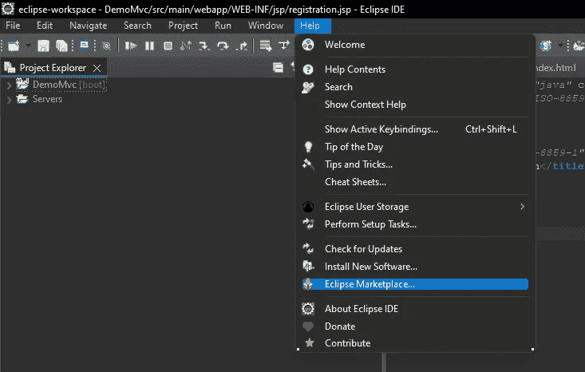
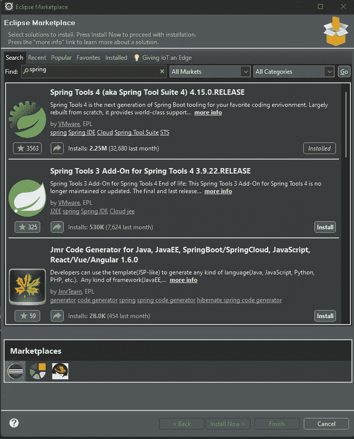
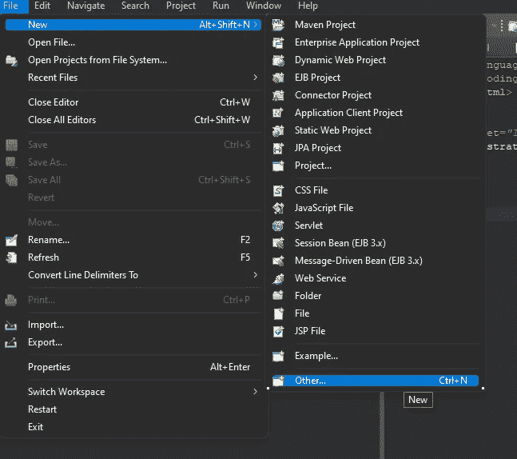
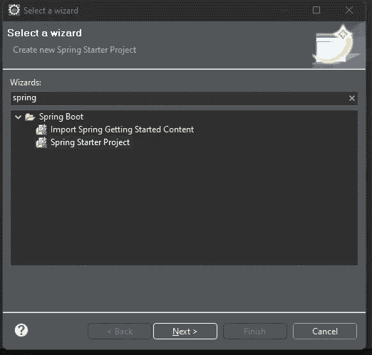
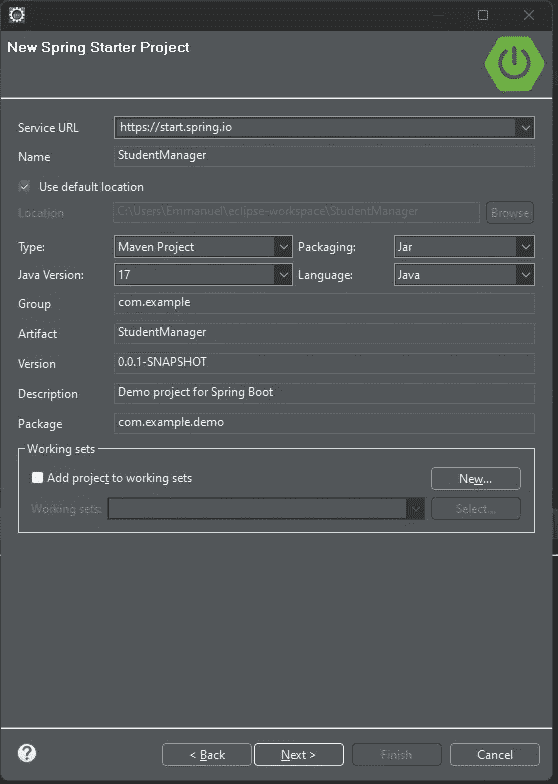
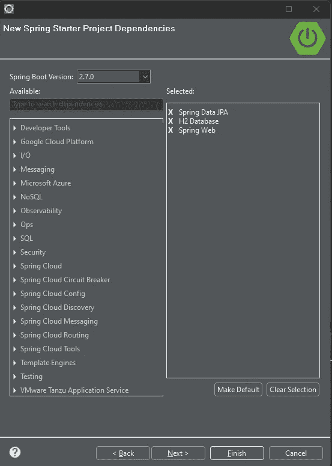

# Java 教程。使用 SpringBoot 创建一个基本的 Rest Api。Pt1

> 原文：<https://levelup.gitconnected.com/java-tutorial-creating-a-basic-rest-api-using-springboot-pt1-3ef25e3c903a>

## 如何使用跳羚？

图片来自 Pexels 的 panumas nikhomkhai

创建一个 REST API 是你今天可以开发的最有价值的技能之一。REST APIs 几乎用于所有现代 web 服务。市场上的许多工作都在寻找理解并能创建 RESTful API 的人。在本教程中，我不打算给你一个关于 REST API 和 SpringBoot 的详细指南。本指南的目的是让您先试一试，并向您展示 API 并不像它们看起来那么可怕。为了正确地遵循本指南，您需要了解 Java，并对 Postman 有一个基本的了解。您还想了解什么是 REST API，以及 spring 框架是关于什么的。你可以在不了解 API 和 REST 的情况下遵循这个指南，但是学习它会大大增加你的理解。

话虽如此，我们还是开始吧。

创建这个应用程序所需的工具是 Postman 来访问我们的 API 端点和 Eclipse for 我们的 IDE。出现提示时，您可以为所有这些应用程序选择默认参数。一旦您下载了这些工具，我们就可以开始了！

## Spring 工具套件

首先，您将启动 Eclipse IDE 并导航到工具栏上的“Help”部分。从那里导航到“Eclipse Marketplace”。

在 Eclipse Marketplace 搜索栏上，您将输入“Spring”并按 Enter 键。你应该在列表上方或顶部附近看到“Spring Tools 4”应用程序。

安装这个应用程序，当安装完成时，它会要求您重新启动 Eclipse IDE。

当您的 Eclipse 重启时，您将创建一个新文件。进入工具栏，选择文件->新建->其他

在搜索栏中，你要输入“春天”。你应该看到“Spring Boot”文件夹，其中包含两个文件。您将选择“Spring Starter Project”并点击 next。

在“New Spring Starter Project”页面上，您将把项目的名称更改为“StudentManager ”,其余部分保持默认。

单击 next，然后您将看到“New Spring Starter Project Dependencies”页面。在这里，我们将添加我们的项目依赖。这些依赖性将反映在我们的 pom 文件中。在搜索栏中，您将查找并添加“Spring Data JPA”、“H2 数据库”和“Spring Web”。一旦你选择了所有三个，你可以点击“完成”。

现在，您已经建立并准备好了 SpringBoot 项目。不要让这成为一场滚动盛宴，以免人们失去他们在指南中的位置。我们将在下一篇文章的[中继续我们项目的配置，到时见！](https://medium.com/@emmanuel_tejeda/java-tutorial-creating-a-basic-rest-api-using-springboot-pt2-c940909b59a0)

## 资源

> [链接到该代码的 github 库](https://github.com/Emmanuel-Tejeda/student-manager-rest-api-spring)