# Java 教程。使用 SpringBoot 创建一个基本的 Rest Api。Pt2

> 原文：<https://levelup.gitconnected.com/java-tutorial-creating-a-basic-rest-api-using-springboot-pt2-c940909b59a0>

## 建立数据库和模型。

照片由来自 Pexels 的 Brett Sayles 拍摄

本指南是一个延续；如果你没有，从头开始[这里](https://medium.com/@emmanuel_tejeda/java-tutorial-creating-a-basic-rest-api-using-springboot-pt1-3ef25e3c903a)。

在上一个指南中，我们回顾了使用 SpringBoot 创建我们的应用程序；现在，我们将配置它。如果您还没有打开您的 Eclipse IDE，我们将设置我们的数据库。我们将使用 H2 数据库。H2 是一个开源软件，可以通过浏览器访问，只需要很少的设置。H2 非常适合测试少量数据。请记住，大多数人和公司并不使用 H2 作为他们的数据库。MySQL 和 Postgres 是最常用的，但需要更多的知识和设置。

## 配置数据库

若要配置数据库，请打开项目文件夹。导航到“src/main/resources”文件夹，打开“application.properties”文件。在里面，你要输入这三行代码。

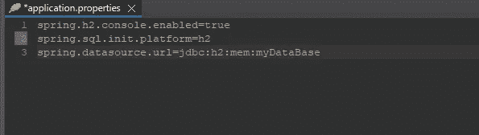

第一行启用我们的数据库。第二行向我们的程序表明我们正在使用哪种数据库；在我们的例子中，是 H2。第三行是我们的数据库“myDataBase”的 URL。

## 检查你的 H2 数据库

要检查数据库是否正常工作，请运行您的应用程序。右键单击您的项目文件夹并导航至|运行方式-> Spring Boot 应用程序|

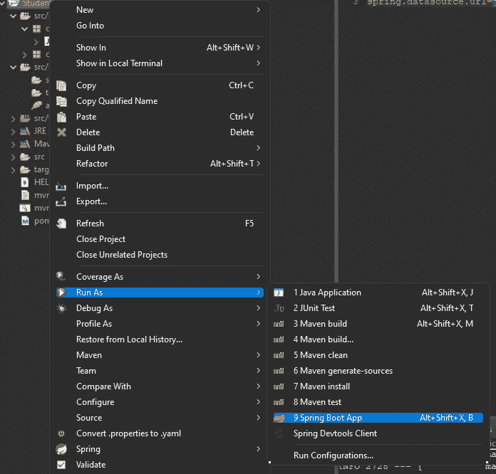

如果您的应用程序成功启动，您将看到“已启动的 StudentManagerApplication”及其运行的端口号。

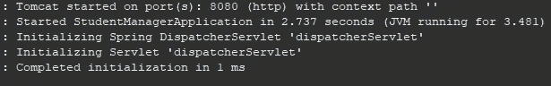

接下来，让我们打开浏览器，输入“http://localhost:8080/H2-console”来查看数据库是否正常运行，这将带您进入这个页面。

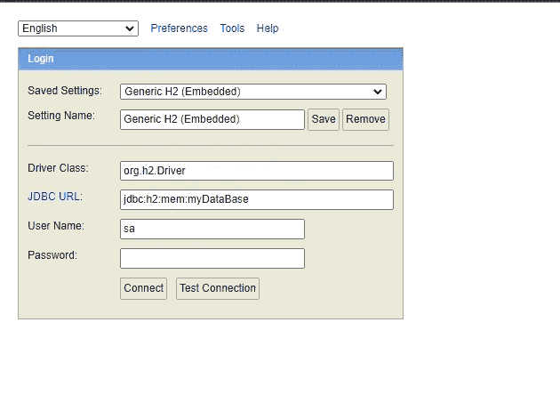

在“JDBC URL”部分，粘贴我们在“application.properties”文件中创建的 URL，然后单击“connect”如果您的数据库设置正确，您将看到这个页面。

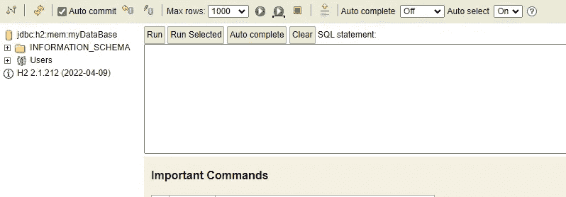

## 创建模型

既然我们的数据库已经建立，我们将创建我们的模型。模型是我们将要处理的数据。由于我们的应用程序被命名为“学生管理器”,我们将创建一个学生模型。导航到“src/main/java”文件夹，右键单击名为“com/example/demo”的包，然后选择 New -> Package。

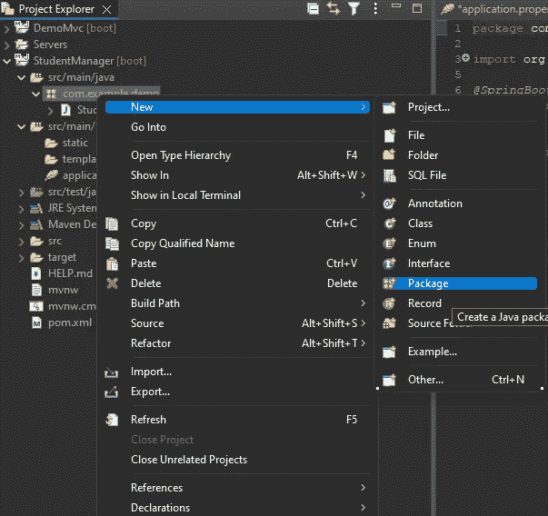

在“名称”部分，在“com.example.demo”的末尾您要键入的“名称”。模型”，它会给你“com.example.demo.model”。这将在“demo”包下创建“model”包。

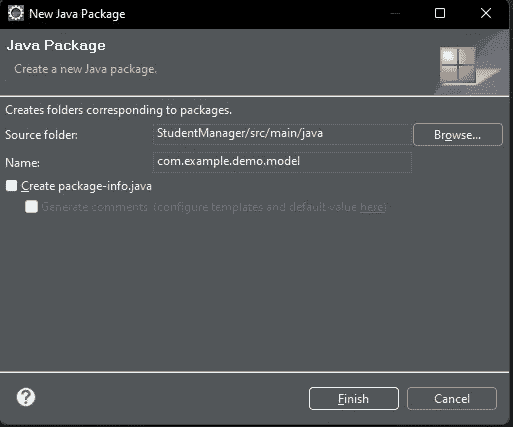

完成后，单击 finish，您的“src/main/java”目录将如下所示。

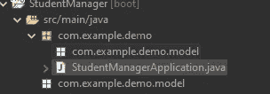

我们为我们的模型创建一个包，而不仅仅是单独创建模型类，因为每个 REST API 可能有不止一个模型。通过为我们的模型创建一个包，我们可以在一个理想的地方跟踪它们，在那里我们的 Spring 应用程序和任何使用我们项目的人都可以找到它们。出于本指南的考虑，我们将只使用一个模型。

继续我们离开的地方，我们现在要为我们的模型创建一个类。您将右键单击您新创建的模型包，并转到|New -> Class|。

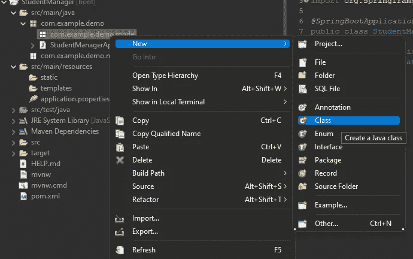

我们将把这个班级命名为“学生”，然后单击“完成”

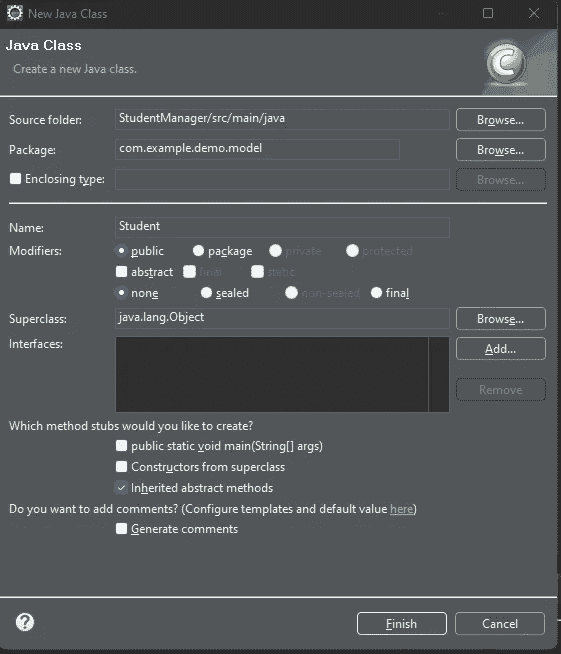

在我们新的“学生”类中，我们将为学生类分配几个字段。让我们保持简单，给我们的学生一个 ID 号、一个名字和一个分数，以及适当的 getters 和 setters。

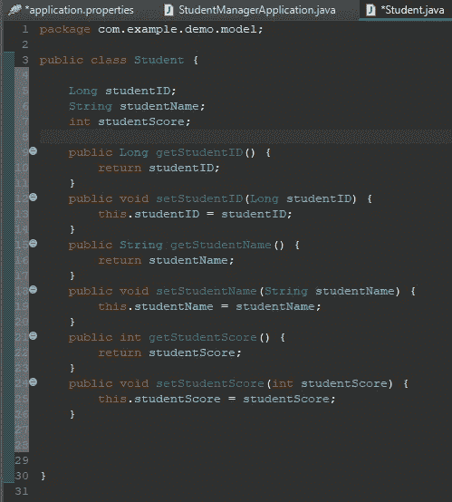

通过右键单击文件编辑器屏幕并选择| Source-> Generate getter 和 Setters |,可以在 Eclipse 中快速创建 getter 和 setter

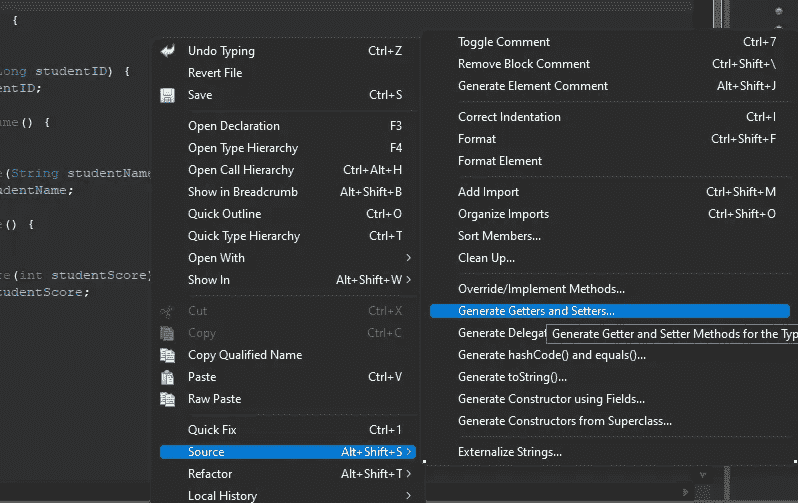

在[后续指南](https://medium.com/@emmanuel_tejeda/java-tutorial-creating-a-basic-rest-api-using-springboot-pt3-f5496ee09c97)中，我们将注释我们的模型。

## 资源

> [该代码的 github 库链接](https://github.com/Emmanuel-Tejeda/student-manager-rest-api-spring)