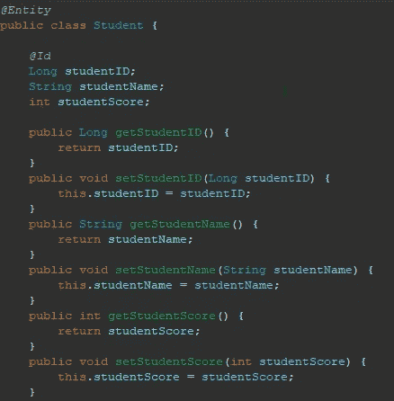
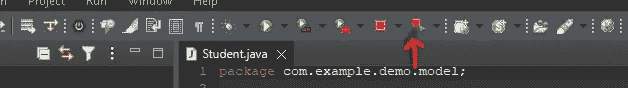
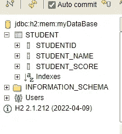
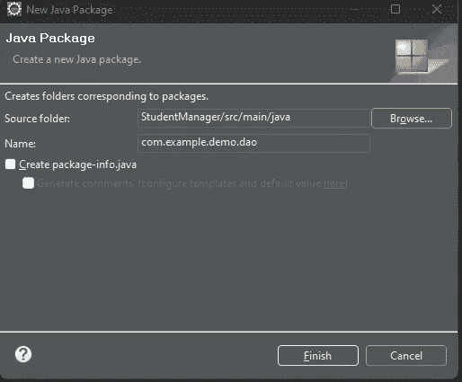
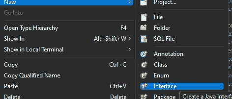
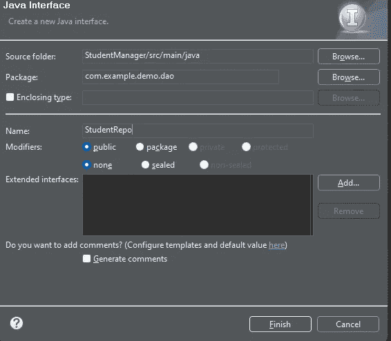
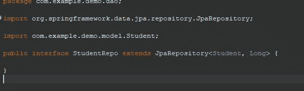

# Java 教程。使用 SpringBoot 创建一个基本的 Rest Api。Pt3

> 原文：<https://levelup.gitconnected.com/java-tutorial-creating-a-basic-rest-api-using-springboot-pt3-f5496ee09c97>

## 模型注释和创建 JpaRepository。

照片由来自 Pexels 的 Alesia Kozik 拍摄

本指南是一个延续；如果没有，从头开始[这里](https://medium.com/@emmanuel_tejeda/java-tutorial-creating-a-basic-rest-api-using-springboot-pt1-3ef25e3c903a)或者 pt2 [这里](https://medium.com/@emmanuel_tejeda/java-tutorial-creating-a-basic-rest-api-using-springboot-pt2-c940909b59a0)。

## 注释您的模型

C 在我们停下来的地方，我们创建了我们的学生模型。现在，我们将注释我们的模型，以便它可以正确地存储在我们的数据库中。我们通过在 Student 类上方添加“@Entity”注释来实现这一点。这允许我们创建的学生对象被持久化/添加到我们的数据库中；[点击此处](https://www.baeldung.com/jpa-entities)阅读更多相关内容。除了实体注释，我们还必须定义一个惟一的标识符，以便每个学生对象都可以被适当地访问。我们创建了一个名为“studentID”的字段，让我们使用它。为此，在您希望使用的字段顶部添加“@Id”注释。添加这两个注释后，您的学生模型应该是这样的。

现在模型完成了！

假设您想要测试您的模型是否被正确配置。首先，重新启动 SpringBoot 应用程序。

旁注！您不能简单地再次运行您的项目，因为这意味着您正在使用的端口 8080(如前所述)仍将被使用，并且您的应用程序将无法运行，除非您在控制台中手动终止该任务。这并不复杂，但最好避免麻烦。如果你已经犯了这样的错误，这里是如何做的

接下来，转到您的 H2 数据库([http://localhost:8080/H2-console](http://localhost:8080/h2-console))并使用您的数据库 URL 进行连接。如果您单击左侧边栏学生表格中的下拉菜单，您将看到我们创建的字段。

## 创建 JpaRepository

现在让我们创建 JpaRepository。JPA 存储库为我们提供了访问和修改已经存储或想要存储在数据库中的数据的工具。

为此，我们将在“com/example/demo”下创建一个包，并随意命名。我将把我的称为“dao ”,它代表数据访问对象。创建子包时，记得在新包名前添加一个句点。如果你感到困惑，请再次查看第 2 部分。

在我们新创建的“dao”包中，我们将添加一个接口。我将把我的名字命名为“StudentRepo”。

现在我们想在我们的接口中扩展 JpaRepository。为此，在接口名称后添加“extends JpaRepository”行(如果需要，可以导入)。最后需要的是包括存储库将使用的对象类型和唯一标识符的数据类型。在这个项目中，我们使用 Student 对象，唯一标识符的数据类型是 Long(包含“@Id”注释的字段)。为了实现这一点，我们在类名的末尾添加了“<student long="">”。完成后，您的界面应该是这样的。</student>

这就是我们的知识库！

在下面的指南中，我们将看看控制器。[那里见](https://medium.com/@emmanuel_tejeda/java-tutorial-creating-a-basic-rest-api-using-springboot-pt4-1fcd39029472)

## 资源

> [JPA 实体](https://www.baeldung.com/jpa-entities)
> 
> [链接到该 cod 的 github 存储库](https://github.com/Emmanuel-Tejeda/student-manager-rest-api-spring)