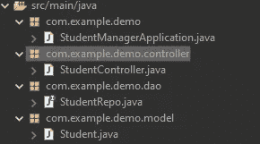
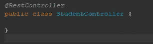
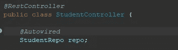
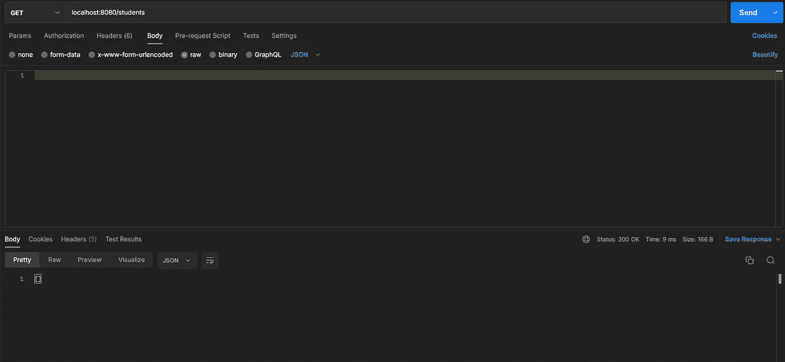
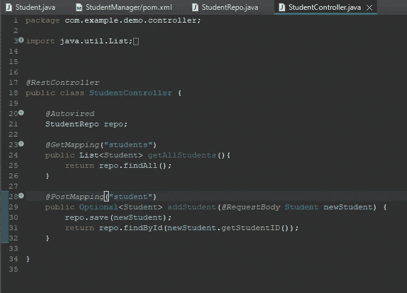
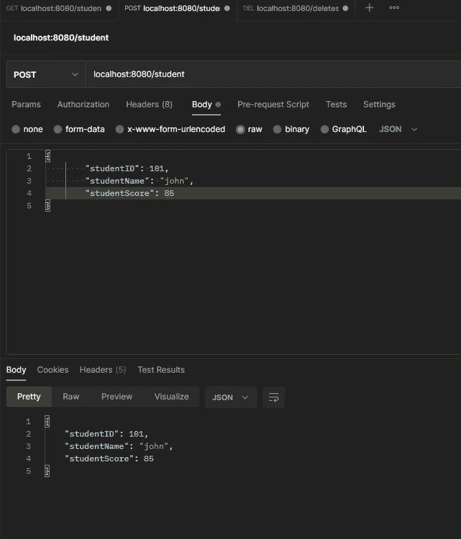
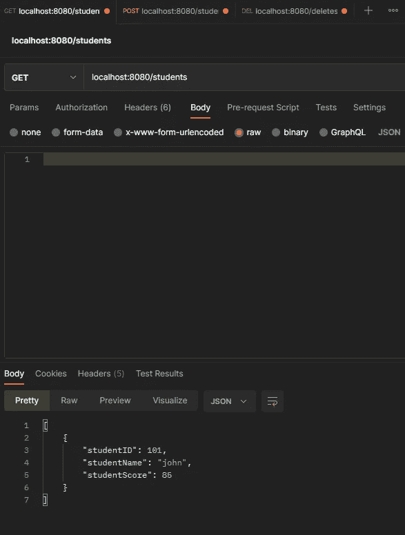

# Java 教程。使用 SpringBoot 创建一个基本的 Rest Api。Pt4

> 原文：<https://levelup.gitconnected.com/java-tutorial-creating-a-basic-rest-api-using-springboot-pt4-1fcd39029472>

## 创建控制器和我们的 CRUD 操作。


luis gomes 摄于 Pexels

本指南是一个延续。如果没有，从头开始[这里](https://medium.com/@emmanuel_tejeda/java-tutorial-creating-a-basic-rest-api-using-springboot-pt1-3ef25e3c903a)或者 pt3 [这里](https://medium.com/@emmanuel_tejeda/java-tutorial-creating-a-basic-rest-api-using-springboot-pt3-f5496ee09c97)。

在本指南中，我们将添加 REST API 的基本特征，即控制器。控制器负责管理我们的 CRUD 操作和处理 API 请求。

首先，在“com/example/demo”下创建一个新包，我们将这个新包命名为“controller”。在我们的新包中将创建一个名为“StudentController”的类。完成后，您的文件结构应该如下所示。



为了使这个类成为 REST API，我们将向该类添加“@RestController”注释。要阅读更多关于 RestController 注释的内容，请点击这里的。但简而言之，RestController 允许我们更轻松地创建 RESTful web 服务。



## 获取请求

在本节中，我们将反向操作。我将向您展示一个完整的 get 请求是什么样子的，然后分解每一行负责做什么。

在提出任何请求之前，我们将首先导入我们的存储库，以访问它提供的所有有价值的工具。



当我们运行应用程序时，“@Autowired”注释为我们创建了对象。这就是所谓的依赖注入。点击了解更多关于依赖注入[的信息。](https://www.baeldung.com/spring-dependency-injection)

接下来是我们的 get 请求。

```
@GetMapping("students")
     public List<Student> getAllStudents(){
     return repo.findAll();
}
```

从头开始

*   我们有自己的“@GetMapping”注释。这个注释告诉 Spring，这个方法负责从我们的数据库中获取信息。该注释的第二部分是 API 的名称。例如，这个请求的名称应该是“localhost:8080/students”。
*   接下来，我们有一个名为“getAllStudents”的方法声明，返回类型为学生列表。
*   最后，我们调用数据库。这个“repo.findAll”返回所有学生的列表。

如果我们运行这个并在 Postman 上发出 GET 请求，我们将得到一个空列表。为了解决这个问题，让我们转到创建 Post 请求。



## 发布请求

```
@PostMapping("student")
public Optional<Student> addStudent(@RequestBody Student newStudent{          
     repo.save(newStudent);
     return repo.findById(newStudent.getStudentID());
}
```

Post 请求与 Get 请求略有不同，但是我们可以看到一些相似之处。

从头开始

*   我们有 PostMapping 注释，它将我们的方法注释为 post 请求。我们将我们的地址命名为“学生”,但是您可以将它改为您想要的任何名称。
*   接下来，我们有自己的方法，命名为“addStudent”，并将返回类型设置为可选的<student>。我们需要这种奇怪的返回类型，因为当返回一个对象时，我们可以返回 student 对象，在本例中是 student 模型。或者，如果没有找到 student 对象，它将返回一个异常。这个可选的返回类型允许我们处理这两种情况。</student>
*   在我们的参数中，有我们试图将“newStudent”与“@RequestBody”注释一起存储到数据库中的学生。我们使用这个注释是因为当在请求中发送信息时，数据在 HTTP 请求体中传输，然后被转换成 Java 对象或 JSON。点击了解更多信息。
*   在我们的方法体内，有“回购”。save ”,它将我们的新学生保存到数据库中，将 student 对象作为参数。
*   最后，我们想要返回我们刚刚保存的学生。我们使用“repo.findById”通过学生的唯一 Id 来查找他们。

最后，你的控制器应该是这样的。



现在，让我们来看看我们的新功能。

我们去找邮递员吧。我们将请求设置为 post，并以 JSON 格式在主体中写入我们的新学生。点击发送后，这是我们得到的。



如您所见，我们得到了刚才输入的学生作为响应。我们可以通过发出 get 请求来测试学生是否在数据库中。



这都是为了我们的 REST API。本指南中没有提到的东西太多了，我恳请你去研究和探索。学习如何创建 REST API 是你能学到的最好的技能之一，它将帮助你跨越你编程生涯的大部分，如果不是全部的话。如果您需要一些指导，请查看如何在控制器中实现删除和放置请求。

我将在本指南的参考资料部分留下这段代码的链接；看看它，玩玩它。如果你有任何问题，请评论，我会尽快处理。

我希望你有美好的一天！

## 资源

> [链接到该代码的 github 库](https://github.com/Emmanuel-Tejeda/student-manager-rest-api-spring)
> 
> [关于休息控制器的信息](https://www.baeldung.com/spring-controller-vs-restcontroller)
> 
> [弹簧依赖注射](https://www.baeldung.com/spring-dependency-injection)
> 
> [Sping 请求正文注释](https://www.baeldung.com/spring-request-response-body)