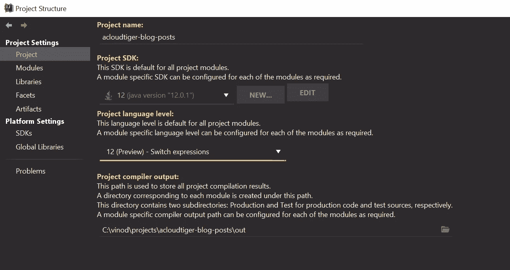

# Java 12 中新的“开关”表达式

> 原文：<https://levelup.gitconnected.com/java12-switch-expression-f2ed457b3e27>

甲骨文最近于 2019 年 3 月发布了 JDK 版本 12。JDK 12 带来了许多新功能，其中最有趣的更新是对`switch`表达式的新实现。


在 Java 12 之前，如果我们想写一个`switch`条件，它看起来会像这样:

```
package com.blog.posts;

/**
 * @author Vinod Kumar Nair
 */
public class SwitchExpression {

    public static void main(String[] args) {
        int animalCode = getAnimalCodeUsingSwitchExpression(Animal.DOG);
        System.out.println("Animal Code: "+animalCode);

        animalCode = getAnimalCode(Animal.DOG);
        System.out.println("Animal Code: "+animalCode);
    }

    /**
     * Using old switch statement
     * @param animal
     * @return
     */
    private static int getAnimalCode(Animal animal){
        int animalCode;
        switch(animal){
            case DOG:
                animalCode = 10;
                break;

            case ELEPHANT:
                animalCode = 20;
                break;

            case TIGER:
                animalCode = 30;
                break;

            case ZEBRA:
                animalCode = 30;
                break;

            case CAT:
                animalCode = 40;
                break;

            default:
                animalCode = 0;
        }
        return animalCode;
    }

    enum Animal{
        ELEPHANT,
        TIGER,
        ZEBRA,
        DOG,
        CAT
    }
}
```

如果我们遵循老派风格的语法，我们需要编写大量的代码。有了 Java 12 `switch`表达式，我们可以使用带有箭头`**->**` 符号的表达式标签以更简洁的方式重写整个逻辑，如下所示:

```
package com.blog.posts;

/**
 * @author Vinod Kumar Nair
 */
public class SwitchExpression {

    public static void main(String[] args) {
        int animalCode =  getAnimalCodeUsingSwitchExpression(Animal.DOG);
        System.out.println("Animal Code: "+animalCode);
    }

    /**
     * Using new Java 12 - Switch Expression
     * @param animal
     * @return
     */
    private static int getAnimalCodeUsingSwitchExpression(Animal animal){
        return switch(animal){
            case DOG -> 10;
            case ELEPHANT -> 20;
            case TIGER -> 30;
            case ZEBRA -> 30;
            case CAT -> 40;
        };
    }

    enum Animal{
        ELEPHANT,
        TIGER,
        ZEBRA,
        DOG,
        CAT
    }
}
```

不需要添加`return`或者`break`关键词。

使用 Java 12 中的`switch`表达式的主要优点是在条件中没有**失败**的风险。因此，没有必要在每一个开关情况中添加一个`break` 关键字。

使用新的 switch 表达式的第二个优点是，您可以一起添加多个具有相同逻辑的案例。例如，如果您仔细查看 switch 表达式代码，两种情况`TIGER`和`ZEBRA`都返回相同的`int`值，因此我们可以像下面这样一起重写两种情况，这在以前的 Java 版本中是不可能的:

```
/**
     * Using new Java 12 - Switch Expression
     * @param animal
     * @return
     */
    private static int getAnimalCodeUsingSwitchExpression(Animal animal){
        return switch(animal){
            case DOG -> 10;
            case ELEPHANT -> 20;
            case TIGER, ZEBRA -> 30;
            case CAT -> 40;
        };
    }
```

使用 switch 表达式的另一个优点是不需要在表达式中放入默认 case。

> **注意:** *带 ENUM，默认情况下不需要。对于其他数据类型，如字符串、整数等，需要默认情况，因为编译器不确定在运行时将发送什么数据。对于 ENUM，情况并非如此，因为编译器对运行时传递的预定义数据集很有信心。*

如果您使用的是 IntelliJ IDEA IDE，则可以轻松配置 JDK 12(预览)-开关表达式。



智能思想集成开发环境

我希望你喜欢这篇文章，并发现它是有用的。请分享您的反馈。

干杯