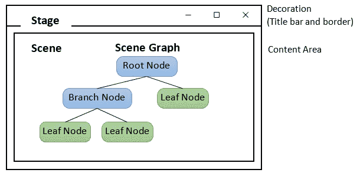
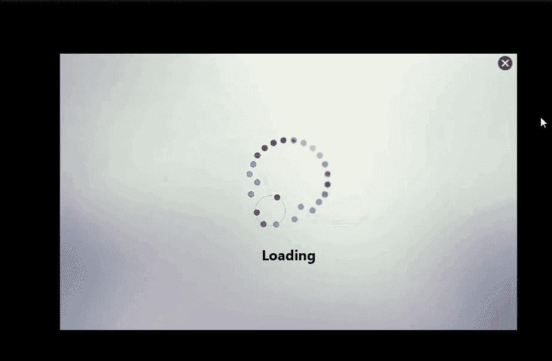

# JavaFX —实践概述

> 原文：<https://levelup.gitconnected.com/javafx-overview-with-hands-on-afd30ad35049>

这是 JavaFX 的标志。

# 1.概观

J**avaFX***是一个 **Java 库**用来构建**R**ich**I**internet**A**applications(**RIA**)。它提供了一组**图形和媒体包**，使开发人员能够设计、创建、测试、调试和部署在不同平台上一致运行的富客户端应用程序。*

JavaFX 提供了一个丰富的图形用户界面。JavaFX 具有专门用于动画、2D 和 3D 几何图形、图表、特殊效果、颜色渐变、图形控件和媒体(包括音频、视频和图像)的简单操作的结构和 API。

# 2.JavaFX 的主要特性

*   **跨平台兼容性:** JavaFX 可用于主流桌面操作系统(Windows、Linux 和 Mac OS X)。
*   **Java 库:** JavaFX 是一个 Java 库，由用原生 Java 代码编写的类和接口组成。
*   FXML: FXML 是一种基于 XML 的声明性标记语言，用于定义 JavaFX 应用程序的用户界面结构。
*   **WebView:** WebView 是**使用*WebKitHTML****技术在 JavaFX 应用程序中嵌入 HTML 内容的 web 组件。WebView 中运行的 JavaScript 可以调用 Java API，Java API 可以调用 WebView 中运行的 JavaScript。*
*   ***Swing 互操作性:**现有的 Swing 应用程序可以使用 JavaFX 特性进行更新，比如嵌入式 web 内容和丰富的图形媒体。使用 JavaFX 比使用 Swing 更容易创建丰富的内容。*
*   ***内置 UI 控件:** JavaFX 提供了开发全功能应用程序所需的所有主要 UI 控件。*
*   ***类似 CSS 的样式:** JavaFX 可以用 CSS 之类的标准 Web 技术进行皮肤处理。它提供了类似 CSS 的样式来改进我们应用程序的设计。*
*   ***Canvas API:**JavaFX Canvas API 支持在由一个图形元素组成的 Java FX 场景区域内直接绘图。*
*   ***多点触摸支持:** JavaFX 根据底层平台的功能，提供对多点触摸操作的支持。*
*   ***集成图形库:** JavaFX 提供了 2D 和 3D 图形的类。*
*   ***图形管道:** JavaFX 支持基于**硬件加速图形渲染管道**的图形，称为 *Prism* 。当与支持的图形卡或 GPU 一起使用时，它可以提供流畅的图形。如果系统不支持图形卡，prism 将默认使用软件渲染堆栈。*
*   ***自含式应用部署** **模型:**自含式应用包**拥有所有的应用资源以及 Java 和 JavaFX 运行时的私有副本**。它们作为可本机安装的软件包分发，并为该操作系统提供与本机应用程序相同的安装和启动体验。*

# *3.JavaFX 应用程序结构*

**

*图片来自[此处](https://www3.ntu.edu.sg/home/ehchua/programming/java/Javafx1_intro.html)*

***JavaFX 使用剧院的比喻来建模图形应用程序。***

## ***阶段***

*   *一个 stage 代表**顶层容器或窗口**。它包含 JavaFX 应用程序的所有对象。*
*   *它是由`javafx.stage.Stage`类定义的。*
*   *舞台的大小可以通过传递其尺寸来指定(`height` 和`width`)。*
*   *舞台分为内容区域和装饰(标题栏和边框)。*

## *事件*

*   *场景代表 JavaFX 应用程序的物理内容。它**包含所有单独的控制或部件**。*
*   *它是由`javafx.scene.Scene`类定义的。*
*   *一个应用程序可以有多个场景，但是在任何给定的时间，舞台上只能显示其中一个场景。*
*   *场景的大小可以通过将它的尺寸(`height` 和`width`)以及**根节点**传递给它的构造函数来指定。*

## *场景图*

*   *场景图是表示场景内容的**树状数据结构(分层)**。所有可视组件(控件、布局等。)是场景图的一部分。*
*   *场景图形组件必须附加到要显示的场景，并且该场景必须附加到舞台，整个场景才可见。*

## *节点*

*   *节点是场景图的**视觉/图形对象。***
*   *场景图的节点由`javafx.scene.Node`类定义。*
*   *一个节点可能包括:
    **:2D、3D
    **UI 控件:** `Button`、`CheckBox`、`ChoiceBox`、`TextArea`等。
    **容器或布局窗格:** `BorderPane`、`GridPane`、`FlowPane`等。
    **媒体元素:**`Audio``Video``Image`对象。***
*   ***节点有以下几种:
    **根节点:**场景图的第一个节点。
    **分支/父节点:**节点，子节点有— `Group`、`Region`、`StackPane`等。
    **叶节点**——没有子节点的节点，如`Rectangle`、`Ellipse`、`Box`、`ImageView`、`MediaView`等。***

# ***4.JavaFX 组件***

***JavaFX 附带了大量的内置 GUI 组件，如按钮、文本字段、表格、树、菜单、图表等等。***

*****Java FX 中的一些主要组件有:*****

## ***控制***

*   ***JavaFX 控件是 JavaFX 组件，在 JavaFX 应用程序中提供某种**控件功能**。***
*   ***要使控件可见，它必须附加到某个场景对象的场景图中。***
*   ***控件通常**嵌套在某个 JavaFX 布局组件**中，该组件管理控件之间的相对布局。***
*   ***JavaFX 控件的一些例子有— `Button` **、** `CheckBox`、`Label`、`Menu`、`RadioButton`、`TableView`、`TextField`、`TreeView`等。***

## ***布局***

*   ***JavaFX 布局是**包含其他**组件的组件。布局组件管理嵌套在其中的组件的布局。***
*   ***JavaFX 布局组件有时也被称为**父组件**，因为它们包含子组件，并且因为布局组件是 JavaFX 类`javafx.scene.Parent`的子类。***
*   ***布局组件必须附加到某个场景对象的场景图才可见。***
*   ***可以将**布局组件**嵌套在其他布局组件内。这有助于实现特定的布局。***
*   ***JavaFX 布局的一些例子有— `Group`、`Pane`、`HBox`、`VBox`、`BorderPane`、`StackPane`、`GridPane`等。***

## ***图表***

***JavaFX 附带了一组内置的现成图表组件，以避免每次需要基本图表时都要从头开始编码图表。***

## ***2D/3D 图形***

***JavaFX 包含一些功能，可以轻松地在屏幕上绘制 2D/3D 图形。***

## ***声音的***

***JavaFX 提供了一些功能，使得在 JavaFX 应用程序中播放音频变得很容易。这在游戏或教育应用中非常有用。***

## ***录像***

***JavaFX 包含的特性使得在 JavaFX 应用程序中播放视频变得很容易。这通常在流应用、游戏或教育应用中很有用。***

## ***网络视图***

***JavaFX 包含一个 WebView 组件，能够使用 HTML 和 CSS 显示网页。JavaFX WebView 组件基于 *WebKitHTML* 技术*。****

# ***5.使用 JavaFX 构建 GUI 应用程序***

***这里，我们正在创建一个简单的 JavaFX 应用程序，如视频所示。这个应用程序由一个加载 GIF，一个加载文本，一个十字按钮控件和一个背景组成。***

******

***作者提供的视频***

*****让我们来看看这个 JavaFX 应用程序的源代码:*****

*****让我们来理解构建这个 JavaFX 应用程序的步骤:*****

## *****设置入口点:*****

*   ***一个 JavaFX GUI 程序从`javafx.application.Application`扩展而来。***
*   ***它是 JavaFX 中应用程序的入口点。***

## *****定义启动方法:*****

*   ***`JavaFXSeeder`类继承了`Application`类并实现了它的抽象方法`start()`。***
*   ***在这个方法中，我们将为 JavaFX 图形编写完整的代码。***

## *****设定场景:*****

*   ***通过指定场景图的根来分配`javafx.scene.Scene`，其中根的类型为`javafx.scene.Group`。***
*   ***我们还可以传递两个 double 类型的参数，分别代表场景的`height` 和`width`。***

## *****设置阶段:*****

*   ***然后我们设置`javafx.stage.Stage` 对象。**使用`setTitle()`方法为舞台设置标题**。使用`setScene()`方法将场景连接到舞台。***
*   ***使用`show()`方法显示场景内容。***
*   ***`primaryStage` 是一个 stage 对象，作为参数传递给场景类的 start 方法。**初级阶段是平台自己创造的。*****
*   ***我们还可以设置舞台的`width`、`height`、任务栏图标、`StageStyle`。***
*   ***我们还可以通过调用 stage 对象上的`setAlwaysOnTop()`将我们的应用程序设置在其他应用程序之上。***

## *****设置外部布局:*****

*   ***这里我们使用`javafx.scene.layout.StackPane`作为顶层布局节点，它**以前后堆栈**的方式布局其子节点。***
*   ***我们可以给这个`StackPane`分配一个唯一的 ID 和维度。***
*   ***我们还可以使用`setOnMousePressed()`和`setOnMouseDragged()`事件处理程序在外部布局上添加鼠标拖动事件。***
*   ***使用`setAlignment()` *设置屏幕上布局的位置。****

## *****设置内部布局:*****

*   ***外部布局节点有三个子节点，分别是`Image`、`javafx.scene.layout.HBox` 和`javafx.scene.layout.VBox`。***
*   ***`HBox`将其内容节点**水平**排列成一行。`VBox` 将其内容节点**垂直**排列成一列。***
*   ***我们可以用`getChildren().add()`为单个节点添加节点，用`getChildren().addAll()`为多个节点添加节点。***

## *****设置控件:*****

*   ***JavaFX 在包`javafx.scene.control`中提供了大量的控件(或组件)。***
*   ***构造一个`Button`控件并将其放置在窗口的右上角。通过方法`setOnAction()`将`javafx.event.EventHandler<ActionEvent>`连接到`Button`上。***
*   ***我们可以通过实例化这个类将`javafx.scene.shape.Text` 嵌入到 JavaFX 场景中。我们可以设置字体、颜色、位置等。的文本。***
*   ***我们可以通过实例化类`javafx.scene.image.Image`在 JavaFX 中加载图像。加载图像后，我们可以通过实例化`ImageView` 类并将图像传递给它的构造函数来设置图像的视图。***

## ***启动应用程序:***

*   ***在`main()`方法中，我们必须使用`launch()`方法启动应用程序。***
*   ***这个方法在内部调用`Application` 类的`start()`方法。***

# ***6.摘要***

***在本文中，我们讨论了 JavaFX 及其强大的功能。我们了解了 JavaFX 提供的主要关键特性。我们学习了 JavaFX 应用程序结构，以及如何将场景、舞台、场景图和节点建模到图形应用程序中。我们了解了 JavaFX 提供的大量内置 GUI 组件。然后我们创建了一个 JavaFX 应用程序并研究了它的工作原理。***

***从解释型 JavaFX 到成熟的 GUI 库，JavaFX 的**成长值得称赞**。***

# ***7.资源***

*** [## JavaFX 是什么？

### 在本文中，您可以了解 JavaFX 2 技术，阅读特性摘要，探索示例应用程序…

docs.oracle.com](https://docs.oracle.com/javafx/2/overview/jfxpub-overview.htm)  [## JavaFX 教程

### JavaFX 是一个用于 Java 的 GUI 工具包，它使得用 Java 创建桌面应用程序变得更加容易。JavaFX 附带了一个…

tutorials.jenkov.com](http://tutorials.jenkov.com/javafx/index.html)  [## 解释 JavaFX 的特性

### 以下是 JavaFX 的一些重要特性——用 Java 编写——Java FX 库是用 Java 编写的，并且…

www.tutorialspoint.com](https://www.tutorialspoint.com/explain-the-features-of-javafx)***