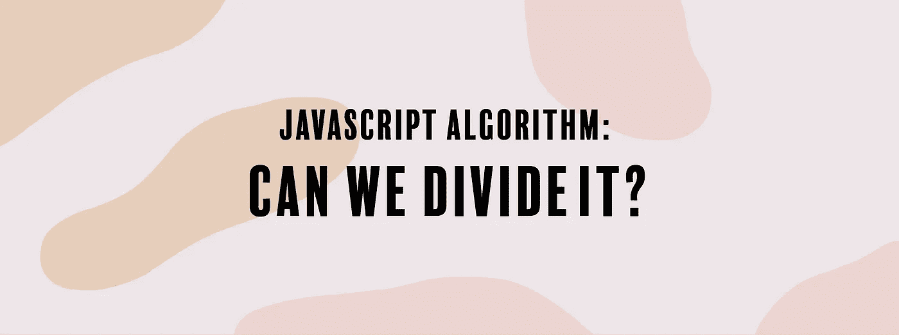

# JavaScript 算法:可以分吗？

> 原文：<https://levelup.gitconnected.com/javascript-algorithm-can-we-divide-it-c86842cb5657>

## 我们将编写一个函数，如果参数`"number"`能被`a`和`b`整除，它将返回真或假



今天我们将编写一个名为`isDivideby`的函数，它将接受三个整数`number`、`a`和`b`作为输入。

该函数的目标是检查参数`number`是否能被`a`和`b`整除。如果`number`被 a 和 b 均除，则返回`true`，否则返回`false`。

让我们看一个例子:

```
let number = 12;
let a = -2;
let b = 6;
```

我们正在检查`12`是否能被`-2`和`6`整除。既然这是真的，函数将返回`true`。

```
let number = 15;
let a = -3;
let b = 6;
```

对于上面的例子，虽然`15`可以被`3`整除，但是它不能被`6`均匀可见，所以函数将返回`false`。

现在我们继续用代码来写:

我们将使用模运算符`%`来检查一个数是否能被另一个数整除。模运算符给出两个数相除所得的余数。如果一个数能被整除，运算将返回`0`。

因为我们正在返回一个布尔值，所以我们将编写一个返回语句来检查`number`是否能被`a`和`b`整除。

```
return (number % a === 0) && (number % b === 0);
```

没有必要的变量(除非你想),但除此之外，仅此而已。以下是剩余的代码:

```
function isDivideBy(number, a, b) {
  return (number % a === 0) && (number % b === 0);
}
```

如果你觉得这个算法有帮助，可以看看我最近的其他 JavaScript 算法解决方案:

[](https://medium.com/@endubueze00/javascript-algorithm-alphabet-soup-91f5dea79e51) [## JavaScript 算法:字母汤

### 我们要写一个函数，返回一个按字母顺序排列的字符串。

medium.com](https://medium.com/@endubueze00/javascript-algorithm-alphabet-soup-91f5dea79e51) [](/javascript-algorithm-lonely-integer-4397cd8b6ffc) [## JavaScript 算法:孤独的整数

### 我们要写一个函数，输出数组中唯一没有重复的数字。

levelup.gitconnected.com](/javascript-algorithm-lonely-integer-4397cd8b6ffc) [](https://codeburst.io/javascript-algorithm-camelcase-4df119b6216e) [## JavaScript 算法:CamelCase

### 对于今天的简短算法，我们将创建一个名为 camelcase 的函数，它将接受一个字符串输入 s。

codeburst.io](https://codeburst.io/javascript-algorithm-camelcase-4df119b6216e)