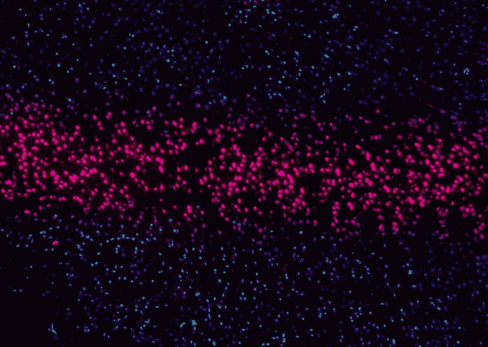

# JavaScript 算法:互补 DNA

> 原文：<https://levelup.gitconnected.com/javascript-algorithm-complementary-dna-3ad421071110>

## 输出 DNA 序列中每个碱基的碱基对



[国立癌症研究所](https://unsplash.com/@nci?utm_source=medium&utm_medium=referral)在 [Unsplash](https://unsplash.com?utm_source=medium&utm_medium=referral) 上拍摄的照片

我们将编写一个名为`DNAStrand`的函数，它将接受一个字符串`dna`作为参数。

脱氧核糖核酸(DNA)是在细胞核中发现的一种化学物质，它携带着生物体发育和功能的“指令”。

DNA 中有四种常见的核苷酸:

腺嘌呤

c-胞嘧啶

g-鸟嘌呤

胸腺嘧啶

在这个函数中，给你一个包含部分或全部核苷酸的 DNA 序列串。该功能的目标是输出每个核苷酸的互补碱基。

碱基对:

A = T

G = C

## 示例:

```
DNAStrand ("ATTGC") *// returns "TAACG"*

DNAStrand ("GTAT") *// returns "CATA"*
```

腺嘌呤与胸腺嘧啶配对，所以每次函数看到`A`，函数就会输出`T`，反之亦然。鸟嘌呤和胞嘧啶也是如此。如果序列包含`G`，该功能将输出`C`(反之亦然)。

首先，我们创建一个名为`sequence`的对象:

```
let sequence = {
    "A": "T",
    "T": "A",
    "G": "C",
    "C": "G"
}
```

该变量包含所有核苷酸碱基对组合的键/值对。

接下来，我们将使用正则表达式和`replace()`函数用碱基对替换 DNA 序列中的所有核苷酸。

```
return dna.replace(/A|T|G|C/g, function(matched) {
    return sequence[matched];
});
```

为了更好地了解发生了什么，正则表达式`/A|T|G|C/g`只查看匹配`A`、`T`、`G`或`C`的字符。然后，我们在 replace 方法中创建一个替换函数。

replace 函数获取与正则表达式`matched`匹配的字符，并将其用作键，以从我们的`sequence`对象中获取键的值对。

我们使用对象括号符号来访问键值。

```
object[keyName] // to get the object value for that particular key
```

仅此而已。该函数将返回互补的 DNA 序列。

下面是完整的函数:

如果您发现这个算法很有帮助，请查看我的其他 JavaScript 算法解决方案文章:

[](https://javascript.plainenglish.io/javascript-algorithm-does-my-number-look-big-in-this-744d6f032c1e) [## JavaScript 算法:我的数字在这里看起来很大吗？

### 确定给定整数是否为自恋数的函数

javascript.plainenglish.io](https://javascript.plainenglish.io/javascript-algorithm-does-my-number-look-big-in-this-744d6f032c1e) [](/javascript-algorithm-power-calculator-372c5f2d41eb) [## JavaScript 算法:功率计算器

### 使用给定的电压和电流计算电量的功能。

levelup.gitconnected.com](/javascript-algorithm-power-calculator-372c5f2d41eb) [](/javascript-algorithm-convert-minutes-into-seconds-4d4a0d750b6c) [## JavaScript 算法:将分钟转换成秒钟

### 这是一个关于如何将分钟转换成秒钟的简单函数。

levelup.gitconnected.com](/javascript-algorithm-convert-minutes-into-seconds-4d4a0d750b6c)