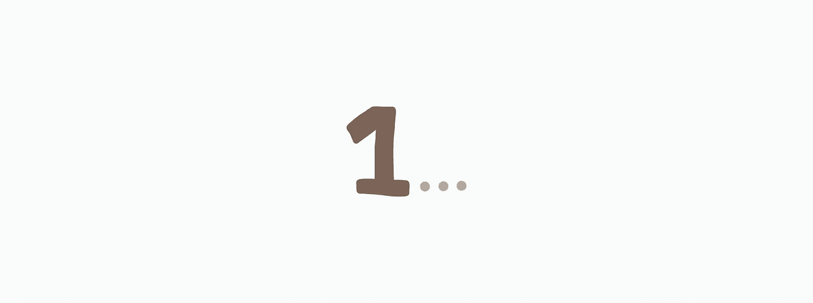

# JavaScript 算法:孤独的整数

> 原文：<https://levelup.gitconnected.com/javascript-algorithm-lonely-integer-4397cd8b6ffc>



对于今天的算法，我们将编写一个名为`lonelyInteger`的短函数，它将接受一个数组`a`作为输入。

给定一个整数数组，每个整数除了一个以外都出现不止一次。数组中没有重复值的整数被认为是唯一的。该函数的目标是输出唯一的数字。这里有一个例子:

```
let a = [1,1,2,2,**6**];
```

看看上面的数组输入，值`1`和`2`有重复的值，但是`6`是唯一没有重复的值。该函数将返回`6`，因为它是一个唯一的数字。

让我们把这个问题变成代码。

```
let unique = a.filter(function(value){
    return a.indexOf(value) === a.lastIndexOf(value)
})
```

我们的变量`unique`将保存我们的…唯一编号。为了找到我们唯一的数字，我们使用了`filter()`方法。简而言之，filter 方法遍历一个数组，并将数组中的每个值传递给一个回调函数。回调函数根据返回语句返回 true 或 false。在上面的例子中，我们检查当前值是否没有任何重复值。

使用`indexOf()`和`lastIndexOf()`，如果整数有重复，两种方法都会返回不同的数字。我们不想那样。如果两个方法返回相同的值，那么这意味着数组中第一个出现的数字也是最后一个。没有重复的值。

因为`unique`数组只有一个值，所以我们返回这个唯一的数字。

```
return unique[0];
```

仅此而已。以下是剩余的代码:

```
function lonelyInteger(a) {
  let unique = a.filter(function(value){
    return a.indexOf(value) === a.lastIndexOf(value)
  })

  return unique[0];
}
```

如果你觉得这个算法有帮助，可以看看我最近的其他 JavaScript 算法解决方案:

[](/javascript-algorithm-marcs-cakewalk-98ad0c699348) [## JavaScript 算法:Marc 的 Cakewalk

### 对于今天的算法，我们将编写一个名为 marcsCakewalk 的函数，它将接受一个数组，卡路里，作为…

levelup.gitconnected.com](/javascript-algorithm-marcs-cakewalk-98ad0c699348) [](/javascript-algorithm-sherlock-and-squares-e1a39b5edef1) [## JavaScript 算法:夏洛克和正方形

### 对于今天的算法，我们将创建一个名为 squares 的函数，它将接受两个整数作为输入:a 和…

levelup.gitconnected.com](/javascript-algorithm-sherlock-and-squares-e1a39b5edef1) [](https://medium.com/swlh/mini-max-sum-a62de1d7f4f1) [## 最小-最大和

### 对于今天的算法，我们将创建一个名为 miniMaxSum 的函数。在这个函数中，给你一个数组…

medium.com](https://medium.com/swlh/mini-max-sum-a62de1d7f4f1)