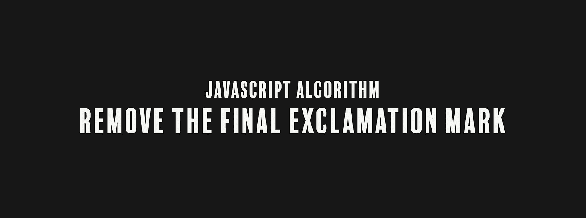

# JavaScript 算法:去掉最后一个感叹号

> 原文：<https://levelup.gitconnected.com/javascript-algorithm-remove-the-final-exclamation-mark-8a7c3c8cd3a2>

## 我们要写一个函数来删除字符串末尾的感叹号



我们将编写一个名为`remove`的函数，它将接受一个字符串(`s`)作为参数。

我们得到一个包含一些单词和感叹号的字符串。该函数的目标是删除字符串末尾的感叹号(如果有)并返回该字符串。以下是一些例子:

```
"Hi!" --> "Hi"
"Hi!!!" --> "Hi!!"
"!Hi" --> "!Hi"
"!Hi!" --> "!Hi"
"Hi! Hi!" --> "Hi! Hi"
"Hi" --> "Hi"
```

我们将研究解决这个问题的两种方法。第一种方法很长，但是使用了基本的 JavaScript 基础知识。第二种方式涉及正则表达式。

对于我们的第一个解决方案，我们创建一个 if 语句。

```
function remove(s) {
    if (s[s.length - 1] === "!") {
        return s.slice(0, s.length - 1);
    } else {
        return s
    }
}
```

或者

```
function remove(s){
  return s[s.length - 1] === "!" ? s.slice(0, s.length - 1) : s
}
```

在我们的字符串输入中，我们要查看最后一个字符串是否有感叹号。我们使用括号符号来获取字符串中的最后一个字符。如果最后一个字符是感叹号，我们使用`slice()`方法。

slice 方法返回字符串的一部分，从开始索引一直到结束索引，但不包括结束索引。我们提取字符串中从开始到倒数第二个字符的所有字符。如果最后一个字符不是感叹号，我们就按原样返回字符串输入。

对于我们的第二个解决方案，有一个使用正则表达式的更简单的方法。

```
function remove(s){
  return s.replace(/!$/, '') 
}
```

我们的正则表达式`/!$/`意味着从字符串的末尾`$`开始寻找感叹号的第一个匹配。美元符号是匹配字符串末尾的字符串锚。

如果发现感叹号，删除它。如果没有发现感叹号，则原样返回字符串输入。

我们的代码到此结束。

如果你觉得这个算法有帮助，看看我的其他 JavaScript 算法解决方案:

[](https://medium.com/@endubueze00/javascript-algorithm-profile-lookup-821bcd88f290) [## JavaScript 算法:配置文件查找

### 我们编写了一个函数，它将遍历一个对象数组，如果确定的话，返回一个特定属性的值…

medium.com](https://medium.com/@endubueze00/javascript-algorithm-profile-lookup-821bcd88f290) [](/javascript-algorithm-record-collection-fc107c1eb612) [## JavaScript 算法:记录收集

### 我们编写一个函数来修改一个包含多个音乐记录的 JSON 对象。

levelup.gitconnected.com](/javascript-algorithm-record-collection-fc107c1eb612) [](/javascript-algorithm-using-objects-for-lookups-d28f34a59504) [## JavaScript 算法:使用对象进行查找

### 我们将把一个 switch 语句转换成一个 JavaScript 对象，并根据给定的…

levelup.gitconnected.com](/javascript-algorithm-using-objects-for-lookups-d28f34a59504)