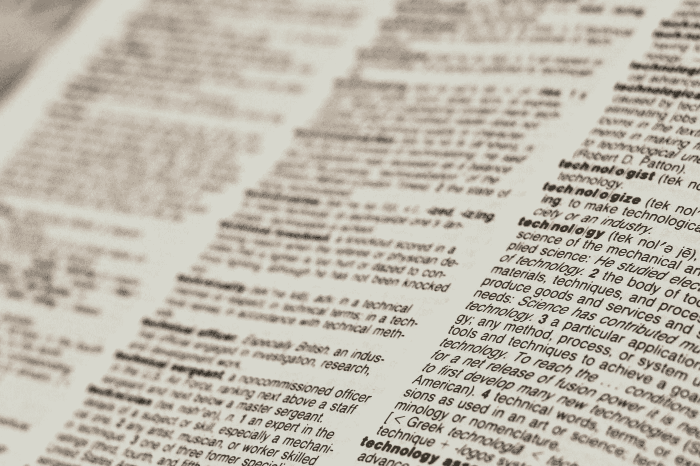

# JavaScript 算法:从句子中返回单词数组

> 原文：<https://levelup.gitconnected.com/javascript-algorithm-return-an-array-of-words-from-a-sentence-b9b74e97ebd3>

## 创建一个函数，该函数将返回一个包含字符串中所有单词的数组。



[Joshua Hoehne](https://unsplash.com/@mrthetrain?utm_source=medium&utm_medium=referral) 在 [Unsplash](https://unsplash.com?utm_source=medium&utm_medium=referral) 上拍摄的照片

我们将编写一个名为`getWords`的函数，它将接受一个字符串`text`作为参数。

给你一串文本。该函数的目标是返回一个包含该字符串中所有单词的数组。该数组应省略所有标点符号和其他非字母数字字符。

示例:

```
let text = "The milkman brought donuts, cheese (along with milk), and a bottle of whiskey to 10 houses.";getWords(text);//output: ["The","milkman","brought","donuts","cheese","along","with","milk","and","a","bottle","of","whiskey","to","10","houses"]
```

首先，我们将使用`replace()`方法和正则表达式从字符串中删除所有非字母数字字符和多余的空格。现在，我们将用一个单倍行距的空字符串替换所有这些字符。

由于缺乏更好的变量名，我们将其赋给一个名为`x`的变量。

```
let x = text.replace(/[^A-Za-z0-9]+/g, " ");
```

接下来，我们将使用`split()`方法把我们的字符串转换成一个数组，但是在此之前我们还需要做一件事。

`replace()`方法删除了所有非字母数字字符，并用一个空格替换它们。但是当字符串以非字母数字字符开始或结束时会发生什么呢？我们只剩下一个字符串，当我们分割数组时，它的开头和结尾都会出现空白。

因此，在我们分割字符串之前，我们将使用`trim()`方法删除字符串开头和结尾的多余空间。

```
let newArr = x.trim().split(" ");
```

在我们修剪文本之后，我们可以使用`split()`方法将我们的字符串转换成单词数组。我们将其赋给一个名为`newArr`的变量。

最后，我们返回包含字符串中所有单词的新数组。

```
return newArr
```

下面是完整的函数:

如果您发现这个算法很有帮助，请查看我的其他 JavaScript 算法解决方案文章:

[](/javascript-algorithm-missing-letters-90009de4720d) [## JavaScript 算法:缺少字母

### 我们编写了一个函数，它将返回按字母顺序排列的字母序列中缺失的字母。

levelup.gitconnected.com](/javascript-algorithm-missing-letters-90009de4720d) [](https://js.plainenglish.io/javascript-algorithm-calculate-sum-of-numbers-in-a-string-dd007da460b7) [## JavaScript 算法:计算字符串中数字的总和

### 计算以逗号分隔的字符串形式接收的数字的总和。

js .平原英语. io](https://js.plainenglish.io/javascript-algorithm-calculate-sum-of-numbers-in-a-string-dd007da460b7) [](/javascript-algorithm-convert-minutes-into-seconds-4d4a0d750b6c) [## JavaScript 算法:将分钟转换成秒钟

### 这是一个关于如何将分钟转换成秒钟的简单函数。

levelup.gitconnected.com](/javascript-algorithm-convert-minutes-into-seconds-4d4a0d750b6c)