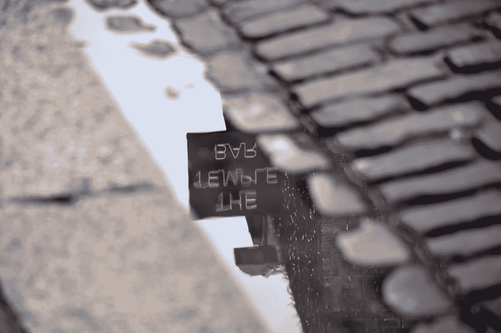

# JavaScript 算法:反转字符串

> 原文：<https://levelup.gitconnected.com/javascript-algorithm-reverse-a-string-c24d06129f03>

## 在 JavaScript 中创建两种反转字符串的方法



Pierre Binet 在 [Unsplash](https://unsplash.com?utm_source=medium&utm_medium=referral) 上拍摄的照片

我们将编写一个名为`reverseString`的函数，它将接受一个字符串`s`作为参数。

这个函数的目标是…反转一个字符串。我们要学习两种反转字符串的方法。一个使用标准的 for 循环，另一个使用 JavaScript 内置方法`reverse()`。所有的大小写都会保留在输出中，所以不需要担心小写。

示例:

```
let str = "Pajamas;
reverseString(str);// output: "samajaP"
```

## For 循环示例

在我们进入 for 循环之前，我们需要创建一个名为`reverseStr`的变量，并为它分配一个空字符串。这是函数最后返回的结果。

```
let reverseStr = "";
```

然后，我们跳转到 for 循环中，从末尾开始遍历字符串，并向后进行。对于我们添加的每个字符串，我们将其连接到`reverseStr`变量。

```
for(let i = s.length - 1; i >= 0; i--){
    reverseStr += s[i];
}
```

因为我们从字符串的末尾开始，所以当我们到达数组的开头时，我们已经创建了反向字符串。然后我们归还它。

```
return reverseStr;
```

下面是完整的函数:

## Reverse()方法示例

要使用`reverse()`方法反转一个字符串，我们必须将该字符串转换成一个数组，因为`reverse()`是数组对象的一部分。我们将使用`split()`方法将字符串转换成数组。我们将这个数组赋给一个名为`reverseStr`的变量。

```
let reverseStr = s.split("");
```

现在我们有了数组，我们可以反转它。

```
reverseStr.reverse();
```

由于`reverse()`方法改变了一个数组，将数组赋给一个额外的变量对于这个函数来说是可选的。接下来我们要做的就是返回反转的结果**，但是**我们使用`join()`方法快速地将数组变回一个字符串。

```
return reverseStr.join("");
```

下面是完整的函数:

[](https://medium.com/javascript-in-plain-english/javascript-algorithm-reverse-an-array-without-using-reverse-238c9f58362a) [## JavaScript 算法:不使用 Reverse()反转数组

### 编写一个函数，不使用内置的 JavaScript reverse 方法来反转一个小数组。

medium.com](https://medium.com/javascript-in-plain-english/javascript-algorithm-reverse-an-array-without-using-reverse-238c9f58362a) [](/javascript-algorithm-missing-letters-90009de4720d) [## JavaScript 算法:缺少字母

### 我们编写了一个函数，它将返回按字母顺序排列的字母序列中缺失的字母。

levelup.gitconnected.com](/javascript-algorithm-missing-letters-90009de4720d) [](https://medium.com/javascript-in-plain-english/javascript-algorithm-power-2cbedf59f40c) [## JavaScript 算法:Power

### 我们将编写一个函数，不使用任何内置的数学函数来返回一个数的幂。

medium.com](https://medium.com/javascript-in-plain-english/javascript-algorithm-power-2cbedf59f40c)