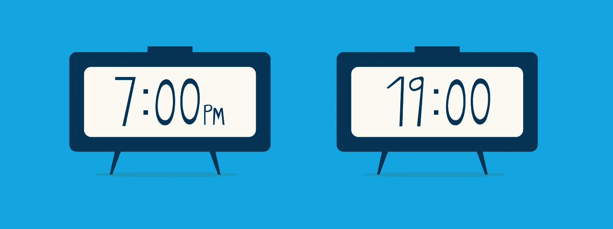
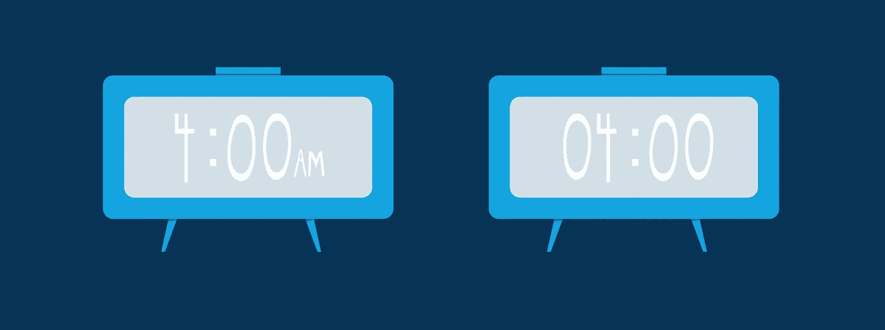

# JavaScript 算法:时间转换

> 原文：<https://levelup.gitconnected.com/javascript-algorithm-time-conversion-71dc15dd13b8>


对于今天的算法，我们将创建一个名为 timeConversion 的函数。这个函数将接受一个字符串作为输入。在此函数中，您将获得一个以 12 小时制表示的时间:

```
07:05:45PM
```

您必须以军用或 24 小时制格式输出时间。

```
19:05:45
```

我们要做的第一件事是获取字符串的前两个数字。这是将 AM/PM 格式的时间转换为军用时间时唯一重要的事情。

```
let hour = s.substring(0, 2) * 1;
let timeFormat = s.substring(2,8);
```

我们使用 string 类的 substring 方法提取从位置 0(第一个字母)到位置 2(第三个字符)的字符。

有多种方法可以将字符串转换成数字，但是如果我们将字符串乘以一个原始数字，它就会被转换。我们的字符串已经是一个数字，我们要乘以 1，因为我们只需要字符串格式的数字。我们不是在这里做数学。我们将把结果添加到一个名为**小时**的变量中。

我们还将创建一个名为 **timeFormat** 的变量，它将接受从第一个冒号到 PM/AM 之前的最后一个数字的所有值:

```
07:05:45PM // before substring(2,8)
:05:45 // after substring(2,8)
```

我们删除了 AM/PM，因为用 24 小时格式写时间是没有用的。我们只想要那一小段绳子，因为它将保持不变。

从 12 小时制转换为 24 小时制时，需要考虑一些事情。其中之一是 12 AM 和 12 PM 转换。


在 24 小时制中，12:00 PM 是… 12:00，但对于 12:00 AM，则是 0:00，因此我们编写以下语句:

```
// if midnight
if (hour === 12 && s.indexOf("AM") !== -1) {
    return ("00" + timeFormat);
}// if afternoon
if (hour === 12 && s.indexOf("PM") !== -1) {
    return (time + timeFormat);
}
```

如果**小时**变量等于 12，我们也必须回头看看我们的原始字符串，看看它是否包含 PM 或 AM 使用 indexOf。IndexOf 将返回一个数字，即第一次找到字符串的字符位置。如果什么都没有找到，它将返回-1。

在我们的第一个 if 块中，如果值是 midnight，我们必须检查是否是 12:00 以及字符串是否包含 AM。如果是这样，我们将从 **timeFormat** 变量中为剩余的字符串追加“00”。如果值是 noon，我们将简单地将**小时**变量连接到**时间格式**变量。

接下来我们要看的是午夜和中午之间以及中午和午夜之间的时间:

```
// if hour is from 1 to 11PM, add 12 to the time
if (hour < 12 && s.indexOf("PM") !== -1) {
    return (12 + hour + timeFormat);
} else { // if hour is from 1 to 11 AM
    if (hour < 10) { // if number is less than 10, add a zero in front
        return ("0" + hour + timeFormat);
    } else { // if number is greater than 9, just add rest of string
        return (hour + timeFormat);
    }
}
```

在我们的 if 块中，我们将查看 PM 时间。如果数字小于 12，但是是 PM 时间，我们只需在小时上加 12。



在 else 语句中，我们将查看小于 12 的 AM 时间。我们包含了一个嵌套的 if 语句，因为对于 AM 时间有几件事情需要检查。

在我们的第一个 if 块中，如果 time 小于 10，我们必须在这个数字前面附加一个零。



但是对于所有大于 9 的值，只需输出时间。

确保将**小时**变量连接到来自**时间格式**变量的字符串。

这就是我们的时间转换函数。如果由于某种原因，你最终去了一个使用军事时间的地方，你可以运行这个代码，尽管在脑子里算一下会快得多。

要查看更多 JavaScript 算法，请查看以下文章:

[](https://medium.com/javascript-in-plain-english/javascript-algorithm-birthday-cake-candles-86da2c686634) [## JavaScript 算法:生日蛋糕蜡烛

### 对于今天的算法，我们将创建一个名为生日蛋糕蜡烛的函数。

medium.com](https://medium.com/javascript-in-plain-english/javascript-algorithm-birthday-cake-candles-86da2c686634) [](https://medium.com/swlh/mini-max-sum-a62de1d7f4f1) [## 最小-最大和

### 对于今天的算法，我们将创建一个名为 miniMaxSum 的函数。在这个函数中，给你一个数组…

medium.com](https://medium.com/swlh/mini-max-sum-a62de1d7f4f1)