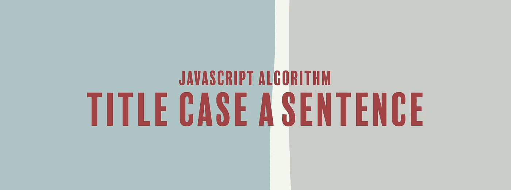

# JavaScript 算法:标题大小写一句话

> 原文：<https://levelup.gitconnected.com/javascript-algorithm-title-case-a-sentence-995da42238f0>

## 我们写了一个函数，将字符串转换成标题大小写。



我们将编写一个名为`titleCase`的函数，它将接受一个字符串(`str`)作为参数。

该函数的目标是获取给定的字符串，将其转换为标题大小写并返回结果。标题格是指句子中每个单词的第一个字母大写。为了实现这个功能，您还应该大写连接词，如“the”、“and”和“of”。

示例:

```
let str = "sHoRt AnD sToUt";// returns "Short And Stout";
```

我们首先使用`toLowerCase()`方法将每个字符串转换成小写。可以把它想象成重新设置每个字符串，这样我们就可以回去正确地大写每个单词。我们将小写的字符串赋给一个名为`strLowerCase`的变量。

```
let strLowerCase = str.toLowerCase();
```

接下来，我们使用`split()`方法将字符串转换成数组。然后我们在数组上使用`map()`方法来遍历字符串中的所有单词。

因为 map 方法将返回一个新的数组，所以我们将每个单词的第一个字母大写。然后我们把大写的第一个字母和单词的其余部分连接起来。我们使用`substring()`方法提取字符串中剩余的字母。

我们将这个新数组赋给一个名为`wordArr`的变量。

```
let wordArr = strLowerCase.split(" ").map(function(currentValue) {
    return currentValue[0].toUpperCase() + currentValue.substring(1);
});
```

我们使用`join()`方法将数组连接到一个字符串，并返回该字符串。

```
return wordArr.join(" ");
```

下面是该函数的其余部分:

如果你觉得这个算法有帮助，可以看看我最近的其他 JavaScript 算法解决方案:

[](https://medium.com/javascript-in-plain-english/javascript-algorithm-power-2cbedf59f40c) [## JavaScript 算法:Power

### 我们将编写一个函数，不使用任何内置的数学函数来返回一个数的幂。

medium.com](https://medium.com/javascript-in-plain-english/javascript-algorithm-power-2cbedf59f40c) [](https://medium.com/javascript-in-plain-english/javascript-algorithm-first-reverse-85243cccdb3d) [## JavaScript 算法:先反向

### 我们要写一个函数，输出一个反过来写的字符串。

medium.com](https://medium.com/javascript-in-plain-english/javascript-algorithm-first-reverse-85243cccdb3d) [](https://medium.com/javascript-in-plain-english/javascript-algorithm-migratory-birds-848ad6a99ac3) [## JavaScript 算法:候鸟

### 对于今天的算法，我们将编写一个名为 migratoryBirds 的函数，在这个函数中，我们将接受一个…

medium.com](https://medium.com/javascript-in-plain-english/javascript-algorithm-migratory-birds-848ad6a99ac3)