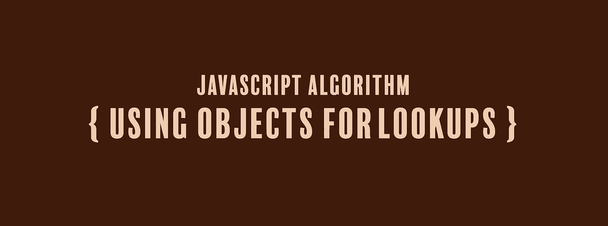

# JavaScript 算法:使用对象进行查找

> 原文：<https://levelup.gitconnected.com/javascript-algorithm-using-objects-for-lookups-d28f34a59504>

## 我们将把 switch 语句转换成 JavaScript 对象，并根据给定的属性名返回对象的属性值。



今天我们将编写一个名为`phoneticLookup`的函数，它将接受一个字符串(`val`)作为参数。

在我们的函数中，我们有一个包含一系列情况的 switch 语句:

```
switch (val) {
    case "alpha":
        result = "Adams";
        break;
    case "bravo":
        result = "Boston";
        break;
    case "charlie":
        result = "Chicago";
        break;
    case "delta":
        result = "Denver";
        break;
    case "echo":
        result = "Easy";
        break;
    case "foxtrot":
        result = "Frank";
}
```

每种情况下，我们也有一组数值。这相当于在 if 语句中使用`if(val === case)`。虽然使用 switch 语句或一系列 if 语句是可以的，但如果您只是查找值或有表格数据，则可以使用对象。

当您有固定数量的数据时，使用对象非常有用。您只想知道与您给它的输入相关联的名称。

该函数的目标是将 switch 语句转换成带有 key:value 对的 JavaScript 对象，并返回给定键的值(`val`)。

在这个 switch 语句中，每个`case`是一个键，每个`result`变量是一个与该键配对的值。我们清理它，创建一个对象，并将其赋给一个名为`lookup`的变量。

```
let lookup = {
    "alpha": "Adams",
    "bravo": "Boston",
    "charlie": "Chicago",
    "delta": "Denver",
    "echo": "Easy",
    "foxtrot": "Frank"
}
```

我们的函数输入`val`将成为我们对象的属性名。

我们使用括号符号(点符号也可以)将该对象属性的值赋给一个名为`result`的变量，并返回它。

```
let result = lookup[val];
return result;
```

因此，如果我们的函数有一个参数`"alpha"`，该函数将查找`lookup["alpha"]`并返回`"Adams"`。下面是该函数的其余部分:

```
function phoneticLookup(val) {
    let lookup = {
        "alpha": "Adams",
        "bravo": "Boston",
        "charlie": "Chicago",
        "delta": "Denver",
        "echo": "Easy",
        "foxtrot": "Frank"
    }
    let result = lookup[val];
    return result;
}phoneticLookup("charlie");
```

如果你觉得这个算法有帮助，可以看看我最近的 JavaScript 算法解决方案:

[](https://medium.com/javascript-in-plain-english/javascript-algorithm-vowel-remover-c8808868ee55) [## JavaScript 算法:元音去除器

### 我们将创建一个函数来删除字符串中的所有元音

medium.com](https://medium.com/javascript-in-plain-english/javascript-algorithm-vowel-remover-c8808868ee55) [](https://medium.com/@endubueze00/javascript-algorithm-set-alarm-54a7abd094d7) [## JavaScript 算法:设置警报

### 我们将编写一个函数，它将根据你是否有工作来决定是否值得设置闹钟，并且…

medium.com](https://medium.com/@endubueze00/javascript-algorithm-set-alarm-54a7abd094d7) [](https://medium.com/swlh/javascript-algorithm-stand-in-line-92e1e21e2f52) [## JavaScript 算法:排队

### 我们将编写一个基于计算机科学概念的函数，称为队列，在这里我们添加和删除项目到…

medium.com](https://medium.com/swlh/javascript-algorithm-stand-in-line-92e1e21e2f52)