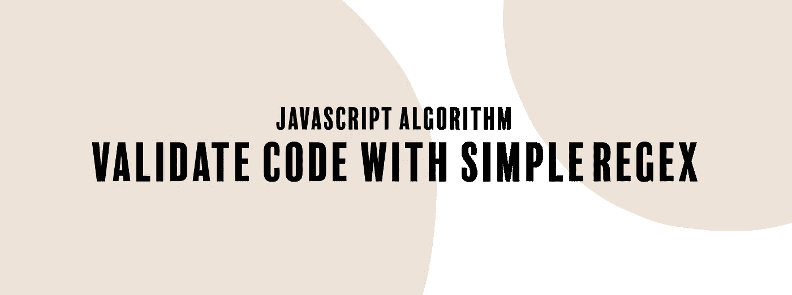

# JavaScript 算法:用简单的正则表达式验证代码

> 原文：<https://levelup.gitconnected.com/javascript-algorithm-validate-code-with-simple-regex-827bbbc066dd>

## 编写一个使用正则表达式验证数字代码的函数。



我们将编写一个名为`validateCode`的函数，它将接受一个整数(`code`)作为参数。

你会得到一个不同长度的数字代码。该函数的目标是检查代码是以 1、2 还是 3 开头。如果数字以这些数字中的任何一个开始，返回`true`。否则返回`false`。

示例:

```
let code = 123; // true
let code = 55334; // false
```

您可以不使用正则表达式来解决这个算法，但是如果您使用它，识别字符串模式会更快(有时更容易)。

让我们首先将数字参数转换成一个字符串，并将该字符串赋给一个名为`codeStr`的变量。

```
let codeStr = code + "";
```

我们希望编写一个正则表达式模式，以字符串的第一个字符为目标，并查看它是以 1、2 还是 3 开头。我们可以使用两种正则表达式模式。

```
/^[123]/
```

上面的模式查看第一次出现的 1、2 或 3。起始锚或`^`匹配字符串的开头。

```
/\b[123]/g;
```

我们也可以用边界锚或者`\b`这个词。这匹配单词字符和非单词字符之间的单词边界位置或者字符串的开始或结束位置。该模式还查看字符串的开头，检查第一个字符是否以这些数字之一开头。

为了针对`codeStr`测试我们的正则表达式模式，我们将使用`test()`方法。test 方法执行正则表达式和指定字符串之间的匹配搜索。它将根据匹配返回`true`或`false`。

我们返回测试方法的结果。

```
return regex.test(codeStr);
```

我们的代码到此结束。下面是该函数的其余部分:

```
function validateCode (code) {
  let codeStr = code + "";
  let regex = /^[123]/;
  return regex.test(codeStr);
}
```

或者

```
function validateCode (code) {
  let codeStr = code + "";
  let regex = /\b[123]/g;
  return regex.test(codeStr);
}
```

如果您发现这个算法很有帮助，请查看我的其他 JavaScript 算法解决方案文章:

[](https://medium.com/@endubueze00/javascript-algorithm-sorted-union-9e316654561f) [## JavaScript 算法:排序联合

### 我们编写一个函数，它将返回从两个或更多其他数组中获取的唯一值的数组。

medium.com](https://medium.com/@endubueze00/javascript-algorithm-sorted-union-9e316654561f) [](/javascript-algorithm-search-and-replace-6895e17ccfd7) [## JavaScript 算法:搜索和替换

### 我们编写了一个函数，可以对字符串执行简单的搜索和替换操作。

levelup.gitconnected.com](/javascript-algorithm-search-and-replace-6895e17ccfd7) [](/javascript-algorithm-missing-letters-90009de4720d) [## JavaScript 算法:缺少字母

### 我们创造了两个变量。let alphabet = " abcdefghijklmnopqrstuvwxyz "；let starting point = alphabet . index of(str[0])；的…

levelup.gitconnected.com](/javascript-algorithm-missing-letters-90009de4720d)