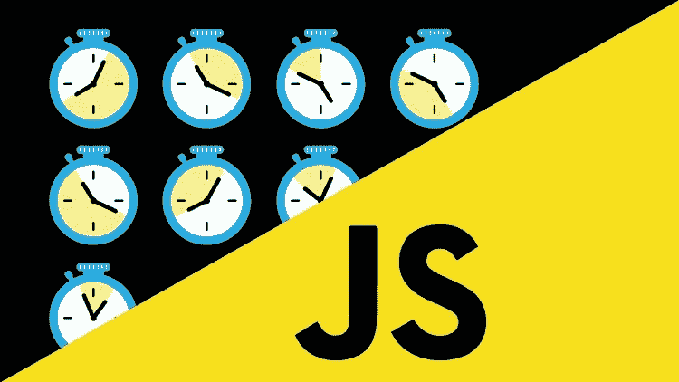
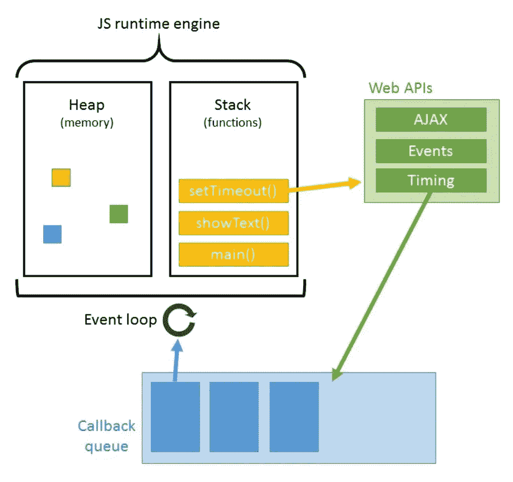

# Javascript 和异步魔术——解释 JS 引擎和事件循环

> 原文：<https://levelup.gitconnected.com/javascript-and-asynchronous-magic-bee537edc2da>



当我们说 JavaScript 是单线程或同步的时候，我们指的是什么？在 JS-speak 中，这些术语是这样一个事实的同义词，即 Javascript 引擎，无论是像 Google Chrome 的 V8 这样的浏览器引擎，还是在本地机器上用 NodeJS 解释的代码，都只有一个调用栈。

就如何编写高效的 Javascript 代码而言，仅仅这个事实就有非常重要的意义。这篇文章将探讨我目前对其中一些含义的了解，以及使用 Javascript ES6 的异步功能解决这些问题的方法。

## Javascript 引擎

首先，我们需要了解 JavaScript 引擎是如何工作的，以及这个架构实际上是什么样子。下图中可以看到 Javascript 引擎:



发动机有几个部分。

1.  ***堆*** :这是用来存储变量、函数、对象的物理内存空间。因为 Javascript 中的一切都是对象，所以使用`new`关键字在内存中分配的任何东西都存储在堆中。Javascript 还有一个垃圾收集器，可以释放分配的内存，这样就不必像在 C/C++中那样手动释放。
2.  ***栈*** :这里是存储函数和 API 调用(浏览器中的 Web API 和本地机器上的 C/C++ API 通过 NodeJs)的地方。这部分的行为就像一个典型的具有后进先出结构(LIFO)的堆栈数据结构。函数调用被添加到堆栈的顶部，并在执行完成后从顶部弹出。
3.  ***API(Web 或 C/C++)*** :这是`setTimeout()`和`fetch()`等内置函数的实际功能所在的位置。在某种程度上，像`setTimeout()`这样的函数可以被认为是激活了 API 函数，然后在 API 函数继续在后台运行的同时被立即弹出调用堆栈(在这种情况下，一个定时器在后台运行)。
4.  ***回调队列*** :一些像`setTimeout()`这样联系 API 的函数需要提供一个回调函数给它，这样它就知道 API 函数运行后该做什么。在这种情况下，回调函数被放在回调队列中。队列本身就像队列数据结构一样，是一种先进先出结构(FIFO)。
5.  ***事件循环*** :事件循环是一种不断检查调用栈，看是否有需要运行的函数调用的算法。当调用堆栈为空时，回调队列中的第一项被推送到调用堆栈上以完成执行。这种情况会一直发生，直到队列为空。

## 单线程与多线程

我们已经知道 Javascript 是一种单线程语言，它只有一个调用栈，但是这实际上意味着什么呢？在计算机科学中，线程就像一个能够独立运行代码行的实体。因此，单线程就像是说只有一个实体在运行代码行。多线程就像是说有多个实体能够同时运行多行代码。

单线程应用的含义是，瓶颈是不可避免的，一系列代码行的运行时间受到运行时间最长的代码行的速度限制。例如，如果您要运行以下内容:

```
console.log("Hello");
const takesALongTime = () => {
  // Function that takes 1 hour to runtakesALongTime();
console.log("Bye");
```

Javascript 的单线程特性意味着这一系列代码将把`Hello`打印到控制台，然后花整整一个小时才把`Bye`打印到控制台。没有办法绕过中间函数，因此第二个控制台日志可以在中间函数完成之前运行。在这种情况下，第一个`console.log`被推到调用堆栈上，执行，然后弹出。中间的函数被推送到调用堆栈中，而在它内部运行的任何其他函数都被推送到调用堆栈中。最后，中间的函数在一个小时后被弹出，最后一个`console.log`被推入、运行并从调用堆栈中弹出。效率很低，是吧？

## 一个可行的解决方案:异步回调

Javascript 可以做的一件很酷的事情是将函数作为参数传递给其他函数。当一个函数被传递给另一个函数而没有`()`时，它被称为回调函数。例如，如果您有以下代码:

```
function functionOne(num) {
  console.log(num);
}function functionTwo(num, callback) {
  callbackNum = 10;
  callback(callbackNum);
  console.log(num);
}functionTwo(5, functionOne); //outputs 10, then 5 on a new line
```

这创建了一个闭包，其中函数`functionOne`可以访问`functionTwo`的范围。函数`functionOne`作为回调传递给`functionTwo`，因此，回调函数本身被放入 Javascript 引擎的回调队列中，然后当回调函数为空时，将回调函数推送到调用堆栈中。

当然，我们知道`console.log`立即运行，所以我们把`functionOne`放在回调队列中，但是由于调用栈是空的，所以它立即被放在调用栈上运行，这样就打印出了为 10 的`callbackNum`，然后从栈中弹出。然后将`console.log(num)`放在调用堆栈上，打印 5。

这不是一个非常有用的例子，所以让我们用这个函数花了一个小时执行的代码作为例子。以下是评论:

```
console.log("Hello");
const takesALongTime = () => {
  // Function that takes 1 hour to runtakesALongTime();
console.log("Bye");
```

您不能自己编写一个异步 Javascript 函数。你可以做的是使用一个异步原语，比如`setTimeout()`，它将与回调队列交互。那么，我们如何使用`setTimeout()`来允许在`takesALongTime()`完成之前打印`Bye`？我们可以这样做:

```
console.log("Hello");
const takesALongTime = () => {
  // Function that takes 1 hour to run
setTimeout(takesALongTime, 2000);
console.log("Bye");
```

这将打印出`Hello`，然后是`Bye`，然后等待一个小时，等待`takesALongTime()`函数完成执行，然后退出程序。那么这里到底发生了什么呢？

1.  将`console.log("Hello")`推入调用堆栈并执行。然后它被弹出。
2.  `setTimeout(takesALongTime, 1000)`被推到调用堆栈上。`setTimeout`函数与 Web API 或 C/C++ API 交互，启动一个 2 秒计时器。
3.  `setTimeout`函数的工作已经完成，所以它被弹出调用堆栈。
4.  将`console.log("Bye")`推入调用堆栈并执行。然后它被弹出。
5.  两秒钟后，计时器结束，并且`takesALongTime`回调被加入回调队列。
6.  事件循环查看调用堆栈，发现它是空的，于是它将`takesALongTime`回调函数推到调用堆栈上执行。
7.  一小时后，`takesALongTime`完成，并从调用堆栈中弹出。

## 更好的解决方案:Javascript Promise 对象


所以当我说你不能写异步函数的时候，我有点撒谎了。Javascript ES6 引入了一个名为 promises 的特性，使得编写异步 Javascript 更加容易。承诺基本上是将来可能解析(本质上是返回)一个值的对象，但它将通过回调通知调用函数它是否成功。

承诺有三种状态:履行、拒绝或待定，这三种状态的定义都很简单。完整的承诺流程由以下序列组成:

```
1\. Executor code (may take time to complete)
2\. One or more consumer code (uses result of previous executor or consumer code)
3\. (optional) error catch code
```

承诺可以通过以下方式宣布:

```
let promise = new Promise((resolve, reject) => {
  // executor code
});
```

promise 对象具有内部属性:

1.  `state` —承诺的当前状态，可以是“已履行”、“已拒绝”或“待定”。当 executor 代码运行时，状态是“待定”,当承诺完成时，状态可以是“履行”或“拒绝”。
2.  `result` —某个任意值。

传入的参数`resolve`和`reject`是 Javascript 引擎的两个内部函数，根据承诺的最终状态运行。

1.  `resolve`在履行承诺时运行，它将承诺的状态设置为“已履行”，并将结果设置为某个指定的值。
2.  `reject`在承诺被拒绝时运行，它将承诺的状态设置为“已拒绝”,并将结果设置为错误。

例如，下面的代码运行 executor 函数，成功后，将内部变量`state`设置为`"fulfilled"`并将`result`设置为`"Success"`:

```
let promise = new Promise((resolve, reject) => {
  console.log("Hello");
  resolve("Success");
});
```

下面是一个使用`reject`功能失败的例子:

```
let promise = new Promise((resolve, reject) => {
  console.log("No hello");
  reject("Failure");
});
```

不过有一个陷阱！不能直接访问`state`和`result`变量。它们必须通过“消费者”来访问。主要消费关键词是`then`。还有一个`catch`消费者调用，专门用于执行器代码遇到错误而无法完成时。

`then`调用的语法如下:

```
promise.then(result => successFunction, error => failureFunction);
```

这就是承诺的异步性的来源。`.then`在承诺解决后运行(即从“待定”变为“已履行”/“已拒绝”)。第一个参数在承诺成功时运行，而第二个参数在承诺失败时运行，但是两者都将接收到`result`是成功并提供值还是失败并提供错误。

这是回调队列真正出彩的地方。所有的`.then`处理程序都被放入回调队列，这实质上允许所有的承诺代码被直接读取，但不一定被执行。正如我们所了解的，Javascript 引擎只在调用栈为空时查看回调队列。因此，这允许在承诺的`.then`处理程序之后编写的代码首先执行，即使承诺立即得到解决。一旦所有主函数调用完成，就会执行`.then`处理程序。举个例子:

```
let promise = new Promise((resolve, reject) => {
  console.log("Hello");
  resolve("Promise complete");
});
promise.then(result => console.log(result));
console.log("Bye");// Output
Hello
Bye
Promise complete
```

Javascript 引擎从头到尾阅读承诺，然后是剩余的代码。在这个执行`promise.then(result => console.log(result))`的过程中，它执行 promise 对象，并将`console.log("Hello")`推送到调用栈上，调用栈运行并弹出。然后，它用等于`"Promise complete"`的`result`来解析承诺。然而，它读取到一个`.then`遵循承诺解析，并将其放在回调队列中。然后，它将`console.log("Bye")`命令推到调用堆栈上，在那里执行然后弹出。最后，由于调用栈现在是空的，它将`console.log(result)`推到调用栈上，并打印`"Promise complete"`，后者使用来自执行器代码的结果。

综上所述，在我们最初的例子中，我们现在可以将`takesALongTime`变成一个承诺，这样它就可以异步执行了！

```
const takesALongTime = new Promise((resolve, reject) => {
  // Code that takes 1 hour to run
  resolve("That took an hour...");
});console.log("Hello");
takesALongTime.then(result => console.log(result));
console.log("Bye");//Output
Hello
Bye
That took an hour...
```

## 结论

老实说，这只是触及了异步 Javascript 的皮毛。你能做的事情太多了，也太复杂了。我也还在学习，有些东西让我很难理解！我们甚至还没有涵盖来自 ES8 的`async/await`组合！希望这能给 Javascript 引擎的工作方式提供一点背景知识，以及如何解决这种令人敬畏的语言的单线程特性。请让我知道是否有任何可以改进的地方。谢谢！

请随时与我联系！我也在找工作，所以如果你知道任何纽约市地区的招聘人员或公司在寻找全栈软件工程师，请告诉我！:)我喜欢写这样的帖子，并将继续这样做，因为我在我们生活的这个不断变化的技术世界中学到了更多有趣的东西！

[投资组合](http://derekhkwok.com)

[LinkedIn](https://linkedin.com/in/derekkwok94)

[Github](https://github.com/dkwok94)

[](https://levelup.gitconnected.com)[](https://gitconnected.com/learn/javascript) [## 学习 JavaScript -最佳 JavaScript 教程(2019) | gitconnected

### 50 大 JavaScript 教程-免费学习 JavaScript。课程由开发人员提交并投票，从而实现…

gitconnected.com](https://gitconnected.com/learn/javascript)