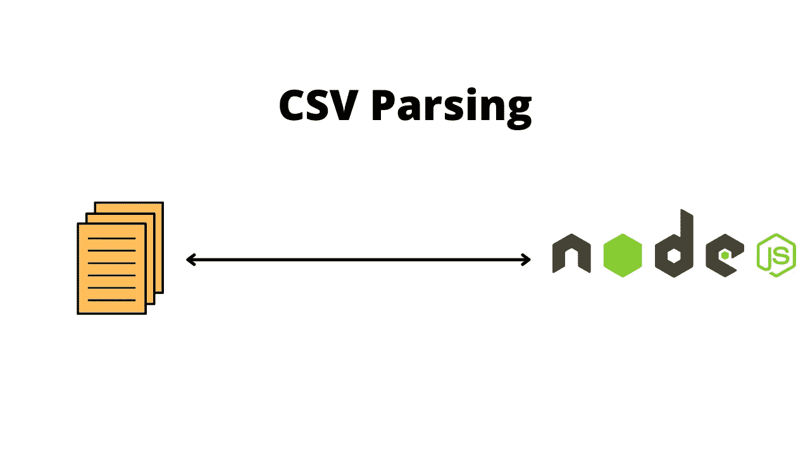

# 用于数据工程的 JavaScript/Nodejs 开源 ETL 工具和脚本——第 1 部分“抽取”

> 原文：<https://levelup.gitconnected.com/javascript-and-node-js-open-source-etl-tools-for-easy-data-engineering-part-1-on-extraction-deb9ea32b910>

本文是一个系列的一部分，为您提供关于最佳 JS 和 Node 开源 ETL 工具的全面指南，描述特性，展示有用的现代 JS 代码片段，并触及利用这些工具的一些限制。


# TL；速度三角形定位法(dead reckoning)

*   ETL 管道的第一步是从数据源中提取数据。
*   在这个阶段，重要的是选择数据源，决定提取什么数据以及如何查询或检索数据。

# 1.对于 XML 提取

要生成用于测试目的的随机 XML 数据，请访问[这里](https://codebeautify.org/generate-random-xml)


## 快速 xml 解析器

验证 XML，将 XML 解析为 JS 对象，或者在没有基于 C/C++的库和回调的情况下从 JS 对象构建 XML。

```
const { XMLParser, XMLBuilder, XMLValidator } = require("fast-xml-parser");
const fsPromise = require("fs").promises;const readXmlData = async (filename) => {
  const readFile = await fsPromise.readFile(filename, "utf-8");
  const parser = new XMLParser();
  let data = parser.parse(readFile);
  return data;
};
```

# 2 用于 CSV 提取

要生成用于测试目的的随机 CSV 数据，请访问此处的



## 2.1 CSV-解析

`[csv-parse](https://csv.js.org/parse/)` [包](https://csv.js.org/parse/)是一个将 CSV 文本输入转换成数组或对象的解析器。它是 [CSV 项目](https://csv.js.org/)的一部分。

它实现了 Node.js `[stream.Transform](http://nodejs.org/api/stream.html#stream_class_stream_transform)` [API](http://nodejs.org/api/stream.html#stream_class_stream_transform) 。为了方便起见，它还提供了一个简单的基于回调的 API。它不仅非常容易使用，而且功能强大。它于 2010 年首次发布，由一个大型社区用于大数据集。

```
const { parse } = require("csv-parse/sync");
const readCsvData = async (filename) => {
  const fileData = await fs.readFile(filename);
  return await parse(fileData, {columns: true});
};
```

## 2.2 csv 解析器

流式 CSV 解析器，旨在实现最高速度以及与 [csv-spectrum](https://npmjs.org/csv-spectrum) CSV acid 测试套件的兼容性。

`csv-parser`能够以每秒 90，000 行的速度将 CSV 转换成 JSON。性能因使用的数据而异；尝试`bin/bench.js <your file>`对您的数据进行基准测试。

```
const csv = require('csv-parser')
const fs = require('fs')const readCsvData = async (filename) => {
 return new Promise((resolve, reject) => {
   const results = [];
   fs.createReadStream(filename)
     .pipe(csv())
     .on('error', (err) => {
       reject(err);
     })
     .on('data', (data) => results.push(data))
     .on('end', () => {
       resolve(results);
     });
 })
}
```

# 3.对于 JSON 提取

要生成用于测试目的的随机 json 数据，请访问此处的[和](https://random-data-api.com/)


读取 JSON 文件最简单的方法是请求它。传递带有 JSON 文件路径的`require()`将同步读取数据并解析成 JavaScript 对象。

```
const data = require(filename)
// for example, const data = require("./data.json");
```

但是用 require 读取 JSON 文件有它的缺点。该文件将只被读取一次；再次请求它将返回第一次运行 require 时的缓存数据。这对于在启动时加载静态数据(比如配置数据)来说很好。但是对于读取磁盘上发生变化的文件，就像我们的 *customer.json* 可能做的那样，我们需要使用异步`fs.readFile`手动读取文件。

```
const fs = require("fs").promises;const readJsonData = async (filename) => {
  const readFile = await fs.readFile(filename, "utf-8");
  return JSON.parse(readFile);
};
```

# JavaScript & Node.js 开源 ETL 工具的局限性

尽管 JavaScript 和 Node.js 开源 ETL 工具可以为您的数据管道提供坚实的基础，但是它们有一些限制，尤其是在提供支持方面。

由于这些工具是正在开发的工具，它们中的许多还没有完全开发出来，并且与多种数据源不兼容。这些工具的一些局限性包括:

*   **企业应用程序连接**:由于兼容性的原因，公司不能用 Node.js 开源 ETL 工具连接他们的一些应用程序。
*   **管理&错误处理能力**:许多开源的 ETL 工具由于缺乏错误处理能力而不容易处理错误。
*   **大数据量&小批量窗口**:很多 Node.js 开源 ETL 工具需要分析大数据量，但是只能处理小批量的数据。这是因为许多工具都是命令行界面，需要 Node.js 和 ETL 工具的强大功能才能有效运行。
*   **复杂转型需求**:有复杂转型需求的公司不能使用 Node.js 开源 ETL 工具。这是因为它们通常缺乏对执行复杂转换的支持。
*   **缺乏客户支持团队**:由于开源 ETL 工具由世界各地的社区和开发者管理，他们没有专门的客户支持团队来处理问题。
*   **安全性差**:开源导致这些工具安全性差，容易受到网络攻击。

一旦数据被提取出来，ETL 管道的下一步就是转换它[这里是](https://medium.com/@caopengau/javascript-nodejs-open-source-etl-tools-and-scripts-for-data-engineering-part-2-on-transform-afabd0026c98)。

**行动呼吁**

如果你觉得这个指南有帮助，请鼓掌并跟我来。通过[链接](https://medium.com/@caopengau/membership)加入 medium，获取我和所有其他优秀作家在 medium 上发表的所有优质文章。