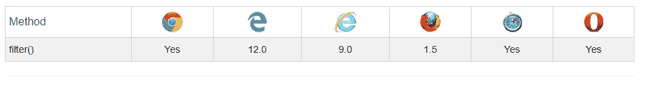

# JavaScript Array.filter()

> 原文：<https://levelup.gitconnected.com/javascript-array-filter-6c6c6585da31>


韦德·奥斯汀·埃利斯在 [Unsplash](https://unsplash.com/?utm_source=unsplash&utm_medium=referral&utm_content=creditCopyText) 上的照片

## 它是什么以及如何使用它？

它创建一个新数组，其中包含由提供的函数实现的给定条件下的所有元素。

此外，它不会改变应用它的原始数组。

```
let filteredArray = orginalArray.filter(
    callback(element[, index, [array]])[, thisArg]
)
```

这里，`filteredArray`包含了通过测试的所有元素。如果没有元素通过测试，将返回一个空数组。

`**callback**`:测试数组各元素的函数。返回`true`保持元素，`false`否则。

它需要三个参数:

`**element**`:数组的当前元素。

`**index | Optional**`:当前正在处理的元素的索引。

`**array | Optional**`:正在应用过滤的原始数组。

`**thisArg | Optional**`:执行`callback`时用作`this`的值。

简单来说:

```
var filteredArray = orginalArray.filter(function(arrayItem) {
 return condition;
});
```

这里，`arrayItem` 指的是数组中的当前元素，`filter()`根据条件对其进行检查。当我们想要访问对象的属性时，这个语法对对象很有用。

# 例子

## 简单的例子

```
var numbers = [1, 5, 8, 11, 14];var evenNumber = numbers.filter(function(number) {
  if(number%2 == 0 ) 
  {
      console.log(number);
  };
});// 8 14
```

## 使用对象

假设，我们有一个对象列表，我们想根据某些条件或某些属性过滤一些对象。

一种方法是使用循环 的 ***手动迭代对象列表，然后根据条件返回过滤后的列表。***

```
var vehicles = [
 {name: "Audi", type: "Car"},
 {name: "Mercedes", type: "Car"},
 {name: "Ducati", type: "Bike"},
 {name: "Harley Davidson", type: "Bike"},
];var carItems = [];for (var i = 0; i < vehicles.length ; i++) {
    if (vehicles[i].type === "Car") {
        carItems.push(vehicles[i]);
    }
}console.log(carItems);
// [ { name: 'Audi', type: 'Car' }, { name: 'Mercedes', type: 'Car' } ]
```

然而，使用`array.filter()`，我们可以用最少的代码轻松做到这一点。

```
var vehicles = [
 {name: "Audi", type: "Car"},
 {name: "Mercedes", type: "Car"},
 {name: "Ducati", type: "Bike"},
 {name: "Harley Davidson", type: "Bike"},
];var carItems =  vehicles.filter(function(vehicle) {
 return vehicle.type == "Car";
});console.log(carItems);
// [ { name: 'Audi', type: 'Car' }, { name: 'Mercedes', type: 'Car' } ]
```

# 用例

*   一般来说，如果我们需要对数组中的每个元素应用任何特定的条件，并基于该条件返回结果，就使用`Array.filter()` 。
*   我们还可以使用它根据相同的属性从列表中过滤对象。
*   **过滤嵌套数组** —但是，我们必须首先 ***减少*** 数组，然后 ***过滤*** 我们想要的值。

```
const characters = [
    [
        { type : 'Hero', name: "Batman" }, { type : 'Hero', name: "Superman" } ],
    [
        { type : 'Villan', name: "Joker" },{ type : 'Villan', name: "Lex Luthor" } ]
]const villains = characters
                .reduce((characterA , characterB) => characterA.concat(characterB))
                .filter((obj) => obj.type === 'Villan');console.log(villains)// Output -->
[
  { type: 'Villan', name: 'Joker' },
  { type: 'Villan', name: 'Lex Luthor' }
]
```

# 浏览器支持



# 快速小结

*   取一个测试函数。
*   返回包含通过测试的元素的新数组。
*   如果没有匹配项，则返回一个空数组。
*   它可以用来代替循环 中的 ***来过滤数组，而不是我们自己手动循环数组。***

## 参考

MDN
Scotch
等各种在线教程。