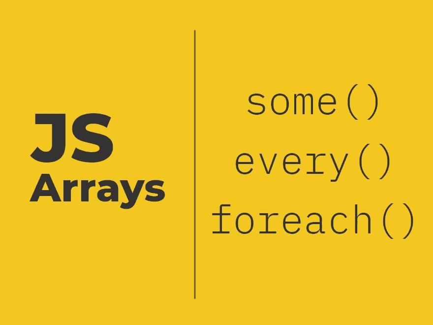

# JavaScript 数组:Some()、Every()和 forEach()

> 原文：<https://levelup.gitconnected.com/javascript-array-some-vs-every-vs-foreach-knowledge-scoops-81dfe43369c6>

## 解释每种方法的用法



# Some()方法

`some()`方法遍历元素并检查数组中的值是否满足条件。`some()`方法接受具有以下签名的布尔表达式:

```
(element) => boolean
```

`element`是数组中的当前元素，其值正在被检查。

`boolean`表示该函数返回一个布尔值。

考虑以下整数数组:

```
let arr = [1, 2, 3, 4, 5, 6, 7, 8];
```

我们将使用`some()`方法来检查数组中是否至少有一个元素。

```
arr.some((value)=> { return (value%2 == 0); });
```

输出:

```
true
```

该数组包含可被`2`整除的元素，因此`some()`方法返回`true`。

当你用`some()`法求负数时:

```
arr.some((value)=> { return (value < 0); });
```

输出是:

```
false
```

它是`false`,因为数组中没有负数。

一旦找到满足所需布尔表达式的元素，`some()`方法就停止迭代。

```
arr.some((value) => { 
    index++;
    console.log(index); 
    return (value % 2 == 0); 
});
```

输出是:

```
1 2 true
```

# Every()方法

与`some()`相反，`every()`方法检查数组中的元素是否满足布尔表达式。如果单个值不满足元素，它返回`false`，否则返回`true`。

```
let arr = [1, 2, 3, 4, 5, 6, 7, 8];arr.every((value)=> { 
    return (value > 0); 
});
```

因为数组`arr`中的所有值都是正的，所以布尔表达式满足所有值。我们接收`true`作为输出。

如果有一个值不满足布尔表达式，我们得到布尔输出`false`。

```
arr.every((value)=> { return (value == 5); });
```

输出:

```
false
```

一旦任何值没有通过布尔表达式，`every()`方法就停止迭代元素。

```
arr.every((value) => { 
    index++; 
    console.log(index); 
    return (value != 4); 
});
```

输出:

```
1 2 3 false
```

# forEach()方法

顾名思义，`forEach()`方法用于迭代数组的每个元素，并对其执行所需的操作。

```
let arr = [1, 2, 3, 4, 5, 6, 7, 8];arr.forEach((value) => { 
    console.log(value == 5); 
});
```

我们得到的输出为:

```
false false false false true false false false
```

这里没有什么不同，只是用操作 *(* 根据需要)迭代每个元素。