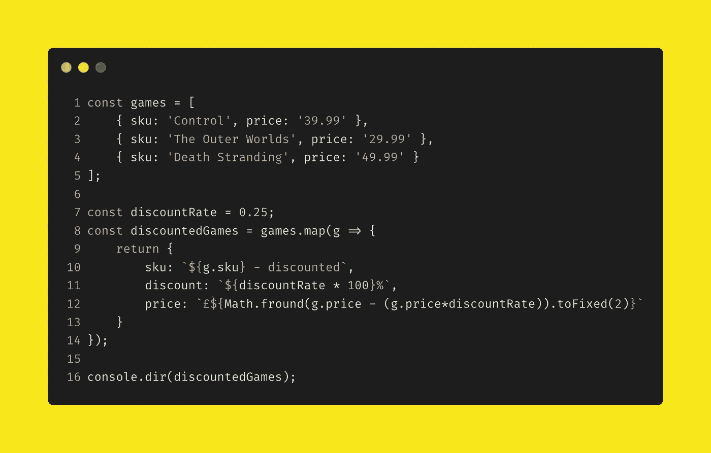

# JavaScript 数组:5 个有用的食谱

> 原文：<https://levelup.gitconnected.com/javascript-arrays-5-useful-recipes-3551a7d32c3>

照片由 [Pexels](https://www.pexels.com/photo/cast-iron-skillet-on-table-with-species-1435909/?utm_content=attributionCopyText&utm_medium=referral&utm_source=pexels) 的 [Engin Akyrut](https://www.pexels.com/@enginakyurt?utm_content=attributionCopyText&utm_medium=referral&utm_source=pexels) 拍摄

JavaScript 是一种非常强大和通用的语言。随着它在 ES5、ES2015 以及更高版本中的成熟，它已经从局限于 web 的脚本语言发展成为大型应用程序的主干——为能够高效快速地处理成千上万个 HTTP 请求的 web 服务器提供动力。

无论您是使用 Node、Angular、React、Vue 还是普通的 JS，您都会经常遇到需要处理数据集的问题。

这本迷你食谱给了你五个有用的食谱，你可以在遇到涉及数组的问题时应用，所有这些都不需要使用第三方库。

## 1.计算总数

**关键成分:**减少

我们可以使用 reduce 方法对数组的每个元素执行一个函数(reducer ),并返回一个输出。使用这种技术，我们可以对数值求和。

多好的中场，多划算的交易

第 8 行的缩减器`(a, b) => a + b.price`获取累加值`a`，并将其添加到当前迭代值的`price`属性中。`0`是初始化值，即`a`的第一个值。

## 2.组合两个或多个数组

**关键成分:** concat

我们可以使用 concat 函数来组合两个或多个数组。

相当多的收藏…

**替代配料**:涂抹操作员

我们可以使用 spread 操作符从两个或更多的数组中创建一个新的数组，方法与 concat 类似。但是请注意，spread 运算符和 concat 确实不同，尤其是在处理非数组对象时。还应该考虑性能——使用 spread 运算符会比 concat 慢很多。

将上面示例中的第 13 行替换为下面的内容，以查看实际的扩展操作

`const menagerie = [...suitablePets, ...unsuitablePets];`

## 3.变换数组的元素

**关键成分**:地图

我们可以使用 map 方法对数组的每个元素执行一个函数，并返回该函数输出的数组。

使用地图折扣一些游戏(我喜欢的)

第 8 行传递给`map`的函数获取当前迭代的值`g`，并基于`discountRate`常量返回一个新对象。结果是新对象的数组。

## 4.连接两个数组中的数据

**关键成分**:贴图和缩小

我们可以结合 map 和 reduce 方法来实现类似于 SQL 连接的功能。

如果你不知道谁在哪艘船上，你就不能去，不管是大胆地去还是不去

在这个配方中，map 和 reduce 被组合起来模拟一个 SQL 连接。在第 16 行，我们调用了`crew`数组上的`map`方法。如配方三所示，map 允许对数组的每个元素应用一个函数，并返回一个新的数组。

这里实现的函数，在第 16 到 20 行，获取当前迭代的值并返回`Object.assign`方法的结果。像这样使用赋值可以合并属性。

在第 20 行使用`reduce`。配方一展示了如何使用 reduce 从数组中返回单个值。这里我们使用该功能来填充返回对象的属性。缩减器遍历`ships`数组中的每个元素，并返回构成*累加器*(本例中为`a`)的对象。当 crew 元素的`shipId`属性和 ship 元素的`id`属性匹配时，返回完整的匹配对象。

## 5.分组数据

**关键成分**:还原

我们可以使用 reduce 方法根据对象的一个属性值对相同类型的对象进行分组。

给毛茸茸的朋友分组

为了将数组的元素选择到不同的分组中，可以利用 reduce 函数。

让我们来分解减速器的功能:

第 10 行:`acc[val.type] = acc[val.type] || [];`

这一行确保从 reducer 返回的对象有一个键，该键带有当前迭代的值`type`。如果存在，则保持当前值。如果不存在，则创建一个并用空数组初始化。

第 11 行:`acc[val.type].push(val);`

这一行将当前值推入刚刚初始化的数组。

第 12 行:`return acc;`

返回具有新值的累加器。

在第 15 行，通过调用 animals 数组上的`reduce`创建了一个新数组。减压器用空物体初始化。