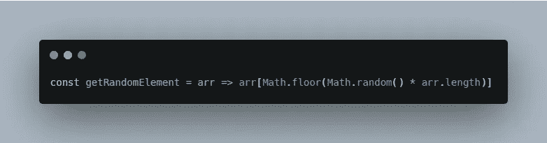
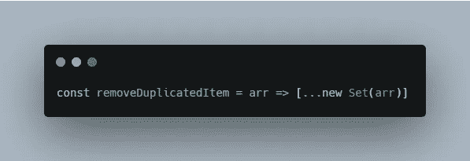

# 从零到一的 JavaScript 数组

> 原文：<https://levelup.gitconnected.com/javascript-arrays-from-zero-to-one-3fd84a850cbb>

## Java Script 语言

## 关于 JavaScript 数组的要点，如何对数组进行类型检查，length 属性的强大功能，以及数组的 8 个常见用例

马里奥·易卜拉希米在 [Unsplash](https://unsplash.com/s/photos/coffee?utm_source=unsplash&utm_medium=referral&utm_content=creditCopyText) 上的照片

本文将提供 JavaScript 数组的一些最重要的方面以及使用它们的强大方法。

1.  JavaScript 数组简介
2.  用 JavaScript 创建一个数组
3.  检查数组类型
4.  长度属性
5.  创建 N 元素数组
6.  获取随机元素
7.  对对象数组进行排序
8.  移除重复的项目
9.  用 Reduce 替换贴图和过滤器
10.  展平数组
11.  打乱数组元素
12.  将数组分割成块

*更多类似内容，请查看*[*https://betterfullstack.com*](https://betterfullstack.com)

# JavaScript 数组简介

JavaScript `**Array**`类是一个全局对象，用于创建和操作数组。数组是一种高级的、类似列表的对象。

数组不能使用字符串作为元素索引。

数组是类似列表的对象，其原型具有执行遍历和变异操作的方法。

# **用 JavaScript 创建一个数组**

在 JavaScript 中创建数组有两种主要方法:

1.  数组文字。
2.  数组构造函数。

用 JavaScript 创建数组

除了这两种创建 JavaScript 数组的主要方法，我们还可以使用`[**Array.of()**](https://developer.mozilla.org/en-US/docs/Web/JavaScript/Reference/Global_Objects/Array/of)`方法，它从可变数量的参数创建一个新的`Array`实例，而不管参数的数量和类型。

`**Array.of()**`和`**Array**`构造函数的区别在于对整数参数的处理。

注意:总是使用数组文字来创建数组，而不是数组构造函数。

# 检查数组类型

在 JavaScript 中有 3 种主要的方法来检查数组类型

使用`[**Array.isArray()**](https://developer.mozilla.org/en-US/docs/Web/JavaScript/Reference/Global_Objects/Array/isArray)`方法。

`Array.isArray()`方法

使用操作符的**实例**

运算符的实例

使用**构造函数**属性

构造函数属性

# 长度属性

一个对象的`**length**`属性，该对象是类型`Array`的实例，类型**设置或返回**该数组中元素的数量。

该属性总是返回最大索引加 1 的值。

这是一个有用的属性，因为我们用它来迭代数组。

迭代数组

我们还可以通过使用 length 属性并将其设置为小于当前长度的值来缩短数组。

使用 length 属性缩短数组

我们可以创建一个不同长度的空数组。

创建一个不同长度的空数组

当设置长度属性为零时，我们可以清除一个数组

将 length 属性设置为零时清除数组

# 创建 N 元素数组

在 JavaScript 中创建 N 元素数组有不同的方法。

使用扩展运算符

使用 spread 创建 n 元素数组

使用填充和贴图方法

使用填充和映射方法创建 n 元素数组

使用 [Array.from](https://developer.mozilla.org/en-US/docs/Web/JavaScript/Reference/Global_Objects/Array/from) 方法，从一个类似数组或可迭代的对象创建一个新的浅拷贝的`Array`实例。

使用 array from 方法创建包含 n 个元素的数组

# 获取随机元素

有时，我们需要为一些特定的任务(如单元测试)获取随机元素。

从数组中获取随机元素

# 对对象数组进行排序

使用[排序方法](https://developer.mozilla.org/en-US/docs/Web/JavaScript/Reference/Global_Objects/Array/sort)对一组对象进行排序。

函数按属性对对象数组排序

示例:

按属性名对用户列表进行排序

# 删除重复项目

使用扩展和[设置对象](https://developer.mozilla.org/en-US/docs/Web/JavaScript/Reference/Global_Objects/Set)移除数组中的重复项目。

使用 spread and set 删除数组中的重复项

使用`filter`方法。

使用 filter 方法删除数组中的重复项

结合使用`Set`对象和`filter`方法来删除对象数组中的重复对象。

使用 set 和 filter 方法删除重复的对象数组

# 用 Reduce 替换贴图和过滤器

例如，您希望获得得分高于 7 的用户名。

我们可以不用`filter`来查找大于 7 的分数，不用`map`来获取用户名，而是用`reduce`的方法。

用 Reduce 替换 Map 和 Filter

# 展平数组

使用[串联](https://developer.mozilla.org/en-US/docs/Web/JavaScript/Reference/Global_Objects/Array/concat)方法展平第一层。

使用 [concat](https://developer.mozilla.org/en-US/docs/Web/JavaScript/Reference/Global_Objects/Array/concat) 方法展平第一层

示例:

第二层不能展平

一级以上怎么样？使用[展平方法](https://developer.mozilla.org/en-US/docs/Web/JavaScript/Reference/Global_Objects/Array/flat)展平更深的层面。

使用展平方法加深展平

示例:

展平更深的两层样本

注意:该方法在 Edge 和 IE 上不可用。

# 洗牌数组元素

有三种主要方法可以做到这一点。

递归应用

使用递归打乱数组

使用`map`方法

用映射法洗牌

使用`reduce`方法

用 reduce 方法混洗数组

# 将数组分割成块

使用`reduce`

使用 reduce 的块数组

使用一个`generator`

使用生成器生成块数组

递归地做

使用递归的块数组

# 摘要

本文提供了 JavaScript 数组的概述，例如关于 JavaScript 数组的一些重点，如何检查数组类型，长度属性的幂，以及 JavaScript 数组的 8 个常见用例。

我希望这篇文章对你有用！可以跟着我上[媒](https://medium.com/@transonhoang?source=post_page---------------------------)。我也在推特上。欢迎在下面的评论中留下任何问题。我很乐意帮忙！

 [## 故事-更好的全栈

### 关于 JavaScript、Python 和 Wordpress 的有用文章，有助于开发人员减少开发时间并提高…

betterfullstack.com](https://betterfullstack.com/stories/)