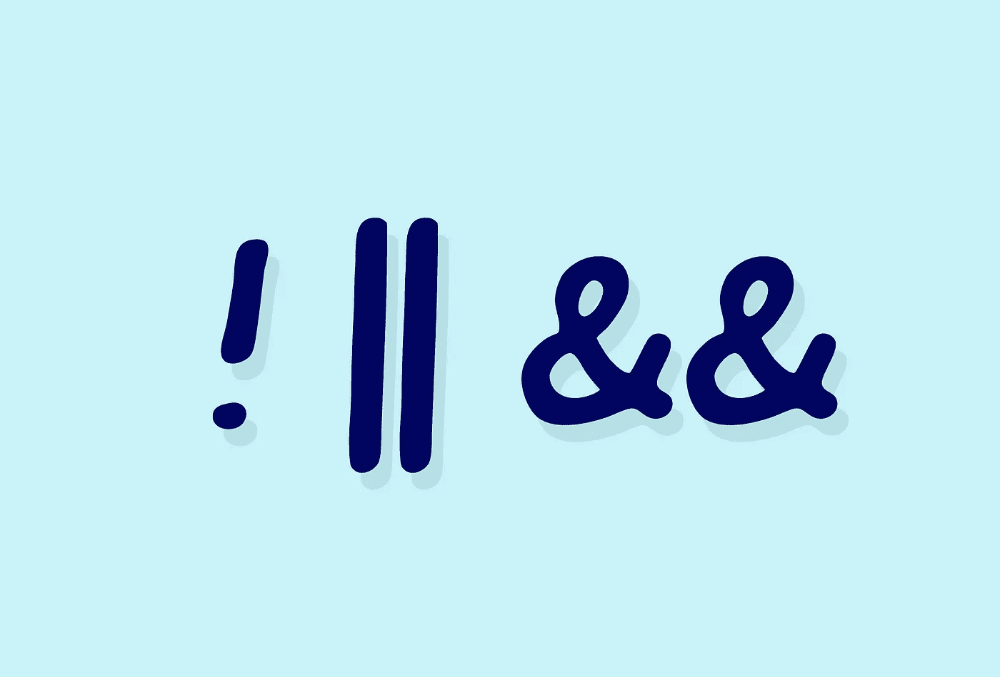

# JavaScript 基础:比较和逻辑运算符

> 原文：<https://levelup.gitconnected.com/javascript-basics-comparison-and-logical-operators-7489f3a16b3f>


今天我们要学习比较和逻辑运算符。在上一篇 JavaScript 基础文章中，我们学习了条件语句。

[](/javascript-basics-conditional-statements-95d1ed403039) [## JavaScript 基础:条件语句

### 今天我们将学习 JavaScript 中的条件句。你可以把条件句想象成这种情况是…

levelup.gitconnected.com](/javascript-basics-conditional-statements-95d1ed403039) 

在括号内，在关键字`if`之后，您需要输入一个语句，该语句将计算 true 或 false。这可能意味着比较价值。

以下是一些比较运算符:

**小于:**

```
12 < 4 // evaluates to false
5 < 53 // evalautes to true
```

**大于:**

```
12 > 5 // evaluates to true
3 > 253 // evaluates to false
```

**大于或等于:**

```
12 >= 4 // evaluates to true
```

**小于或等于:**

```
12 <= 254 // evaluates to true
```

**等于:**

```
12 === 12
```

*   注意，在 JavaScript 中，你也可能遇到`==`。上面的例子`===`是一个严格的比较。如果内容和相同类型匹配，则计算结果为 true。使用`==`只比较内容，不比较类型。

```
12 == "12" // evaluates to true
12 === "12" // evaluates to false
```

对于第一个示例，字符串和整数的计算结果都为 true，即使它们的类型不同。它们具有相同的价值。`==`所做的是在进行比较之前将两个项目转换成相同的类型。

在第二个示例中，比较了类型和内容。严格来说，`===`一个字符串和一个数字并不相同，即使这两个数字是相同的。该语句的计算结果为 false。

**不等于:**

```
14 !== 3 // evaluates to true
```

上面严格的比较解释适用于`!==`操作符。



有时，您希望比较条件中的多个项目。这时逻辑运算符就派上了用场。以下是三个逻辑运算符:

**与运算符(& & )**

```
let x = 12;
if(x < 454 && x > 4){
    // something
}
```

使用`&&`操作符，在代码运行之前，两个语句都必须评估为真。

**Or 运算符(||)**

```
let x = "Monday";
if (x === "Monday" || x === "monday"){
    // something
}
```

使用`||`运算符，至少有一个语句的计算结果为真。如果都不为真，那么代码就不会运行。

**不算符(！)**

```
let running = true;
console.log(!running); // evaluates to falselet walking = false;
console.log(!walking); // evaluates to true
```

`!`运算符反转或否定一个布尔值。在 true 语句前放置一个`!`将评估为 false，在 false 语句前放置一个`!`将评估为 true。

如果你想阅读更多的 JavaScript 基础文章，你可以看看我最近的文章:

[](/javascript-basics-mathematical-assignment-operators-e888e78fd391) [## JavaScript 基础:数学赋值运算符

### 在 JavaScript 中做数学运算时，您可能希望继续增加值。我们可以通过以下组合来实现这一点…

levelup.gitconnected.com](/javascript-basics-mathematical-assignment-operators-e888e78fd391) [](https://medium.com/javascript-in-plain-english/javascript-basics-variables-cb58d26167f9) [## JavaScript 基础:变量

### 在 JavaScript 中，您可以使用变量来标记任何类型的数据。变量就像盒子，里面贴着标签，告诉你…

medium.com](https://medium.com/javascript-in-plain-english/javascript-basics-variables-cb58d26167f9)