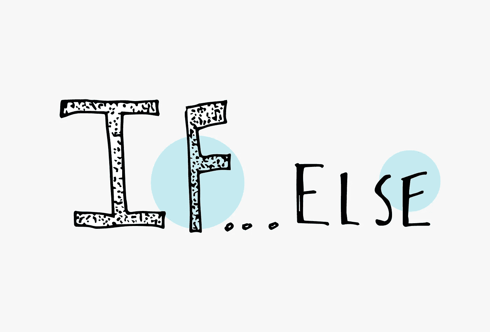

# JavaScript 基础:条件语句

> 原文：<https://levelup.gitconnected.com/javascript-basics-conditional-statements-95d1ed403039>


今天我们将学习 JavaScript 中的条件句。你可以把条件句想成*如果这种情况是真的，那么就这样做*。*如果没有，做另一件事。*你根据行动创造结果。

要在 JavaScript 中创建一个条件，可以使用一个`if`语句。

```
let car = "Jeep";if (car === "Jeep") {
    // do certain action if true.
}
```

在圆括号内，在关键字`if`之后，您放入一个将评估为 true 或 false 的语句。如果条件为真，花括号内的代码将运行，如果语句为假，花括号内的代码块将不运行。


当一条语句返回 false，而你想运行某段代码时，使用`else`关键字。

```
let color = "black";if (color === "black") {
    // do a certain action if true
} else {
   // otherwise, do a certain action if something else
}
```

`else`块中的代码类似于默认代码，当上面的条件都不满足时运行。



如果您希望根据某些条件产生多种结果，而不是创建多个`if`语句，您可以创建`else if`语句。

```
let shape = "square";if (shape === "square") {
    // do a certain action if shape is a square
} else if (shape === "circle"){
    // otherwise, do a certain action if shape is a circle
} else if (shape === "octagon") {
    // do another action
} else {
    // if all else is false and shape is not listed
    // do a certain action
}
```

您可以添加多个`if else`语句，但是要确保在末尾添加一个`else`语句，以便在所有其他条件返回 false 时用作默认值。

当单独使用`if`语句时，不需要`else`语句，但是当包含一个或多个`else if`语句时，则需要 else 语句。

如果你想阅读更多的 JavaScript 基础文章，你可以看看我最近的文章:

[](https://medium.com/@endubueze00/javascript-basics-string-concatenation-with-variables-and-interpolation-deba239debbe) [## JavaScript 基础:变量和插值的字符串连接

### 在 JavaScript 中，我们可以将字符串赋给一个变量，并使用串联将该变量组合成另一个字符串。

medium.com](https://medium.com/@endubueze00/javascript-basics-string-concatenation-with-variables-and-interpolation-deba239debbe) [](/javascript-basics-mathematical-assignment-operators-e888e78fd391) [## JavaScript 基础:数学赋值运算符

### 在 JavaScript 中做数学运算时，您可能希望继续增加值。我们可以通过以下组合来实现这一点…

levelup.gitconnected.com](/javascript-basics-mathematical-assignment-operators-e888e78fd391)