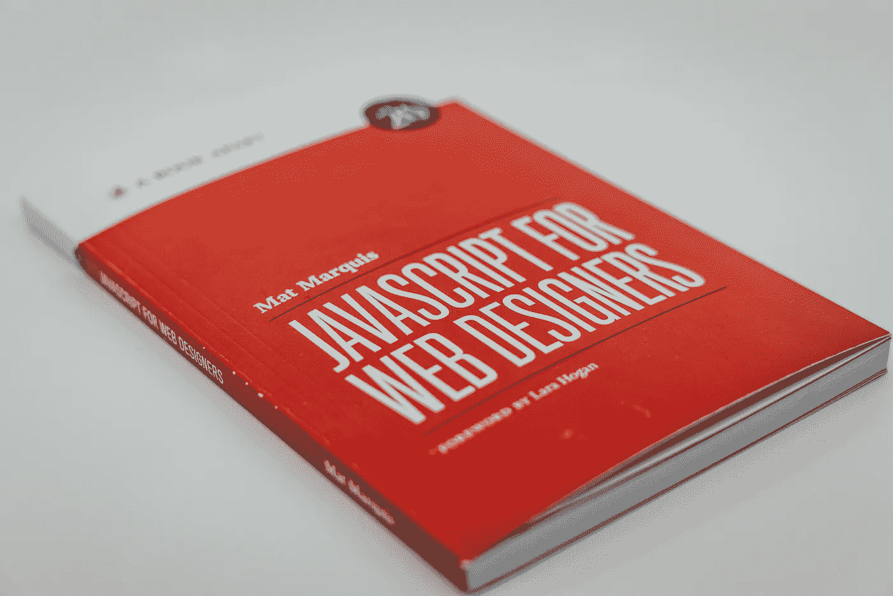
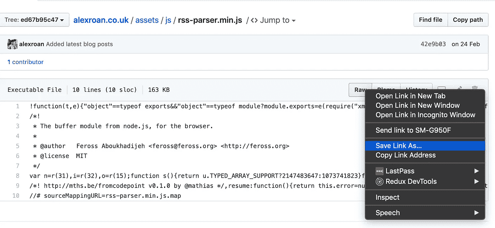

# Javascript 基础:如何使用 RSS 检索中型文章

> 原文：<https://levelup.gitconnected.com/javascript-basics-how-to-use-rss-to-retrieve-medium-articles-d9c4d7c10387>

## 使用你的媒体 RSS 和 Javascript 来展示你的最新故事



照片由[🇨🇭·克劳迪奥·施瓦茨| @purzlbaum](https://unsplash.com/@purzlbaum?utm_source=unsplash&utm_medium=referral&utm_content=creditCopyText) 在 [Unsplash](https://unsplash.com/s/photos/javascript?utm_source=unsplash&utm_medium=referral&utm_content=creditCopyText) 上拍摄

先决条件:这篇文章是为希望学习 Javascript 的初学者准备的。它介绍了 Javascript、HTML，并解释了 RSS 是什么以及如何使用它。

像许多开发人员一样，我有一个投资组合网站，它同时也是一种简历。它用来展示我的开发经验、我的技能和我多年来参与的项目。平常的东西。

我写的所有教程和演练都在 Medium 上发布。然而，我想在我的页面上显示我的最新文章。幸运的是，Medium 在以下网址为每个成员提供了 RSS 提要，其中`[username]`是您的 Medium 用户名:

```
[https://medium.com/feed/@[username]/](https://medium.com/feed/@alexroan/)
```

我的是`[https://medium.com/feed/@alexroan/](https://medium.com/feed/@alexroan/)`

# 什么是 RSS？

> “RSS 是一种 web 源，允许用户和应用程序以标准化的计算机可读格式访问网站的更新。例如，这些订阅源可以让用户在一个新闻聚合器中跟踪许多不同的网站。”— [维基百科](https://en.wikipedia.org/wiki/RSS)

RSS 是一种基于 XML 的标准化数据流，只要符合 RSS 标准，无论数据来自哪里，软件都能理解。

它最常用于新闻聚合器和博客，支持第三方平台显示来自其他平台的博客文章。你在媒体上阅读的文章可以通过 RSS 和浏览器检索。

# 使用 Javascript 检索

在我的作品集网站的新“博客”部分，我想展示我的媒体简介中的最新三篇文章。这意味着:

1.  加载 RSS 源的内容
2.  循环浏览每篇文章
3.  将文章打印到页面上

很简单的东西。

## 正在解析 RSS

因为我们知道 RSS 是标准化的，它遵循一组规则，所以我们可以编写一个解析器来理解来自 RSS 提要的数据，然后在页面上显示出来。幸运的是，已经有很多执行这个功能的库。

[RSS 解析器](https://www.npmjs.com/package/rss-parser)是一个 NPM 模块，它完美地做到了这一点。如果你的站点是一个节点项目，你可以通过运行`npm install --save rss-parser`使用 npm 来安装它，但是如果你只是使用一个基本的 HTML & Javascript 设置，你可以通过导航到这里来下载库[，](https://github.com/alexroan/alexroan.co.uk/blob/ed67b95c478ec68c43741dcc6d91c25f526a1f2f/assets/js/rss-parser.min.js)右击“Raw”按钮并选择“另存为…”。



下载 rss-parser.min.js

将文件复制到项目存储库中，并在 HTML 页面中引用它，如下所示:

```
<script src="assets/js/rss-parser.min.js"></script>
```

现在我们可以使用这个库中的函数来解析我们的提要。

## 检索数据

图 1:检索和打印文章标题

让我们看一下图 1 中的代码。

第 1 行向我们展示了如何初始化一个新的 RSSParser 对象。这是我们刚从下载的库中导入的。

第 2 行使用该库中的`parseURL()`函数来读取我们的提要。

第 3 行到第 7 行包含了一旦`parseUrl()`获取了数据并给了我们`err`和`feed`结果，我们就要编写的函数。

第 3 行声明，如果函数确实返回了一个错误，那么我们的函数应该抛出一个错误，因为有什么地方出错了。否则，就像一切正常一样继续下去。

第 4 行的循环是我们用来将文章打印到页面上的。前 3 篇文章的数据被发送到第 10 行定义的函数`printPost()`。

## 显示数据

Javascript 非常强大，因为它使我们能够动态地改变静态网页的状态，这意味着我们可以编写 HTML，但我们也可以编写 Javascript 来用新数据改变 HTML。

这就是`printPost()`正在做的事情。

第 11 行在内存中创建了一个新的`<article>` HTML 标签。

第 13 到 15 行创建了一个新的`<a>`标签，使用文章的 URL 作为`href`。

第 17 到 18 行使用文章的标题作为内容创建了一个新的`<h4>`标签。

在附加到页面之前，我们需要将所有这些放入一个功能性的 HTML 集合中。

第 20 行将我们创建的`<h4>`元素附加到我们创建的`<a>`标签上。这意味着我们将`<h4>`标签*放在*我们的`<a>`链接中，结果是:

```
<a href="https://the-link-to-our-post" target="_blank">
    <h4>Post Title</h4>
</a>
```

下一行将该链接附加到我们在第 11 行创建的`<article>`中，结果如下:

```
<article>
    <a href="https://the-link-to-our-post" target="_blank">
        <h4>Post Title</h4>
    </a>
</article>
```

第 23 行在 HTML 页面中找到 blog 部分，然后第 24 行将我们的文章添加到其中。因为第 4 行的 for 循环被编程为重复三次，所以三篇文章被打印到 blog 部分。

你有它！动态阅读博客文章，从数据中构建 HTML 并将 HTML 打印到页面上。

如果你对区块链开发感兴趣，我会写一些关于如何开始和建立投资组合的教程、演练、提示和技巧。查看以下资源:

[](https://medium.com/blockcentric/blockchain-development-resources-b44b752f3248) [## 区块链开发资源马上跟进

### 学习区块链、以太坊和 DApp 开发的资源列表

medium.com](https://medium.com/blockcentric/blockchain-development-resources-b44b752f3248)