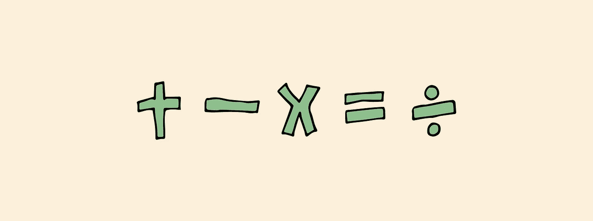
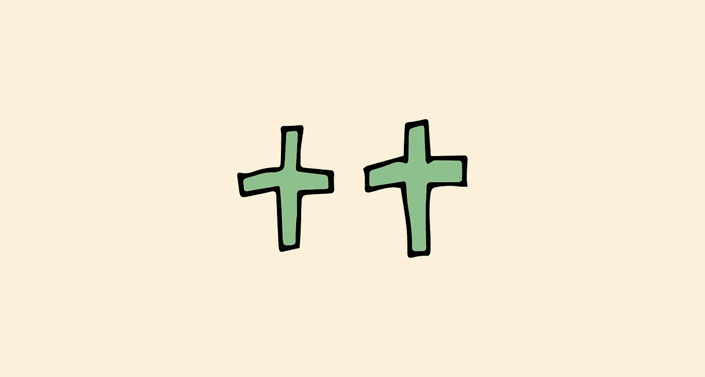
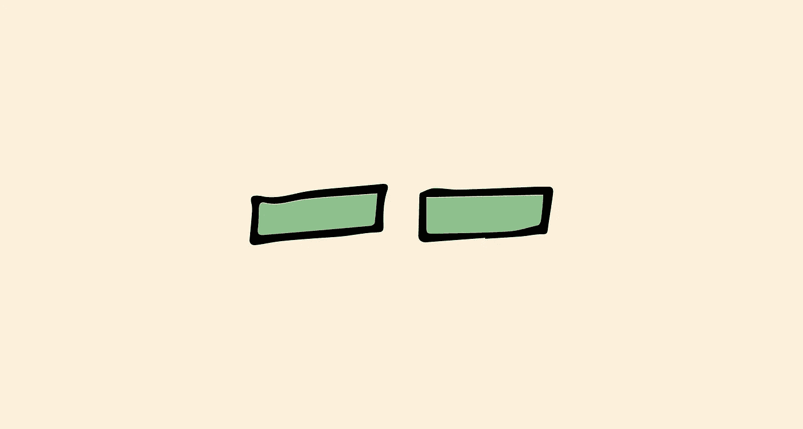

# JavaScript 基础:数学赋值运算符

> 原文：<https://levelup.gitconnected.com/javascript-basics-mathematical-assignment-operators-e888e78fd391>



当用 JavaScript 做数学时，你可能想继续增加我们存储在变量中的值。我们可以通过一个变量和一个数学运算符的组合来实现。

```
let num = 12;
num = num + 12; // 24
```

在上面的例子中，我们创建了一个名为`num`的变量，并给它赋值 12。在下一行，我们给`num` 变量加了 12，并将该值重新分配给`num`。

另一种增加 12 的方法是使用 JavaScript 的数学赋值操作符。

```
let num = 12;
num += 12;
```

在第二行，我们使用 JavaScript 的赋值操作符之一给变量`num`加 12，然后将结果重新赋值给`num`。两个例子产生相同的结果，赋值操作符只是重新赋值的另一种方式。

你不仅限于加号，还有其他数学运算符。以下是一些及其对应的手写内容:

```
num = num - 12; // decrement by 12
num -= 12;num = num * 12; // multiply by 12
num *= 12;num = num / 12; // divide by 12
num /= 12;
```

除了上面的数学运算符，还有增量和减量运算符。



增量运算符将值增加 1。下面的示例将输出 6。

```
let anotherNum = 5;
anotherNum++; // the same as anotherNum = anotherNum + 1
```



减量运算符会将该值减 1。下面的示例将输出 9。

```
let anotherNum = 10;
anotherNum--; // the same as anotherNum = anotherNum - 1
```

要查看更多的 JavaScript 基础文章，这里有一些最近的文章:

[](/javascript-basics-console-log-8532b446db22) [## JavaScript 基础知识:Console.log()

### 今天我们将学习 console.log 的基础知识。如果你看了 JavaScript 基础知识系列的第 1 部分，我们…

levelup.gitconnected.com](/javascript-basics-console-log-8532b446db22) [](https://medium.com/@endubueze00/javascript-basics-variables-cb58d26167f9) [## JavaScript 基础:变量

### 在 JavaScript 中，您可以使用变量来标记任何类型的数据。变量就像盒子，里面贴着标签，告诉你…

medium.com](https://medium.com/@endubueze00/javascript-basics-variables-cb58d26167f9)