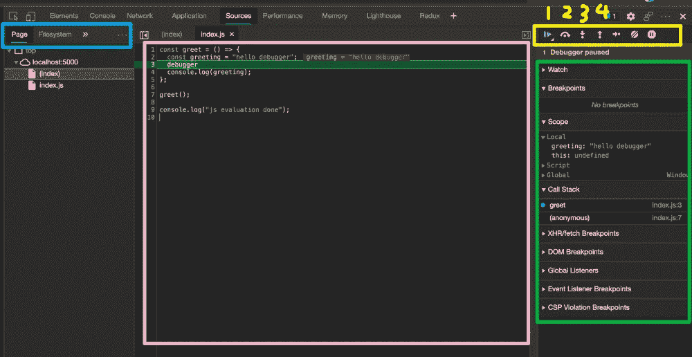
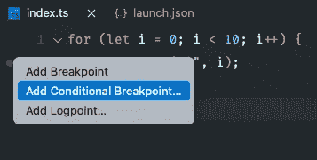
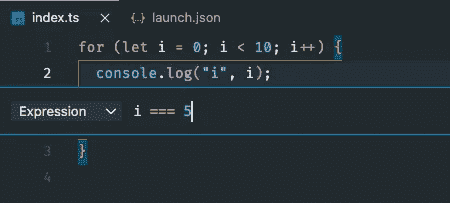

# JavaScript 断点调试技巧

> 原文：<https://levelup.gitconnected.com/javascript-breakpoint-debugging-tips-ddefb1487c73>

## 本文将向您展示如何使用 Google Chrome 调试带有断点的 JavaScript。


# **为什么要使用调试器**

本文将向您展示如何使用 Google Chrome 调试带有断点的 JavaScript。在阅读本文之前，需要问一个问题:为什么要使用断点进行调试？我们都知道`console.log`是前端开发中最常用的调试方法，它简单直接的解决了一些问题。但是遇到非常复杂的问题，`console.log`就会变得笨拙。

**比如:**

*   一个逻辑上复杂的算法当一个测试用例报告一个错误时，仅仅通过视觉检查有时很难识别出有问题的方法。
*   一种繁殖步骤非常复杂的虫子。
*   重现用了 10 分钟，但是只跟踪到了某一行代码，需要第二次添加 log 才能继续查找问题。查看日志->添加日志->查看日志…这个过程重复几次，
*   运行长流程的一段代码

在这些情况下，断点调试是非常有价值的。

# Chrome 调试器的基本用法

为了方便理解，介绍一个简单的例子，在一个文件夹中创建 index.html 和 index.js，然后在 index.html 导入 index.js。index.js 的内容如下:

```
const greet = () => {
  const greeting = "hello debugger";
  // Browser execution will pause here
  debugger
  console.log(greeting);
};greet();console.log("hi maxwell,evaluation done");
```

运行:

```
npm i -g serve
serve .
```

然后访问 [http://localhost:5000](http://localhost:5000) 打开开发者工具。这时，我们的 hello world 断点被命中，就像这样:



该图分为四个区域，蓝色区域用于文件选择，页面列指的是当前页面中的 JS 文件，Filesystem 将显示我们系统中的文件。通常我们用 Page。

粉色是代码的行号和内容。您可以单击代码的行号来添加新的断点，再次单击可以取消。

黄色区域用于控制代码的执行。你只需要掌握前四个按钮的含义就可以处理大多数情况。按钮 1 是让代码继续执行(resume)，如果遇到下一个断点，将再次中断执行。按钮 2 可以让浏览器执行当前行(图中第三行)，然后中断下一行的代码，按钮 3 是进入当前函数，查看函数的具体内容。假设我们目前停在第 7 行 greet()，点击按钮 3 将进入 greet 方法(即第 2 行)。如果不想再看 greet 方法，单击按钮 4 跳出这个方法，回到第 8 行。

绿色区域允许您查看变量和当前调用堆栈的内容。

调试器是最简单粗暴的断点方式，但是需要修改我们的代码。需要注意的是，这些语句必须在上线前删除。也可以通过配置 webpack 自动删除。

# 条件断点

在某些情况下，我们不希望每个命中的断点都发挥作用，而是在断点处执行该行，然后在满足某个条件时中断代码执行。这是一个条件断点。

```
for (let i = 0; i < 10; i++) {
  console.log("i", i);
}
```

例如，在上面的代码中，假设我们在 console.log 的第二行遇到一个断点，这个断点总共会中断十次。这往往是我们不想看到的，也许我们只需要其中一个循环而不是全部。此时，右键单击并选择添加条件断点。



在我们输入 i === 5 的地方会出现一个输入框。



此时开始调试，I 为 0–4 时会被跳过，I 为 5 时直接中断代码执行。当代码继续执行时，I 为 6–9 的情况将被跳过。

当调试大量循环和 if else 判断时，条件断点非常有用，尤其是当某处的逻辑整体上符合预期，并且只有少数输出错误的特殊情况时，使用条件断点可以跳过这些正常情况。在某些情况下，只有在个别特殊情况发生时才中断执行，以便我们检查每个变量是否计算正常。

# 总结

调试是日常工作中非常重要的一项能力，因为除了开发新功能，每天很大一部分时间都在调整旧代码，处理特殊情况下的逻辑错误。精通调试可以大大提高开发效率。一个复杂的 bug 卡住几个小时，很容易让人崩溃。但这并不是说断点调试是任何情况下的银弹，简单的逻辑还是可以愉快的 console.log。