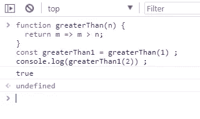
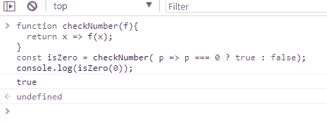
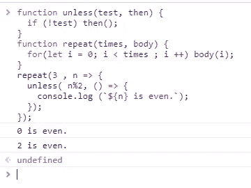
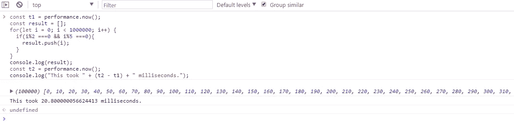
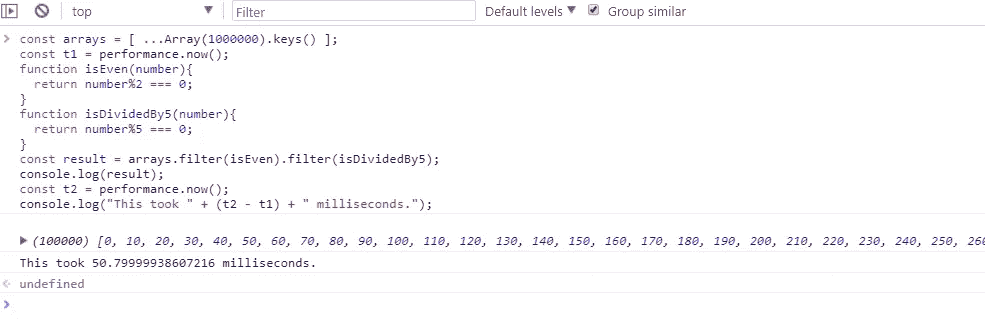

# 理解 JavaScript 中的高阶函数

> 原文：<https://levelup.gitconnected.com/javascript-built-in-higher-order-function-and-performance-3fc5d23cc1d3>

## 与简单的 for 循环相比，高阶函数的优点及其性能问题


图片由 [GC 图书馆创意技术实验室](https://unsplash.com/@goldcoastmedialab?utm_source=unsplash&utm_medium=referral&utm_content=creditCopyText)在 [Unsplash](https://unsplash.com/search/photos/coffee?utm_source=unsplash&utm_medium=referral&utm_content=creditCopyText) 拍摄

在本文中，我将讨论 JavaScript 中的高阶函数。本文将分为以下几个部分

1.  什么是高阶函数
2.  可组合性
3.  高阶函数用**映射**、**滤波器**、**减速器**。
4.  性能问题

*更多类似的内容，请查看*[https://betterfullstack.com](https://betterfullstack.com/stories/)

# 什么是高阶函数

**高阶函数**是对其他函数进行操作的函数，要么将一个函数作为参数，要么从另一个函数返回一个函数**。**高阶函数允许我们抽象动作，而不仅仅是值。

JavaScript 中的函数是一等公民。这意味着它们可以存储在变量中或者作为参数传递给其他函数。它们可以像 JavaScript 中的任何其他值一样使用。

高阶函数在 JavaScript 中实际上非常普遍——事实上，您可能已经在使用它们，但可能没有意识到。任何时候你传递一个回调函数，这都是一个高阶函数在起作用。另外，使用[闭包](https://developer.mozilla.org/en-US/docs/Web/JavaScript/Closures)也是 JS 中常见的高阶函数模式。闭包总是返回另一个可以稍后执行的函数。

**例子**

创建新函数的函数:



创建新函数的函数

改变其他功能的功能



改变其他功能的功能

提供新型控制流的函数



提供新型控制流的函数

# 可组合性

当我们使用高阶函数时，可组合性是一个巨大的好处。我们可以把代码分割成一个小范围，便于理解。

让我们来看一个例子，寻找一个成年男性用户。

没有高阶函数的示例:

不使用高阶函数

高阶函数示例:

组合高阶函数

它没有把逻辑纠结成一个大循环，而是整齐地组合成我们感兴趣的概念——确定性别、计算年龄。我们可以一个一个地应用这些来得到我们想要的结果。

# 具有映射、过滤器、缩减器的高阶函数。

让我们来看一些 JavaScript 函数中内置高阶的例子。

## 地图()

`**map()**`方法**创建一个新数组**，其结果是在调用数组中的每个元素上调用一个提供的函数。

语法:

```
var new_array = arr.map(function callback(currentValue[, index[, array]]) {
    // Return element for new_array
}[, thisArg])
```

示例:

向用户对象添加新属性

map 方法通过对数组的所有元素应用函数并从返回值构建新数组来转换数组。新数组的长度将与输入数组的长度相同，但是它的内容将被函数“映射”成新的形式。

## 过滤器()

`**filter()**`方法创建一个新的数组，其中所有元素都通过了由提供的函数实现的测试。

语法:

```
var newArray = arr.filter(callback(element[, index[, array]])[, thisArg])
```

示例:

过滤成人用户

## 减少()

`**reduce()**`方法对数组的每个元素执行一个 **reducer** 函数(您提供的),产生一个输出值。

语法:

```
arr.reduce(callback(accumulator, currentValue[, index[, array]])[, initialValue])
```

注意:

1.  您的**归约器**函数的返回值被分配给**累加器**，其值在整个数组的每次迭代中被记住，并最终成为最终的单个结果值。
2.  如果没有提供 **initialValue** ，将使用并跳过数组中的第一个元素。

**示例:**

像我一样的大多数 JavaScript 爱好者在尝试使用`reduce()`时会感到困惑。

这里我将试着对**累加器**、 **currentValue** 、 **currentIndex** 和**数组**进行简单的解释。

```
[0, 1, 2, 3, 4].reduce((accumulator, currentValue, currentIndex, array) => {
    return accumulator + currentValue;
});
```

步骤如下:

这段代码将运行 5 次，因为数组长度是 5。

1.  由于没有初始值，**累加器= 0** (第一个元素)并跳过第一个元素。 **currentValue = 1，currentIndex = 1，数组** always **[0，1，2，3，4]** 。**返回值= 1。**
2.  **累加器=第 1 步返回值**=**1。currentValue = 2，currentIndex = 2，返回值=第 1 步的累加器**+**current Value = 3。**
3.  **累加器=第 2 步返回值**=**3。currentValue = 3，currentIndex = 3，返回值=第 2 步的累加器**+**current Value = 6。**
4.  **累加器=第 3 步的返回值**= 6**。currentValue = 4，currentIndex = 4，返回值=第 3 步的累加器**+**current Value = 10。**

所以最终结果是 10。

# 性能问题

高阶函数非常适合编写清晰的代码。不幸的是，这种清晰是有代价的。

让我们看看下面的例子。

**使用 for 循环:**



从一百万个元素中通过 for 循环获得结果

**使用高阶函数:**



从一百万个元素中通过高阶函数得到结果

在上面的例子中，高阶函数 **filter()** 迭代我们的值并产生新的数组。但是，构建一个新的阵列有点昂贵。

同样，将一个函数传递给更高阶的函数，并让该方法为我们处理数组迭代，这样既方便又易读。但是与简单的循环体相比，JavaScript 中的函数调用代价很高。

幸运的是，大多数浏览器都非常快。不管你写的是半毫秒的漂亮解决方案还是十分之一毫秒的超级优化解决方案。

# 摘要

在本文中，我们已经了解了什么是高阶函数，如何构造函数，以及一些内置的高阶函数，如**滤波器**、**映射**、**归约**。

我们还了解到，高阶函数有助于我们写出更漂亮、更易读的代码。但是，与简单循环相比，它们的性能可能较慢。

我希望这篇文章对你有用！可以跟着我上[媒](https://medium.com/@transonhoang)。我也在推特上。欢迎在下面的评论中留下任何问题。我很乐意帮忙！

# 资源/参考资料

[1]:雄辩的 Javascript[https://eloquentjavascript.net/05_higher_order.html](https://eloquentjavascript.net/05_higher_order.html)

[2]:Map[https://developer . Mozilla . org/en-US/docs/Web/JavaScript/Reference/Global _ Objects/Array/Map](https://developer.mozilla.org/en-US/docs/Web/JavaScript/Reference/Global_Objects/Array/map)

[3]:过滤器[https://developer . Mozilla . org/en-US/docs/Web/JavaScript/Reference/Global _ Objects/Array/Filter](https://developer.mozilla.org/en-US/docs/Web/JavaScript/Reference/Global_Objects/Array/filter)

[4]:Reduce[https://developer . Mozilla . org/en-US/docs/Web/JavaScript/Reference/Global _ Objects/Array/Reduce](https://developer.mozilla.org/en-US/docs/Web/JavaScript/Reference/Global_Objects/Array/reduce)

[](https://gitconnected.com/learn/javascript) [## 学习 JavaScript -最佳 JavaScript 教程(2019) | gitconnected

### JavaScript 是世界上最流行的编程语言之一——它随处可见。JavaScript 是一种…

gitconnected.com](https://gitconnected.com/learn/javascript) [](https://betterfullstack.com/stories/) [## 故事-更好的全栈

### 关于 JavaScript、Python 和 Wordpress 的有用文章，有助于开发人员减少开发时间并提高…

betterfullstack.com](https://betterfullstack.com/stories/)