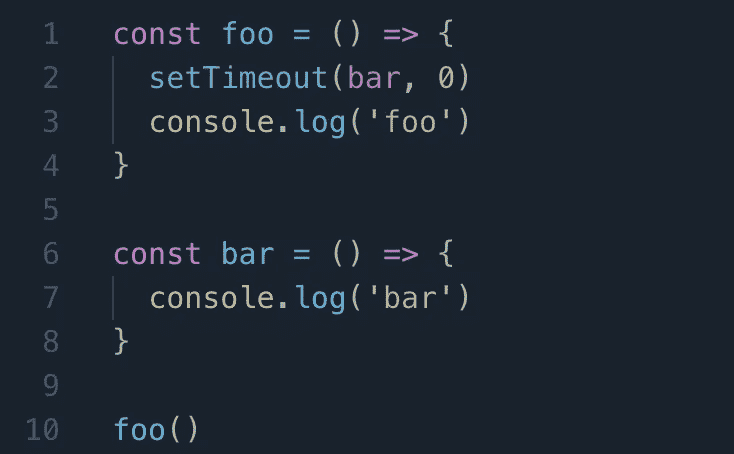

# 解释了 JavaScript 调用堆栈

> 原文：<https://levelup.gitconnected.com/javascript-call-stack-explained-a6e0ae1574be>

## JavaScript 的调用栈、事件循环和事件队列介绍

由 [Kelly Bork](https://unsplash.com/@kellbork?utm_source=medium&utm_medium=referral) 在 [Unsplash](https://unsplash.com?utm_source=medium&utm_medium=referral) 上拍摄的照片

# 什么是调用栈？

> **调用栈**是一种解释器(就像 web 浏览器中的 JavaScript 解释器)跟踪其在调用多个[函数](https://developer.mozilla.org/en-US/docs/Glossary/Function)的脚本中的位置的机制——当前正在运行什么函数，以及从该函数中调用了什么函数，等等。— [MDN 网络文档](https://developer.mozilla.org/en-US/docs/Glossary/Call_stack)

**调用栈**跟踪要执行的函数。当我们调用一个函数时，它被添加，或者说*将*推到调用堆栈的顶部。当函数返回时，它被移除，或者说*从调用堆栈中弹出*。任何异步函数(`fetch`、`setTimeout`、`async`等)。)被移动到**事件队列**(稍后将详细介绍)。

很可能，当抛出错误时，您已经在控制台中看到了调用堆栈。

从上图中，我们可以看到调用栈(a，b，c)的当前状态以及错误发生的时间。

# 调用栈是如何工作的？

你可能听说过 JavaScript 是单线程的。这意味着它只有一个调用堆栈，并且一次只能处理一条语句。调用堆栈遵循 LIFO(后进先出)原则，这意味着它总是首先处理堆栈顶部的调用。

当一个函数被调用时，它被添加到堆栈中。当一个函数调用另一个函数时，它被添加到调用函数之上。

给定上面的代码块，我们可以断言:

1.  首先，`sayHi`被调用，*将*添加到调用堆栈中(`sayHi`尚未解决)。
2.  `sayHi`然后调用`sayBye`并且*将* `sayBye`添加到调用堆栈中(两个函数仍然未解决)。
3.  此时，调用堆栈状态当前为:

4.`sayBye`现在位于调用堆栈的顶部。它将执行并打印出“再见”到控制台。然后，将它从调用堆栈的顶部移除。

5.现在，`sayHi`位于调用堆栈的顶部。它将在控制台上打印出“Hi ”,然后从调用堆栈中移除。调用堆栈现在是空的。

6.最终输出:

# 事件循环是如何工作的？

当调用异步函数时，它不会进入调用堆栈。相反，它被转发到**事件队列**。调用堆栈和事件队列之间的连接通过**事件循环**实现。事件循环不断检查调用堆栈。如果调用堆栈为空，它会将事件队列中的第一个函数添加到调用堆栈中以供执行。否则，它继续处理调用堆栈中的代码。

# 什么是事件队列？

事件队列是异步代码等待执行的地方。与调用堆栈不同的是，**事件队列**遵循 FIFO(先入先出)原则，这意味着它总是按照调用被添加到队列的顺序来处理调用。

需要注意的是，只有当调用堆栈为空时，事件队列才会开始执行。如果调用堆栈已经在处理代码，事件循环将不会从事件队列中添加任何函数。在调用堆栈清除之前，事件循环不会继续。

看一下下面的代码。

不出所料，上面的代码会立即在控制台中打印出`‘foo’`。然后，1 秒钟后它会打印出`‘bar’`。

下面的代码怎么样？

在这里，`setTimeout`被设置为`0`。因此，你可能认为`bar()`会立即执行，导致`‘bar’`在`‘foo’`之前被打印。但事实并非如此。这两个代码片段都将导致:

尽管`setTimeout`被设置为`0`，它仍然被转发到事件队列。这意味着在调用堆栈完全清除之前，它无法执行。

# 额外资源

 [## ✨♻️ JavaScript 可视化:事件循环

### 哦，事件循环。这是每个 JavaScript 开发人员都必须以某种方式处理的事情之一…

开发到](https://dev.to/lydiahallie/javascript-visualized-event-loop-3dif)  [## 解释了 JavaScript 事件循环和调用堆栈

### 我写这篇文章的目的是教你 JavaScript 如何在浏览器中工作。尽管我一直在和…

felixgerschau.com](https://felixgerschau.com/javascript-event-loop-call-stack/)