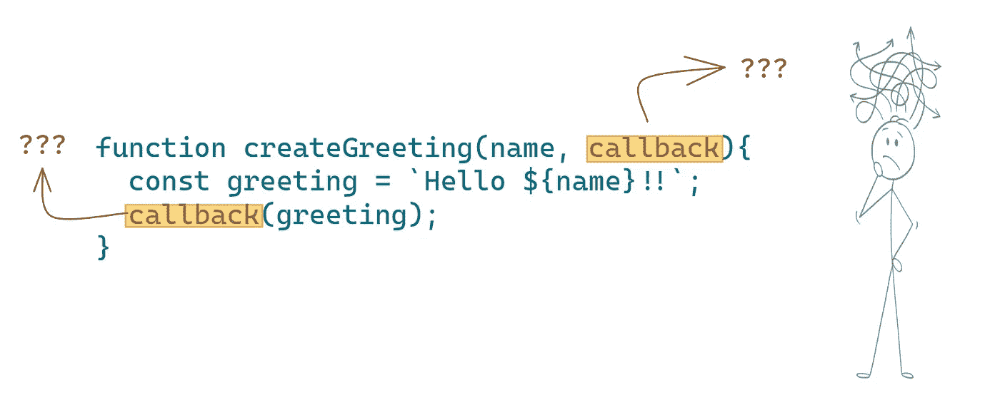

# JavaScript 回调函数

> 原文：<https://levelup.gitconnected.com/javascript-callback-functions-89cc315aa5be>



尽管不知道什么是回调函数，但很可能你已经在不知不觉中使用了它。像`.map()`、`.filter()`和`.reduce()`这样的方法都使用回调函数。

尽管回调可能会令人困惑，但是您仍然需要彻底地学习它们，因为它们构成了 JavaScript 中的一个关键概念。不了解回调，你就走不了多远。

在本文中，您将了解什么是回调，为什么它们很重要，以及如何使用它们。

# 什么是回调函数？

在 Javascript 中，每个函数都是一个对象。这允许我们使用一个函数作为另一个函数的参数，这是回调函数的基本思想。

回调函数是作为一个参数传递给另一个函数的函数，并且期望在稍后的时间点被*回调*。

接受其他函数作为参数的函数称为*高阶函数。*

为了说明回调是如何工作的，让我们看一个简单的例子。

```
function createGreeting(name, callback){ 
  const greeting = `Hello ${name}!!`;
  callback(greeting); 
}

function logGreeting(greeting){
  console.log(greeting);
}

createGreeting("James", logGreeting); 
// Hello James!!
```

在这个例子中，`createGreeting`是高阶函数，它接受两个参数，名称和回调函数。我们使用`logGreeting`作为我们的回调函数。当我们执行`createGreeting`函数时，请注意，当我们将其作为参数传入时，*没有将*括号附加到`logGreeting`上。这是因为我们不想马上执行回调函数，我们只想将函数定义传递给更高阶的函数，以便稍后执行。

# 为什么要使用回调函数？

回调以两种不同的方式使用——在*同步函数*和*异步函数*中。

## 同步函数中的回调

如果你的函数是从上到下执行的，并且在执行下一行之前等待上一行被执行，那么你的函数是同步的。

在同步代码中使用回调的目的是我们可以很容易地将代码的一部分与另一部分交换。

看看下面的例子，我们可以简单地通过交换回调函数，轻松地重用`filter`函数来获得偶数和奇数。

```
const numbers = [3, 4, 10, 20]
const getOddNums = num => num % 2 !== 0
const getEvenNums = num => num % 2 === 0

// Passing getOddNums function into filter
const oddNums = numbers.filter(getOddNums)

// Passing getEvenNums function into filter
const evenNums = numbers.filter(getEvenNums)
```

现在你知道了为什么我们在同步函数中使用回调，让我们继续看为什么我们在异步函数中使用回调。

## 异步函数中的回调

异步意味着，如果 JavaScript 需要等待某件事情完成，它会在等待的同时开始完成其他任务。

一个非常常见的异步函数的例子是`setTimeout`。稍后需要一个回调函数来执行它。

```
// Calls the callback after 1 second
setTimeout(callback, 1000)
```

让我们看看`setTimeout`如何工作，如果你让 JavaScript 完成其他任务的话:

```
const fiveSecondsLater = () => console.log('5 seconds passed!')

setTimeout(fiveSecondsLater, 5000)
console.log('Start!')
console.log('Doing other tasks')
```

在上面的代码中，JavaScript 执行`setTimeout`。然后，它等待五秒钟，并记录“5 秒钟过去了！”。

同时，在等待`setTimeout`完成它的 5 秒钟时，JavaScript 继续执行`console.log("Start!")`和`console.log("Doing other tasks")`。

因此，这是您将看到的上述代码的输出:

```
// Start! (almost immediately)
// Doing other tasks (almost immediately after the first log)
// 5seconds passed! (after five seconds)
```

因此，对于异步函数中的回调，我们提前给出了任务完成时该做什么的指令。

回调的一些常见用例告诉 JavaScript 该做什么

1.  当事件触发时(例如，键盘按键被按下)。
2.  完成一个 API 调用。
3.  在读取/写入文件后。

希望这能让你明白为什么回调是有用的，以及如何使用它们。

在我们结束之前，让我们看一看人们在使用回调时经常遇到的一个常见问题。

# 回调地狱

回调地狱是多个回调一个接一个嵌套的现象。每次回调都依赖/等待前一次回调完成，从而形成一个难以阅读和维护的金字塔结构。

我们来看一个回调地狱的例子。

```
read('first.js', function(error, script) {
  if (error) {
    handleError(error);
  } else {
    // ...
    read('second.js', function(error, script) {
      if (error) {
        handleError(error);
      } else {
        // ...
        read('third.js', function(error, script) {
          if (error) {
            handleError(error);
          } else {
            // ....
          }
        });

      }
    });
  }
});
```

似乎很难遵循这些准则，不是吗？

避免回调地狱的一个解决方案是将代码分成更小的函数以避免嵌套结构。

```
read('first.js', step1);

function step1(error, script) {
  if (error) {
    handleError(error);
  } else {
    // ...
    read('second.js', step2);
  }
}

function step2(error, script) {
  if (error) {
    handleError(error);
  } else {
    // ...
    read('third.js', step3);
  }
}

function step3(error, script) {
  if (error) {
    handleError(error);
  } else {
    // ....
  }
}
```

这个看起来比上一个可读性更强，对吧？

还有其他解决回调问题的方法，比如 promises 和 async/await。我们将在以后的文章中尝试研究它们。

# 包扎

今天，你学习了什么是回调，为什么回调在 JavaScript 中如此重要，以及如何使用回调。您还了解了回调地狱以及解决它的方法。希望现在回调不再让你困惑。

关于复试你还有什么问题吗？如果你愿意，请在下面留下你的评论，我会尽快回复你。

***如果你喜欢这个，请看看我的其他作品***[](https://tahajiru.start.page/)****。****