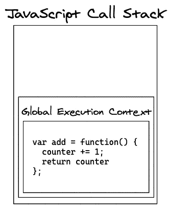

# JavaScript 闭包

> 原文：<https://levelup.gitconnected.com/javascript-closures-eb6961375bbd>

## 一个秘密的魔术袋

JavaScript 闭包的概念可能有点难以理解。当一个函数返回另一个函数时，通常使用闭包。它们背后的神奇之处在于，即使返回了一个函数，从而消除了调用函数和它的局部变量，返回的函数仍然保留了被删除环境的“记忆”,包括被破坏的局部变量，并且可以像它们仍然存在一样使用它们🤯

让我们通过分解下面的代码来揭开闭包的神秘面纱:

```
1:  var add = (function () {
2:    var counter = 0;
3:    return function () {counter += 1; return counter}
4:  })();
5:  const increment1 = add();
6:  const increment2 = add();
7:  const increment3 = add();
8:  console.log('increments: ', increment1, increment2, increment3); // output -> increments:  1 2 3
```

*代码取自* [*w3schools 的 JavaScript 闭包*](https://www.w3schools.com/js/js_function_closures.asp) *页面，修改后增加了一个* `console.log`

在运行任何脚本之前，全局执行上下文(GEC)被推入[调用堆栈](https://medium.com/swlh/javascript-execution-order-e1bebc3976ca)。


脚本运行，在 GEC 中创建变量`add`及其函数表达式。注意，分配给`add`的函数是一个立即调用的函数表达式(IIFE ),它返回一个匿名函数:`function() {counter += 1; return counter}`


*有意思…为什么要这样写函数？嗯……为什么不直接把* `add` *设置成等于一个定义为* `counter += 1; return counter` *的函数，而不是让它等于一个返回那个函数的生命。事实上，你可以在函数之外定义* `counter` *并像这样重写函数，输出也是一样的。*

```
var counter = 0;
var add = function() {
  counter += 1;
  return counter;
};
```

敏锐的观察力侦探。让我们继续沿着黄砖路走下去，看看这次冒险还会把我们带到哪里。

现在，在这一点上，更多的 JavaScript 魔法出现了。生命，顾名思义，一旦被定义，就会被调用。这意味着`var add`现在实际上等于`function() {counter =+ 1; return counter}`。噗，就这样，生命消失了…哦，有意思…但是现在也消失了。



那么，当我们可以像前面提到的那样写出函数的时候，为什么还要钻牛角尖呢？

```
var counter = 0;
var add = function() {
  counter += 1;
  return counter;
};
```

*这个简单多了，也更容易理解。另外，对于 life，* `*counter*` *看起来好像从来没有声明过。它如何执行而不导致错误呢？*

两个伟大的问题。是的，像这样重写代码会更容易理解，而且它仍然会产生预期的结果。但是声明`counter`的方式使它成为一个全局变量。我们只希望它可以被`add`函数访问。以这种方式重写它会污染全局范围，并使其他函数无法访问和修改它。我们试图避免这两种情况。

好吧，这个怎么样？

```
var add = function() {
  var counter = 0;
  counter += 1;
  return counter;
}
```

*哦等等，那会在每次调用的时候把* `counter` *重置为* `0` *。好吧，我看到了缺点，所以告诉我更多关于这里发生了什么…*

```
var add = function() {
  counter += 1;
  return counter
};
```

太好了，所以 IIFE 执行并返回一个函数，这个函数将`counter`增加`1`，然后返回它。生命不再存在，它的局部变量也不再存在，或者看起来如此。返回函数的神奇之处在于，即使在它被销毁之后，它还记得它的环境，包括局部变量，并且可以继续使用它们。因此，在我们的例子中，`counter`在生命的身体中被宣告，一旦被执行，宣告就消失了。然而，返回的函数会记住`counter`的声明，即使它已经不在全局执行上下文中。通常，当一个函数触发并需要找到它所操作的变量的值时，它会首先检查它的局部作用域，然后是它的父作用域，然后是它的祖父作用域……一直到它到达全局作用域。这被称为作用域链。然而当`add`触发时，在检查它的局部范围之前，它将首先检查它的*秘密锦囊*。果然，它会在里面找到`counter`。

当第 5 行调用`add`时，会看到`counter`最初被赋给了`0`。然后将`counter`的值增加`1`，并在设置`increment1 = 1`时返回其值。

当它在第 6 行被调用时，它将再次检查它的*锦囊*并看到`counter`现在是`1`，增加并再次返回它，并分配`increment2 = 2` …

…下一行依此类推。所有的`add`函数都已执行并从堆栈中弹出。`console.log`运行并最终输出`increments: 1 2 3`。

你可以通过使用 Chrome 浏览器开发工具中的控制台来查看你的*锦囊*，也称为*闭包范围*。只需将闭包传递给 console.dir()并展开[[Scopes]]属性。


眼见为实

*关闭功能*拥有魔法能力。它们能够封装从堆栈中弹出的数据，将它们保存在比普通函数更深的层次上，并且独占地使用它们，而不用担心它们已经被任何其他函数✨触及💫✨