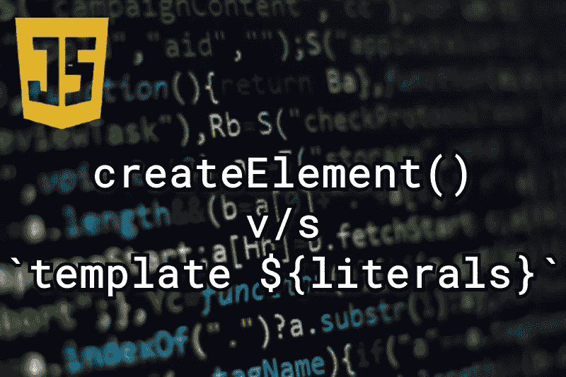

# Javascript: createElement 与模板文字

> 原文：<https://levelup.gitconnected.com/javascript-createelement-vs-template-literals-baa50ec2e941>

几天前，在构建一个项目时，我被问了一个问题，这个问题引起了我的兴趣，我找到并阅读了这个问题。问题是:

> “如果我使用模板字符串而不是 createElement 来创建 HTML 元素会怎么样？有什么区别吗？”

“ **document.createElement()** ”和“**模板文字**”都允许我们创建元素，所以问题是什么时候使用什么？如果我们使用它们中的任何一个或者替换它们，会有什么不同吗？继续读下去你会发现的。

createElement() v/s 模板文本

# createElement()

*   createElement()方法是 1998 年引入的 DOM level-1 特性。
*   它既古老又健壮，但是当我们不得不不时地创建元素时，就会有冗余。
*   浏览器对 createElement()的支持擅长 [97.92 %](https://caniuse.com/?search=createElement) 。

# 模板文字

*   模板文字是在 2015 年的 ES6，也就是 ECMAScript 6 中引入的。
*   它更新更快，代码更少，可读性更强，易于维护，处理错误的机会更少。
*   浏览器对模板字符串的支持是 97.11 % ，这与 createElement()相比并没有太大的区别，但问题是模板文字不能在 IE 11、Opera 和 blackberry 上工作。

**注:** IE 11 即将退役，2023 年 2 月 14 日之后将无法访问。

下面是使用 createElement 和 template 文本添加 HTML 元素的示例代码片段。

**JS 方式**

完全通过 createElement()方法创建 HTML 元素

**带有模板文字的替代选项**

# 结论

正如您在上面的示例代码中看到的，当我们使用 createElement()或使用模板字符串创建元素时，没有太大的区别。所以这个问题的答案归结为选择最适合你的浏览器以及应用程序的用户正在忍受的浏览器。由于 IE11，Opera 和 Blackberry 还不支持模板字符串，你可以选择使用 createElement()方法。