# 详细的 Javascript 日期和时间

> 原文：<https://levelup.gitconnected.com/javascript-date-and-time-in-detail-270e85a68124>

## 通过创建一些很酷的😎东西

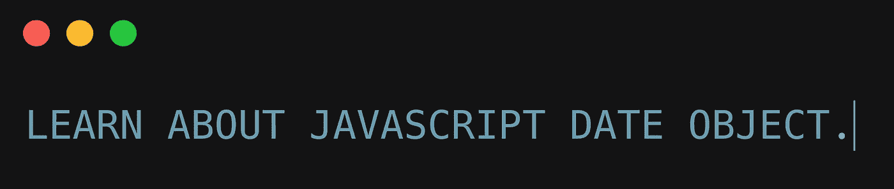

Javascript 有一个内置的`Date`对象来处理所有与时间和日期相关的操作。例如，您可以显示当前日期/时间，创建日历，构建番茄计时器，编写🛑秒表，等等。

## 创建日期对象

我们可以使用`new`操作符创建一个`Date`对象。

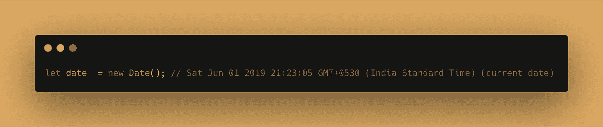

此方法返回带有时间和时区的当前日期。

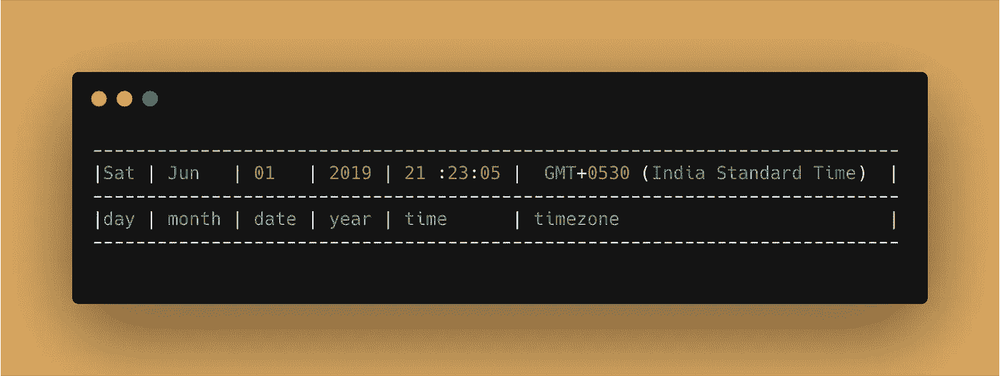

使用 new 关键字时，还有 3 种创建日期的方法:

1.  **用毫秒创建一个** `**Date**` **对象**

我们可以通过向`Date`对象传递一个以毫秒为单位的时间戳来创建一个日期对象。比如`new Date(1572840117245)`。

当我们通过传递给它`0`毫秒来创建一个日期对象时，它将返回`Jan 01 1970 05:30:00`的日期对象。这是 [**Linux 纪元**](https://en.wikipedia.org/wiki/Unix_time) 的日期/时间。

电脑时间以`**Linux Epoch(Jan 01 1970 05:30:00)**`为准。

因为零毫秒对应于这个起始点，任何更大的值都是自 Linux 纪元以来的毫秒数。

> 注:如果 Linux 纪元的概念令人困惑，那么请继续阅读。我们将在文章中进一步了解如何从 JS 中的 epoch 获得当前时间戳。使用 Linux 纪元时间是编程中非常常见的技术，因为它为我们提供了一个精确的比较参考点。

让我们进一步扩展这个演示。一月有 31 天，每天 24 小时，每小时 60 分钟，每分钟 60 秒，每秒 1000 毫秒。

所以，让我们把`31 * 24 * 60 * 60 * 1000 = 2678400000`传递给`Date`对象。不出所料，结果是 1970 年 2 月 1 日，比 Linux 时代晚了一个月。

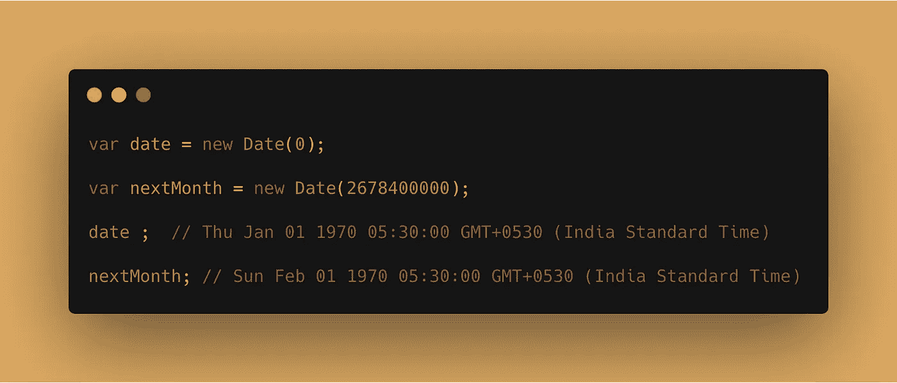

2.**通过传递每个值**创建一个 `**Date**` **对象**

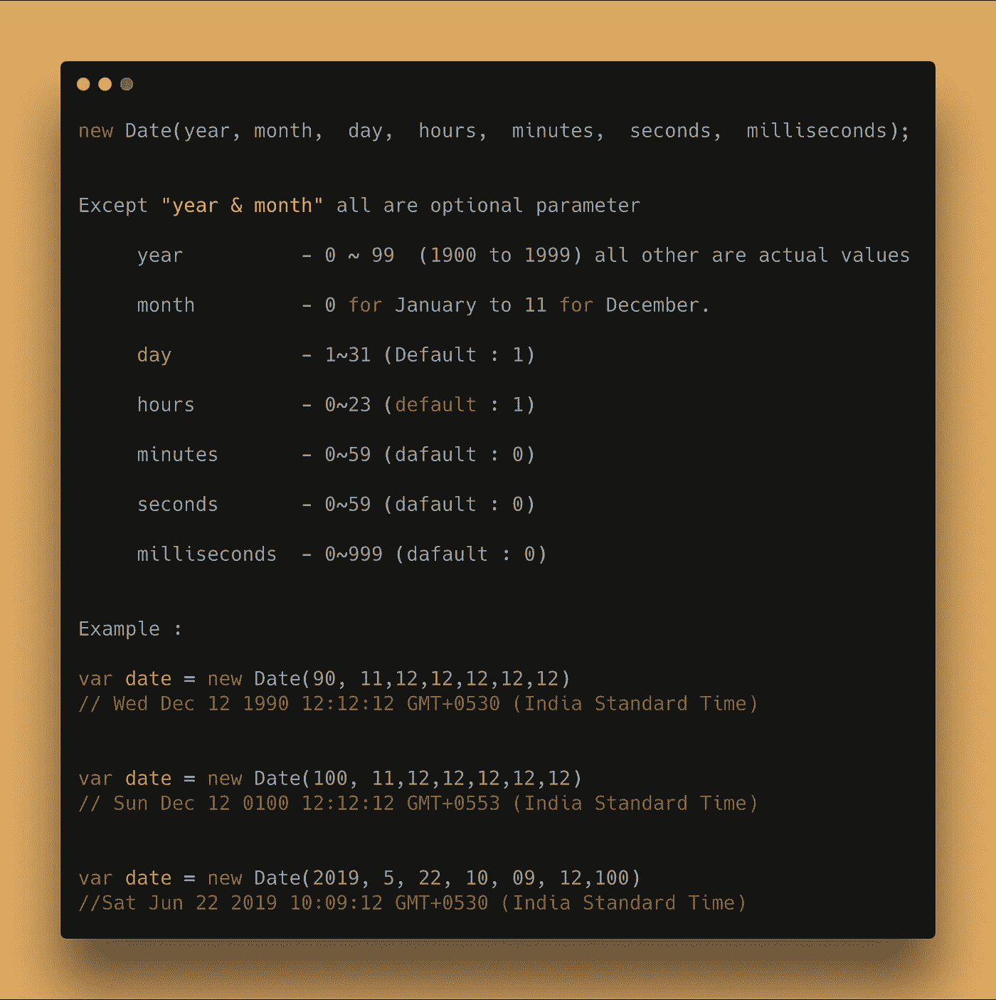

3.**使用** `**dateString**`创建 `**Date**` **对象**

我们可以通过传递日期的字符串表示来创建一个`Date`对象。如果字符串表示能够使用`Date.parse()`进行解析，那么它就是可接受的。

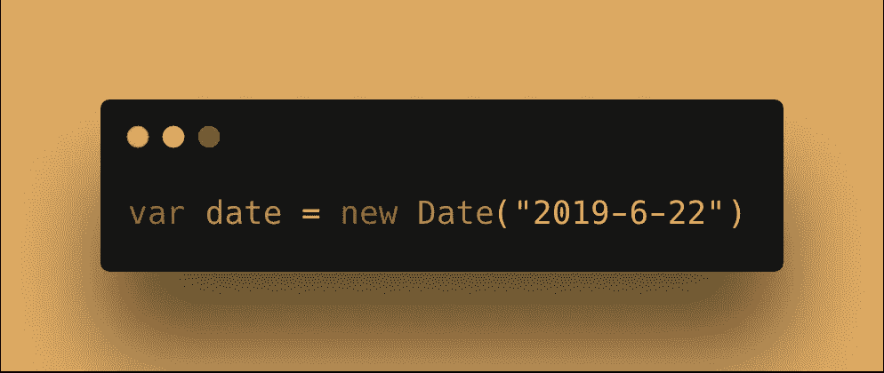

允许的格式是`**YYYY-MM-DDTHH:mm:ss.sssZ**`

YYYY →年份

MM →月

DD →日

T →日期和时间分隔符

HH →小时

毫米→分钟

ss→秒

sss →毫秒

Z →时区

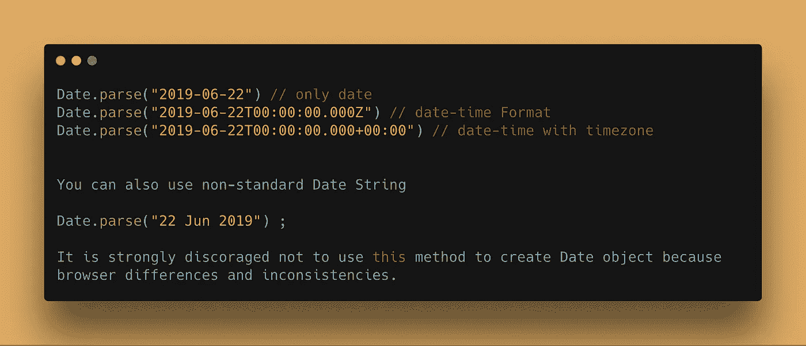

## 使用 Date 对象方法获取和更新日期

我们在上一节中创建的`Date`对象提供了许多获取和更新(设置)日期的方法。

首先，让我们学习一下`get`的方法:

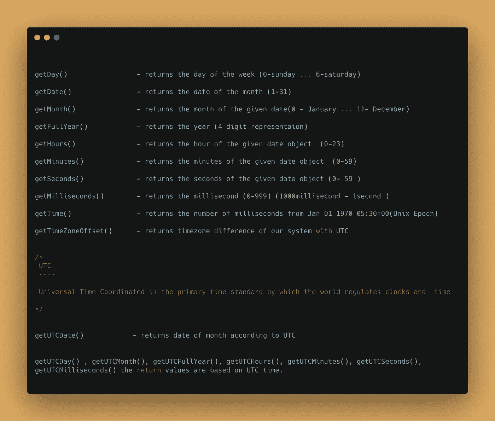

**示例**

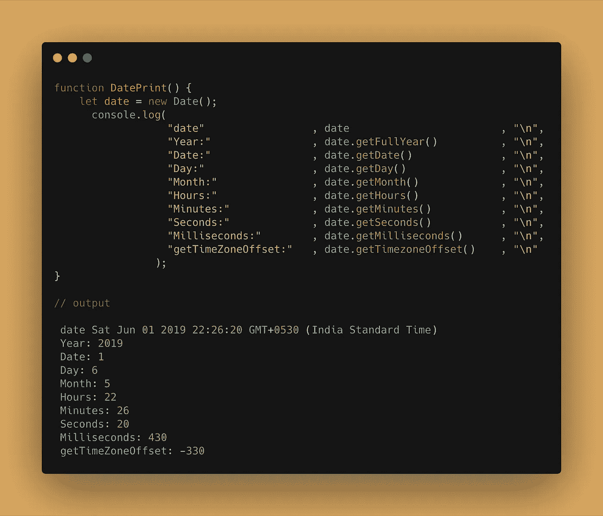

我们可以通过在`**Date**`对象上使用`**set**`方法来改变日期。

**例题**

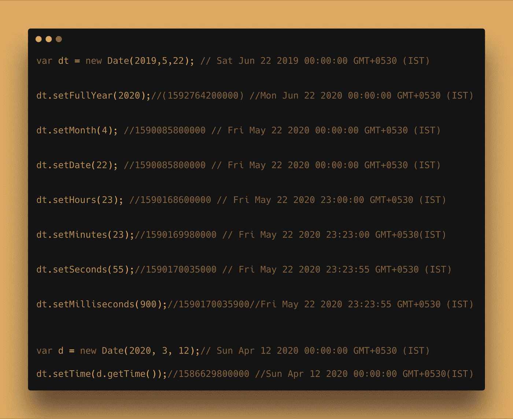

## 日期对象的技巧

1.  要获得以毫秒为单位的当前时间，我们可以使用`Date.now`方法，该方法将返回自 Linux 纪元以来的总毫秒数。

```
Date.now(); // 1572840117245
```

利用那个时间，你可以调用`new Date(1572840117245)`，你会看到它对应的是当前日期。

2.要获得格式化字符串，使用`toDateString`方法:

```
var dt = new Date(22,5,1997);dt.toDateString() // Sun Jun 22 1997
```

3.用 Javascript 计算一个月的总天数。

我们需要创建一个函数，它接受月(在 JS 中月的索引为 0–11)和年作为参数，并且我们需要返回该月的天数。

当我们用年和月创建一个`Date`对象时，一个月中的第几天被设置为 1。

因此，如果我们传递`**new Date(5,2019)**`，那么它将返回`**1st June 2019**` **的日期对象。**

没有一个月会超过 31 天。所以如果我们把日期定为 32，那么

*   如果本月有 **31 天→指向下个月第一天，**
*   如果当月有 **30 天→指向下月第二天**，
*   如果当月有 **29 天→指向下月第三天，**
*   如果当月有 **28 天→指向下月第四天，**

示例:

```
var d = new Date(2019, 0, 32); // Feb 01 2019d.getDate(); // 1 (because Jan 2019 has 31 days)var d = new Date(2019, 1, 32); Mar 04 2019d.getDate(); // 4 (because Feb 2019 has 28 days)
```

如果我们再次`**subtract the current date from 32**`，那么我们将得到所提供的一个月中的天数。

因此，让我们创建一个函数，返回经过年和月的天数:

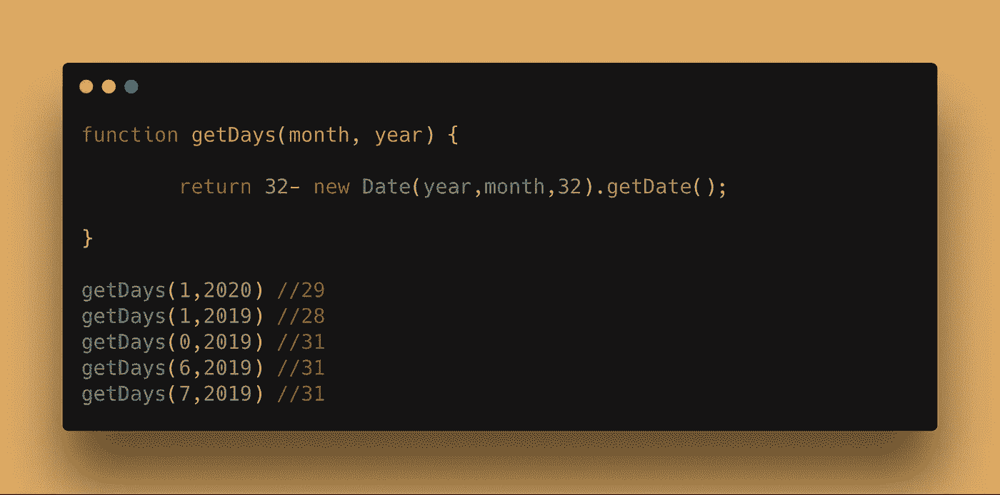

这些就是 JavaScript 中日期对象的关键特性！

如果你发现这个有用的惊喜🎁我这里[](https://www.paypal.me/jagathishSaravanan)****。****

****觉得开心就分享。****

****跟随** [**Javascript Jeep🚙**](https://medium.com/u/f9ffc26e7e69?source=post_page-----270e85a68124--------------------------------) **如果你觉得值得。****