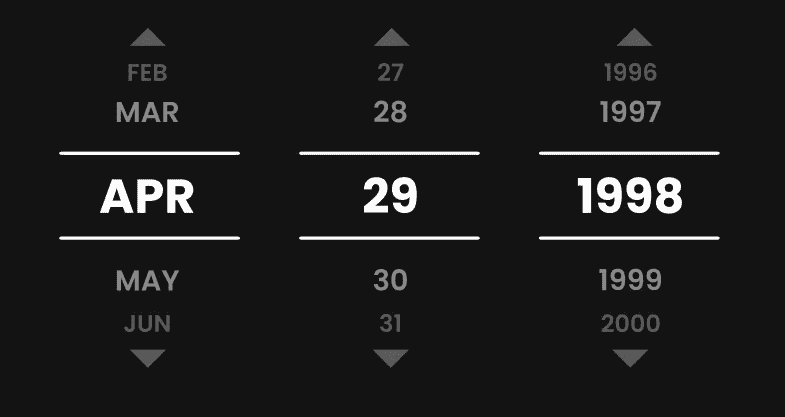

# JavaScript 日期:构建日期选择器

> 原文：<https://levelup.gitconnected.com/javascript-date-building-a-react-hook-for-date-selector-b07955c4d7bd>

本周，我必须在 React 中构建一个日期选择器表单，如下所示:



如您所见，除了选定的日期之外，用户界面还包括周围的月份和日期选项。这意味着我不仅需要跟踪当前日期，还需要一种方法来方便地计算出所选月份中有多少天，以及所选月份的前后月份。

当我第一次看到这个设计时，我想我必须为此写一堆帮助函数。但是我没有很多时间，所以我决定看看 JavaScript 的`Date`对象在这种情况下能为我做什么。

事实证明，`Date`对象非常适合解决这个问题。一开始，我只是在我的浏览器控制台中摆弄它。我惊讶地发现，`Date`对象的构造函数方法完全按照我需要的方式运行，以便轻松地获得所需的信息。

构造函数方法有几种不同的用法。对于这个任务，我创建了这样一个日期:

```
new Date(year, monthIndex, day)
```

`monthIndex`是从`0`而不是`1`开始的月份顺序号。

为了方便起见，我创建了一个钩子和一些 setter 函数，以便在每次日期改变时创建新的`Date`对象:

```
const dateObj = new Date(2000, 0, 1);
const [date, setDate] = useState(dateObj);const setMonth = month => {
  const newDate = new Date(
    date.getFullYear(),
    month,
    date.getDate()
  );
  setDate(newDate);
};const setDay = day => {
  const newDate = new Date(
    date.getFullYear(),
    date.getMonth(),
    day
  );
  setDate(newDate);
};const setYear = year => {
  const newDate = new Date(
    year,
    date.getMonth(),
    date.getDate()
  );
  setDate(newDate);
};
```

现在我有了创建和更改日期的方法，我需要弄清楚如何 1)将月份索引转换为三个字母的月份名称，2)显示所选月份和日期前后的月份和日期。

解决第一个问题很简单。我刚刚用缩写创建了一个数组。然后，为了显示之前/之后的月份，我添加了一些条件语句来调整无效的索引。

这样，要显示比所选日期的月份早两个月的月份名称——在顶部的图像中，应该是“FEB”——我只需要传入`selectedMonthIndex — 2`,函数就会完成剩下的工作:

```
const getMonth = index => {
  let newMonthIndex = index;
  if (index < 0) newMonthIndex += 12;
  else if (index > 11) newMonthIndex -= 12; const monthList = [ ‘JAN’, ‘FEB’, ‘MAR’, ‘APR’, ‘MAY’, ‘JUN’, ‘JUL’, ‘AUG’, ‘SEP’, ‘OCT’, ‘NOV’, ‘DEC’, ]; return monthList[newMonthIndex];
};
```

这就是几个月的原因。现在到了白天。

为了确定要显示哪些天，我需要计算当前所选月份中有多少天。从头开始建造这个需要大量的工作。幸运的是，已经内置了一点 JavaScript 魔法来解决这个问题。

关于`Date`对象的构造方法的酷的部分是它以一种非常方便的方式纠正你犯的任何错误。例如，如果您在控制台中粘贴以下代码:

```
new Date(2020, 0, 32)
```

返回日期为 2020 年 2 月 1 日。`Date`物体知道 2020 年 1 月有 31 天。因此，在 JavaScript 中，1 月 32 日与 2 月 1 日相同。反之，2 月 0 日与 1 月 31 日相同。

因此，给定一个月索引，您可以通过以下方式计算该月有多少天:

```
const maxDay = new Date(year, monthIndex + 1, 0)
```

下个月的第零天是当月的最后一天。使用它，我可以编写一个类似于上面的`getMonth()`的函数来计算我的前/后天数:

```
const getDay = dayNum => {
  const fullMaxDate = new Date(
    date.getFullYear(),
    date.getMonth() + 1,
    0
  );
  const maxDay = fullMaxDate.getDate(); if (dayNum < 1) return maxDay - dayNum;
  if (dayNum > maxDay) return dayNum - maxDay;
  return dayNum;
};
```

就像以前一样，我可以简单地将`selectedDay — 2`传递到这个函数中，它将完成剩余的工作，计算要显示的正确日期。

最终，当我将这个日期发送到后端时，我需要将它格式化为`YYYY-MM-DD`。`Date`对象对此没有内置的方法，但是它提供了一个`toISOString()`方法，在返回字符串的开头包含这种格式。为了正确格式化我的日期，我只去掉了前 10 个字符:

```
const format = () => date.toISOString().slice(0, 10);
```

这就是我构建本文顶部所示的 UI 组件所需的全部内容。使用 JavaScript 内置的`Date`对象，我让 JavaScript 完成所有复杂的日期计算，并将它的 API 包装在我自己的易于使用的函数中。

最棒的是，除了使计算简单之外，日期选择器无需任何额外的工作就可以考虑闰年。