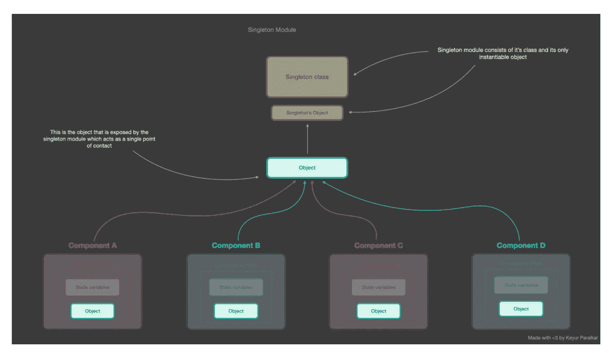

# Javascript 设计模式

> 原文：<https://levelup.gitconnected.com/javascript-design-patterns-aa4adb7b85e6>

单例模式|工厂模式|构造器模式

## 主题

*   单一模式
*   工厂模式
*   工厂模式与构造器模式

## 单一模式(使用 Redux 或 React 上下文)



*   单例设计模式公开了可以被多个组件使用的单个实例
*   **单例模式**可以被认为是全局状态管理库的基础，如 **Redux 或 React Context** 。
*   这是一种限制类只能创建一个实例的模式。
*   它们可以被全局访问，并作为访问全局状态的单一访问点。

```
let instance;
let globalState = {
  color: ""
};

class StateUtility {
  constructor() {
    if (instance) {
      throw new Error("New instance cannot be created!!");
    }
    instance = this;
  }
  getPropertyByName(propertyName) {
    return globalState[propertyName];
  }
  setPropertyValue(propertyName, propertyValue) {
    globalState[propertyName] = propertyValue;
  }
}
let stateUtilityInstance = Object.freeze(new StateUtility());
export default stateUtilityInstance;
```

*   我们确保不暴露`globalState`。我们使用`StateUtility`的类方法来公开它们。这样，我们保护全局状态不被直接改变。
*   最后，我们创建类的实例如下:`let stateUtilityInstance = Object.freeze(new StateUtility());`。
*   我们已经使用了`Object.freeze`，所以没有其他类/组件/模块能够修改暴露的`stateUtilityInstance`。

## 工厂模式(工厂模式 vs 构造函数)—

*   工厂是用于创建对象的函数式编程范例中的对象或类或函数。
*   ***工厂方法*按照客户的指示创建新对象**。在 JavaScript 中创建对象的一种方法是使用 new 运算符调用构造函数
*   工厂设计模式用于**当我们有一个包含多个子类的超类时，基于输入，我们需要返回一个子类**。这种模式将类实例化的责任从客户端程序转移到了工厂类。
*   类将责任委托给几个助手子类中的一个，并且您想要本地化哪个助手子类是委托的知识
*   工厂方法经常用于管理、维护或操作不同但同时具有许多共同特征(即方法和属性)的对象集合的应用程序中。
*   工厂模式可以在内部使用构造函数或类，但是在对象创建过程依赖于动态因素的情况下——比如当我们想要动态创建子类时——工厂模式是首选。
*   Factory 给了我们一个既灵活又可重用的对象创建机制。

```
// creates factory function
function vehicleFactory (manufacturer, plateNO) {
    return  {
        manufacturer,
        plateNO,
        startEngine () {
            console.log("reving engine")
        },
        drive () {
            console.log("driving car...")
        }
    }
}

const Vehicle1 = vehicleFactory("Toyota", 12345);
console.log(Vehicle1) 
// prints 
//{
//  manufacturer: 'Toyota',
//  plateNO: 12345,
//  startEngine: [Function: startEngine],
//  drive: [Function: drive]
//}

const Vehicle2 = vehicleFactory("Ford", 13345);
console.log(Vehicle2) 
// prints 
// {
//  manufacturer: 'Ford',
//  plateNO: 13345,
//  startEngine: [Function: startEngine],
//  drive: [Function: drive]
// }
```

例子，

*   工厂模式通过重用`StartEngine`、`driveVehicle`和`stopEngine`方法来提高代码的可重用性。

```
class Car {
    constructor(options) {
        this.wheels = options.wheels || 4;
        this.doors = options.doors || 4;
        this.color = options.color || "silver"; 
    }
}

class Truck {
    constructor(options) {
        this.wheels = options.wheels || 6;
        this.doors = options.doors || 2;
        this.color = options.color || "red"; 
    }
}

class Factory {

    create = (options, vehicleType) => {

        if(!vehicleType) {
            return "unable to make vehicle. Please specify a vehicle type and tryagain!"
        }

        let vehicle;

        if (vehicleType === "car") {
            vehicle = new Car(options);
        } else if (vehicleType === "truck") {
            vehicle = new Truck(options);
        } 

        vehicle.vehicleType = vehicleType;

        vehicle.startEngine = ()=> console.log(`Reving ${vehicleType} engine`);

        vehicle.driveVehicle = ()=> console.log(`Driving ${vehicleType}...`);

        vehicle.stopEngine = ()=> console.log(`Stop ${vehicleType} engine`);

        return vehicle;
    }

};

const vehicleFactory = new Factory();

const car = vehicleFactory.create({
    wheels: 4,
    doors: 2,
    color: "black",
}, "car");

console.log(car)
console.log(car.startEngine())
console.log(car.driveVehicle())

// prints:
//Car {
//  wheels: 4,
//  doors: 4,
//  color: 'silver',
//  vehicleType: 'car',
//  startEngine: [Function],
//  driveVehicle: [Function],
//  stopEngine: [Function]
//}

// Reving car engine
// Driving car...

const truck = vehicleFactory.create({
    wheels: 4,
 doors: 2,
 color: "yellow",
}, "truck")

console.log(truck)
console.log(truck.startEngine())
console.log(truck.stopEngine())
// prints
//Truck {
//  wheels: 4,
//  doors: 2,
//  color: 'yellow',
//  vehicleType: 'truck',
//  startEngine: [Function],
//  driveVehicle: [Function],
//  stopEngine: [Function]
//}

// Reving truck engine
// Stop truck engine
```

*   **通过使用工厂模式，我们的代码也很容易维护**，因此，如果业务扩展，工厂开始生产新类型的车辆，我们可以很容易地控制我们的实现来处理这种情况，如下所示:

```
class Car {
    constructor(options) {
        this.wheels = options.wheels || 4;
        this.doors = options.doors || 4;
        this.color = options.color || "silver"; 
    }
}

class Truck {
    constructor(options) {
        this.wheels = options.wheels || 6;
        this.doors = options.doors || 2;
        this.color = options.color || "red"; 
    }
}

class Bus {
    constructor(options) {
        this.wheels = options.wheels || 4;
        this.doors = options.doors || 4;
        this.color = options.color || "white"; 
    }
}

class Motorcycle {
    constructor(options) {
        this.wheels = options.wheels || 2;
        this.doors = options.doors || 0;
        this.color = options.color || "Black"; 
    }
}

class Factory {

    create = (options, vehicleType) => {

        if(!vehicleType) {
            return "unable to make vehicle. Please specify a vehicle type and tryagain!"
        }

        let vehicle;

        if (vehicleType === "car") {
            vehicle = new Car(options);
        } else if (vehicleType === "truck") {
            vehicle = new Truck(options);
        } else if (vehicleType === "bus") {
            vehicle = new Bus(options);
        } else if (vehicleType === "motorcycle") {
            vehicle = new Motocycle(options);
        }

        vehicle.vehicleType = vehicleType;

        vehicle.startEngine = ()=> console.log(`Reving ${vehicleType} engine`);

        vehicle.driveVehicle = ()=> console.log(`Driving ${vehicleType}...`);

        vehicle.stopEngine = ()=> console.log(`Stop ${vehicleType} engine`);

        return vehicle;
    }

};

const vehicleFactory = new Factory();

const bus = vehicleFactory.create({
    wheels: 4,
    doors: 4,
    color: "yellow",
}, "bus");

console.log(bus)
console.log(bus.startEngine())
console.log(bus.driveVehicle())

// prints:
// Bus {
//  wheels: 4,
//  doors: 4,
//  color: 'yellow',
//  vehicleType: 'bus',
//  startEngine: [Function],
//  driveVehicle: [Function],
//  stopEngine: [Function]
//}

// Reving bus engine
// Driving bus...

const bike = vehicleFactory.create({
    wheels: 2,
 doors: 0,
 color: "red",
}, "motorcycle")

console.log(bike)
console.log(bike.startEngine())
console.log(bike.stopEngine())
// prints
// Motorcycle {
//  wheels: 2,
//  doors: 0,
//  color: 'red',
//  vehicleType: 'bike',
//  startEngine: [Function],
//  driveVehicle: [Function],
//  stopEngine: [Function]
//}

// Reving motorcycle engine
// Stop motorcycle engine
```

更多例子，

```
var Factory = function () {
    this.createEmployee = function (type) {
        var employee;

        if (type === "fulltime") {
            employee = new FullTime();
        } else if (type === "parttime") {
            employee = new PartTime();
        } else if (type === "temporary") {
            employee = new Temporary();
        } else if (type === "contractor") {
            employee = new Contractor();
        }

        employee.type = type;

        employee.say = function () {
            console.log(this.type + ": rate " + this.hourly + "/hour");
        }

        return employee;
    }
}

var FullTime = function () {
    this.hourly = "$12";
};

var PartTime = function () {
    this.hourly = "$11";
};

var Temporary = function () {
    this.hourly = "$10";
};

var Contractor = function () {
    this.hourly = "$15";
};

function run() {

    var employees = [];
    var factory = new Factory();

    employees.push(factory.createEmployee("fulltime"));
    employees.push(factory.createEmployee("parttime"));
    employees.push(factory.createEmployee("temporary"));
    employees.push(factory.createEmployee("contractor"));

    for (var i = 0, len = employees.length; i < len; i++) {
        employees[i].say();
    }
}
```

# 工厂模式与构造函数

*   构造器模式和工厂模式是相似的，因为**它们是返回新对象的对象创建模式**
*   **工厂方法可以返回一个已经创建的对象**，不像构造函数总是创建一个新的实例。
*   工厂方法提倡先使用接口再使用实现来编码的思想，这样会产生更灵活的代码，但是构造函数会将您的代码绑定到特定的实现上。
*   **使用构造函数的理由:**我们使用构造函数**用默认或初始状态**初始化对象。原语的默认值可能不是您想要的。使用构造函数的另一个原因是它告知依赖关系。
*   **使用工厂的理由:**工厂方法模式**允许子类选择要创建的对象类型**。它消除了将特定于应用程序的类绑定到代码中的需要，从而促进了松散耦合。

```
const vehicleOptions = {type: "cars", color: "white", doors: 4, wheels: 4}

// factory pattern
function Factory(options) {
  let factory = {};
  factory.type = options.type;
  factory.color = options.color;
  factory.wheels = options.wheels;
  factory.doors = options.doors;

  return factory;
}

const vehicle = Factory(vehicleOptions);

// constructor pattern
function ConstructorPattern(options) {
  this.type = options.type;
  this.color = options.color
  this.doors = options.doors;
  this.wheels = options.wheels;
}

const vehicle2 = new ConstructorPattern(vehicleOptions);

console.log("factory car", vehicle)
// prints { type: 'cars', color: 'white', wheels: 4, doors: 4 }

console.log("constructor car", vehicle2)
// prints { type: 'cars', color: 'white', wheels: 4, doors: 4 }
```

# 何时使用工厂模式

工厂模式在应用于以下情况时尤其有用:

*   当我们的对象或组件设置涉及高度复杂时。
*   当我们需要根据所处的环境轻松生成不同的对象实例时。
*   当我们处理许多具有相同属性的小对象或组件时。
*   当用其他对象的实例组成对象时，只需要满足一个 API 契约(也称为 duck typing)就可以工作。这对解耦很有用。

# 感谢阅读

*   👏请为这个故事鼓掌，然后跟我来👉
*   📰查看更多关于[编码和系统设计访谈的内容](https://sonikamaheshwari067.medium.com/)
*   🔔关注我: [LinkedIn](https://www.linkedin.com/in/sonika-maheshwari-81542220/) ！

我知道总会有需要改进的地方。请随意分享你的想法

**🚀👉** [**加入升一级的人才集体，找到一份惊人的工作**](https://jobs.levelup.dev/talent/welcome?referral=true)