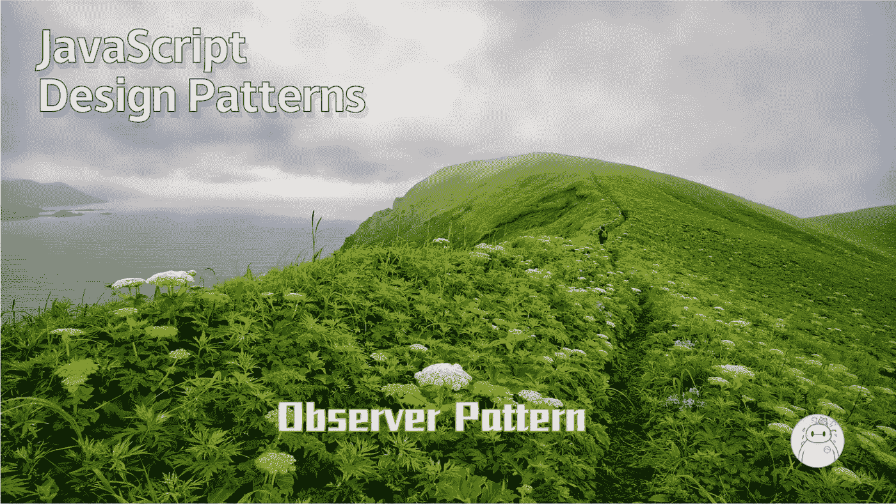
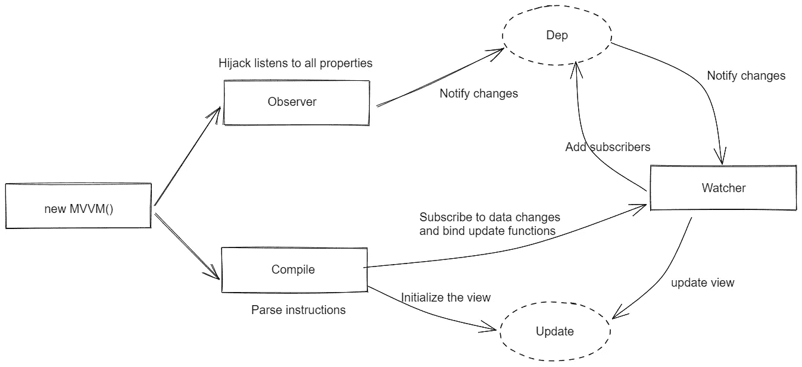

# JavaScript 设计模式:观察者模式

> 原文：<https://levelup.gitconnected.com/javascript-design-patterns-observer-pattern-1cf90cffb1e2>



## **观察者**

观察者也称为发布-订阅模式或消息机制。它定义了对象之间一对多的依赖关系。只要一个对象的状态发生变化，所有依赖它的对象都会得到通知，并且自动更新，解决了主体对象和观察者之间的功能耦合，即一个对象的状态发生变化时通知其他对象的问题。

只看定义，对于前端的朋友来说，这个概念可能比较模糊，而且我对观察者模式还是有一点了解的，好吧，那我再看一个生活中比较贴切的例子，相信你马上就能理解了。

**生活中的观察者模式**

每次苹果发布新手机，都是热销。我看中了苹果 14 pro，想去苹果专卖店买，但是到了店里之后，售货员告诉我这款手机很受欢迎。嗯，那我也不能天天过来问，很费时间，就把手机号留给售楼小姐了。如果他们店里有货，就让她给我打电话让我知道，像这样你就不用担心不知道什么时候有货，也不用天天跑去问。如果你已经成功购买了一部手机，那么销售小姐在那之后就不需要通知你了。

*这样不是清楚了很多吗~这样的案例还有很多，就不赘述了。*

## 使用观察者模式

说实话，我可以保证每个阅读这篇文章的人都使用过观察者模式。如果你不相信我，看看下面的代码:

```
document.**querySelector**('#btn').**addEventListener**('click',**function** () {         
   **alert**('You click this button');     
},false)
```

看起来眼熟吗？没错，我们通常绑定到`DOM` 的事件是一个非常典型的发布-订阅模式。这里我们需要监控用户在按钮上的`click` 事件，但是我们无法知道用户什么时候点击，所以我们订阅了按钮上的点击。事件，只要点击按钮，按钮就会向订阅者发布消息，我们就可以做相应的操作了。
除了我们常见的`DOM` 事件绑定，观察者模式还有很多应用范围。
比如对比目前流行的`vue` 框架，很多地方都涉及到了观察者模式，比如:数据双向绑定



使用 Object.defineProperty()劫持数据，设置一个 listener Observer 来监控所有属性，如果属性发生变化，需要告诉订阅者 Watcher 更新数据，最后命令解析器编译解析相应的命令，然后执行相应的更新函数来更新视图，实现双向绑定。

**子组件与父组件通信**

在`Vue`中，我们通过`props`将数据从父组件传递到子组件，子组件通过自定义事件与父组件通信，即`$on`、`$emit`，这实际上意味着我们通过`$emit`发布消息，并对订阅者进行统一处理`$on`

**接下来，让我们自己创建一个简单的观察器:**

首先我们需要创建一个 observer 对象，包含一个消息容器和三个方法，分别是订阅消息方法`on` 、退订消息方法`off` 和发送订阅消息`subscribe` 。

好了，我们观察者的原型已经出来了，剩下的就是完善里面的三个方法了。

**注册消息**

registered message 方法的作用是将订阅者注册的消息推送到消息队列中，所以需要传递两个参数:消息类型和对应的处理函数。如果存在，创建一个消息类型并将消息放入消息队列。如果消息已经存在，将相应的方法推入执行方法队列。

**发布消息**

发布消息，它的作用是观察者发布消息时，依次执行所有订阅者订阅的消息，还需要传递两个参数，一个是消息类型，一个是对应执行函数所需的参数，其中消息类型是必需的。

**删除消息**

remove message 方法的作用是清除订阅者已经从消息队列中注销的消息。它还需要传递两个参数，消息类型和执行队列中的一个函数。这里，为了避免删除中消息不存在的情况，需要检查消息的存在。

好了，至此，我们已经实现了一个基本的观察者模型，接下来是我们展示技巧的时候了。

首先，我们来做一个简单的测试，看看我们自己创建的观察者模式表现如何？

我们在消息类型`say`的消息中注册了两个方法，一个接受参数，一个不需要参数，然后通过`subscribe`发布`say` 和`success` 消息。结果如我们所料，控制台输出`hello world`和`success`

## 自定义数据的双向绑定

如上所述，`vue` 双向绑定是通过数据劫持和发布订阅实现的。现在我们用这个思路自己实现一个简单的双向数据绑定。

```
<div id="app">     
   <h3>Two-way binding of data</h3>     
   <div class="cell">         
     <div class="text" v-text="myText"></div>         
       <input class="input" type="text" v-model="myText" >          </div> 
</div>
```

相信你已经知道了，我们要做的是输入标签的`input` ，通过`v-text`绑定到类名为`text` 的 div 标签

首先我们需要创建一个类，这里姑且称之为 myVue。

这里我们定义了`myVue` 构造函数，并在构造函数中执行一些初始化操作。以上有注释，这里不再赘述，主要看两个关键方法`_obverse` 和`_compile`。

首先是`_observe` 法。它的功能是处理传入的`data` 并重新定义数据的`set` 和`get` 方法，以确保我们可以在数据发生变化时跟踪并发出通知，主要使用`Object.defineProperty()`

**_ 观察**

接下来，我们来看看 _compile 方法，它实际上是一个解析器。它的功能是解析模板指令，将更新函数绑定到每个指令对应的节点，并添加订阅者来监控数据。一旦数据发生变化，只需接收通知，然后更新视图变化，具体实现如下:

**_ 编译**

上面的代码也很清楚，我们从根元素`#app`开始递归遍历每个节点，判断每个节点是否有对应的指令，这里我们只针对`v-text`和`v-model`，我们执行了`v-text`一次 new `Watcher()`，把它放在`myText`的指令集中，解析`v-model`，把输入事件绑定到它的输入，通过 new `Watcher()`把它和`myText` 关联起来，所以我们要看看这个 Watcher 到底是什么？

Watcher 实际上是一个订阅者，是`_observer` 和`_compile` 之间的沟通桥梁，绑定更新函数来更新`DOM` 元素。

**沃彻**

每次创建`Watcher` 的实例时，都会传入相应的参数，还会执行一个`_update` 操作。在上面的`_compile`中，我们创建了两个 Watcher 实例，但是两个对应的`_update` 操作是不同的。对于 div 来说，`.text`的操作实际上相当于`div.innerHTML=h3.innerHTML = this.data.myText` ，对于 input 来说相当于`input.value=this.data.myText` ，所以每次设置数据时，我们都会触发两个`_updates`操作，分别更新 div 和 input 中的内容。

**测试**

现在，你对观察者模式有更深的理解了吗？其实我在这里说了这么多，只是起到一个吸引新思想的作用。重要的是设计思路。可能很难学会将这种设计思想合理地应用到我们的实际开发过程中。

[](/javascript-design-patterns-strategy-pattern-c013d3dbc059) [## JavaScript 设计模式:策略模式

### 学习设计模式的目的是代码的可重用性，使代码更容易被其他人理解，并且…

levelup.gitconnected.com](/javascript-design-patterns-strategy-pattern-c013d3dbc059) [](/javascript-design-patterns-singleton-pattern-7ada98be9a10) [## JavaScript 设计模式:单例模式

### Singleton 模式:将类实例化的次数限制为一次，一个类只有一个实例，并且…

levelup.gitconnected.com](/javascript-design-patterns-singleton-pattern-7ada98be9a10)