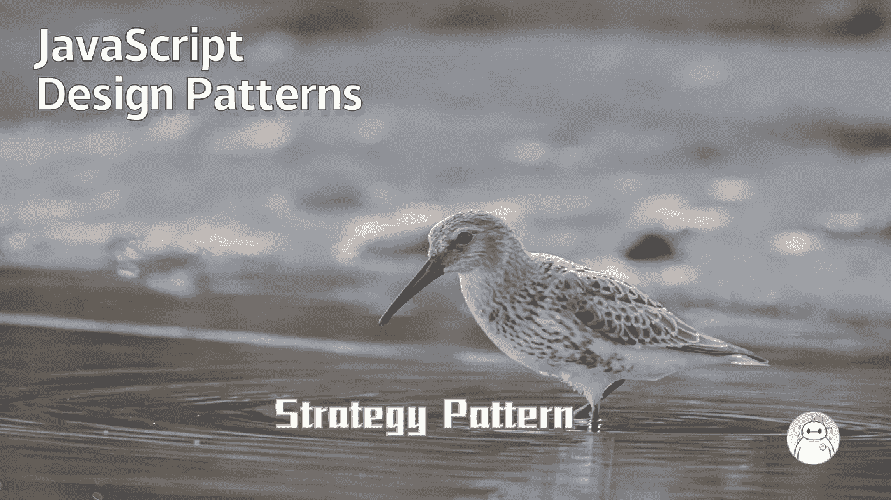
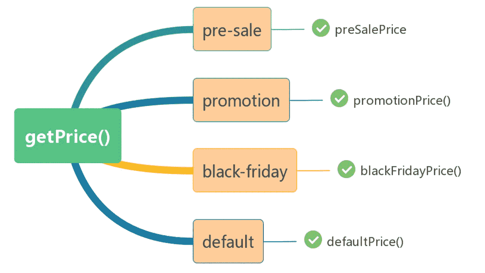
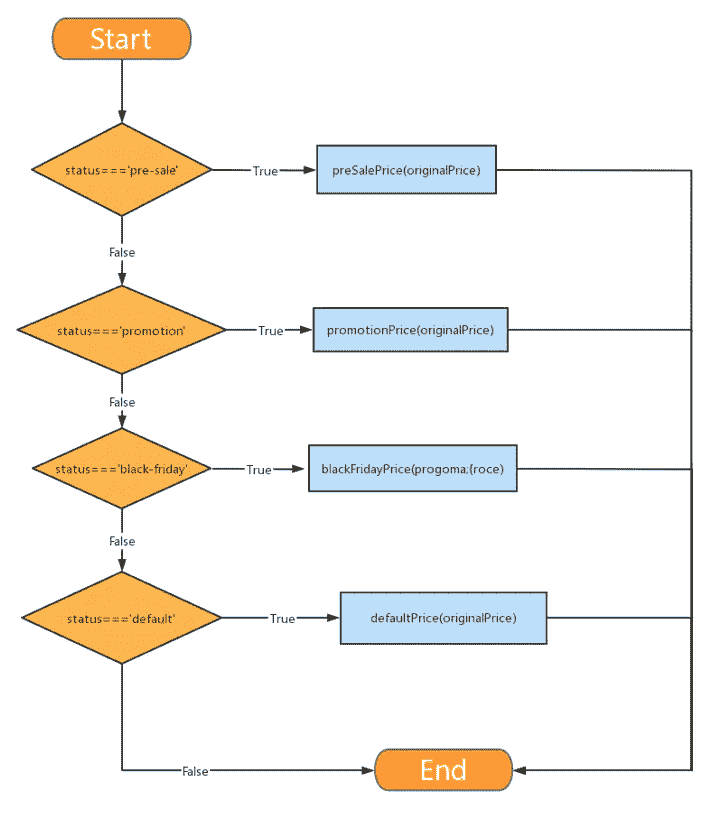

# JavaScript 设计模式:策略模式

> 原文：<https://levelup.gitconnected.com/javascript-design-patterns-strategy-pattern-c013d3dbc059>



学习设计模式的目的是代码的可重用性，使代码更容易被他人理解，并确保代码的可靠性。设计模式使编码真正工程化；设计模式是软件工程的基石，就像建筑物的结构一样。

有 23 个经典的设计模式，但并不是每个设计模式都被频繁使用。在这里，我们介绍最常见和实用的设计模式。在上一期中，我们介绍了[单例模式](/javascript-design-patterns-singleton-pattern-7ada98be9a10)。今天，我们将介绍策略模式。

> 在计算机编程中，策略模式(也称为策略模式)是一种行为软件设计模式，允许在运行时选择算法。代码不是直接实现单个算法，而是接收运行时指令，以决定使用哪一组算法。

如果你在开发一个网店项目，每个产品都有一个原价，叫做`originalPrice`。但实际上并非所有产品都是全价销售，可能会推出允许商品打折销售的促销活动。

商家可以在后台为产品设置不同的状态，然后会根据产品状态和原价动态调整实际售价。

具体规则如下:

*   **部分产品预售:**为鼓励顾客预购，会有原价八折优惠。
*   **部分产品处于正常促销阶段:**原价小于等于 100，打九折销售；如果原价高于 100，他们就优惠 10 元。
*   **部分商品没有任何促销:**默认状态，全价销售。

这时候你需要写一个函数 getPrice 来获取产品的价格。应该怎么写？

```
function getPrice(originalPrice,status){
   //...
   //return price
}
```

其实面对这样的问题，在不考虑任何设计模式的情况下，最直观的写法可能就是 if-else 多个条件判断语句来计算价格。

有三种状态，您可以像这样快速编写代码:

有三个条件，上面的代码写了三条`if`语句，很直观的代码，但是这段代码组织的不好。

首先，它违反了单一责任原则(即每个类或函数都应该有一个单一的函数，并且该函数应该被该类或函数完全封装)。函数`getPrice` 做的事情太多，这个函数不容易读懂，容易出 bug。如果一个条件出错，整个功能就会崩溃。同时，这样的代码也不容易调试。

而且这种代码很难应对不断变化的需求。这时候就要考虑设计模式了，设计模式往往在业务逻辑发生变化的时候才显示出它的魅力。

假设生意扩大，现在又有一个打折促销:黑色星期五。折扣规则如下:

*   价格低于或等于 100 美元的产品以 20%的折扣出售。
*   定价高于 100 美元但低于 200 美元的产品将打折 20 美元。
*   价格高于或等于 200 美元的产品将减少 20 美元。

此时如何扩展`getPrice` 功能？

看起来你必须给`getPrice` 函数添加一个条件语句:

每当折扣增加或减少时，功能都需要改变。这种做法违反了开闭原则(开放用于扩展，关闭用于修改)。修改现有功能容易产生新的 bug，让`getPrice` 越来越臃肿。

那么如何优化这段代码呢？

首先，可以拆分`getPrice` 功能以减少臃肿。

经过这次修改，虽然代码行数有所增加，但是可读性有了明显的提高。`getPrice` 函数显然没有那么臃肿，写单元测试更方便。
但是上面的改动并没有解决根本问题:代码中仍然充满了 if-else，在加减折扣规则时`getPrice` 仍然需要修改。
其实用这些`if-else`的目的就是为了对应状态和折扣策略。



从图中可以看出，这个逻辑本质上是一个映射关系:产品状态和折扣策略的映射关系。

可以用 map 代替冗长的 if-else 来存储地图。按照这种思路，可以构建一个价格策略映射关系(策略名称与其处理功能之间的映射)，如下:

结合状态和折扣策略，价格函数可以优化如下:

此时，如果需要增减折扣策略，则不需要修改该功能，只需要修改价格策略映射关系 priceStrategies 即可

前面的代码逻辑如下:



优化的代码逻辑如下:


以上优化策略使用的是设计模式的策略模式，在实际项目开发过程中更加实用。

在什么情况下可以考虑使用策略模式？如果函数具有以下特征:

*   判断条件有很多
*   每种判断条件下的代码是相互独立的。

然后可以将每个判断条件下的代码封装成一个独立的函数，然后建立判断条件和具体策略之间的映射关系。

[](/javascript-design-patterns-singleton-pattern-7ada98be9a10) [## JavaScript 设计模式:单例模式

### Singleton 模式:将类实例化的次数限制为一次，一个类只有一个实例，并且…

levelup.gitconnected.com](/javascript-design-patterns-singleton-pattern-7ada98be9a10)