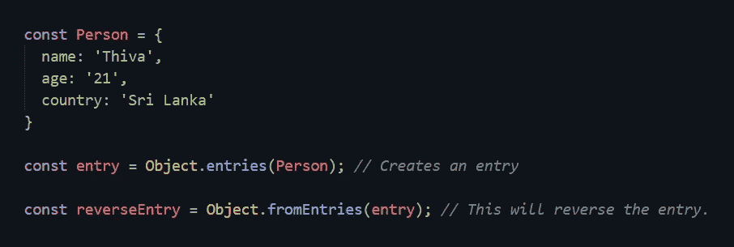
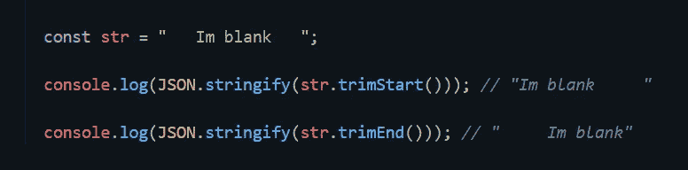
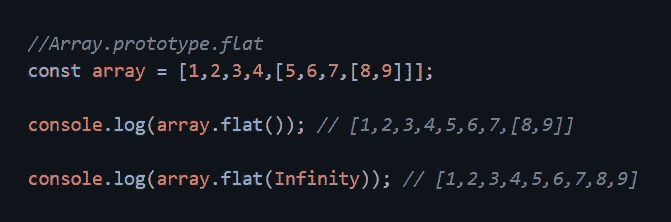
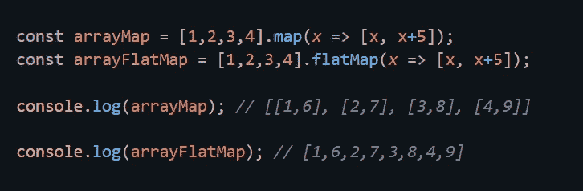
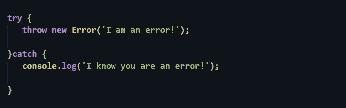
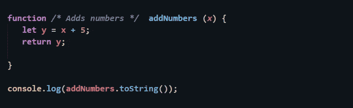
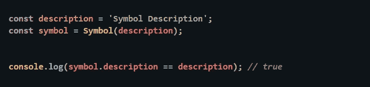

# JavaScript ES10/ES2019 功能

> 原文：<https://levelup.gitconnected.com/javascript-es10-es2019-features-d80c4fca6094>

## ES10/ECMAScript 2019 的新功能


学分:Pexels

每年都会根据 TC39 委员会接受的建议发布 ECMAScript 的新版本。让我们来看看 TC39 委员会批准的新特性。

> 为了测试这些，你需要把你的 chrome 升级到 v72

## Object.fromEntries()

在 ECMAScript 的早期版本中，您可以使用`Object.entries()`从一个对象创建键值对数组。但是现在你可以通过使用`***Object.fromEntries()***` *简单地反转这个过程。*这将立即返回一个带有键和值的新对象。



## String.prototype.trimStart()或 trimEnd()

我们已经有了一个功能 ***trim()*** 帮助我们避免字符串中的空格。有了全新的`***trimStart()***`*`***trimEnd()***`*你就可以选择你要避开的字符串的哪一部分了。**

****

**我使用`JSON.stringify()`方法打印并显示控制台日志中的空白区域。**

## **格式良好的 JSON.stringify**

**已经提交了一个新的提议来防止`JSON.stringify`返回格式错误的 Unicode 字符串。建议的解决方案是将不成对的代理代码点表示为 JSON 转义序列，而不是将它们作为单个 UTF-16 代码单元返回。**

```
**JSON.stringify('\uDF06\uD834'); // → '"\\udf06\\ud834"'JSON.stringify('\uDEAD'); // → '"\\udead"'**
```

**你可以查看 [**tc39**](https://github.com/tc39/proposal-well-formed-stringify) 知识库了解更多关于这方面的信息。**

## **Array.prototype.flat()**

**方法会将一个嵌套的数组展平到一个给定值。默认情况下，如果不指定值，该值将为 1。通过将 Infinity 作为参数传递到`***flat()***`中，它将递归运行无限次，并将数组展平为一个单独的数组。**

****

## **Array.prototype.flatMap()**

**这和`Array.prototype.Map()`有些相似但又略有不同。然而`***Array.prototype.flatMap()***`会给你一个扁平数组中的值对，而`***Array.prototype.Map()***`会给每个不同数组中的值对。**

****

## **尝试/捕捉绑定**

**在这个版本的 ECMAScript 中，我们可以为`try/catch`提供一个可选的绑定。在早期版本中，我们应该实现 catch 绑定，即使我们不需要使用它。在新的提议中，如果我们不需要使用 catch 绑定，它允许我们删除它。**

```
**try {
   throw new Error('I am an error!');
}catch(error) {
   console.log(error);
}**
```

**在新提案中，这一点已有所改变，我们可以像下面这样使用 try/catch:**

****

## **Function.prototype.toString()已修订**

**`Function.prototype.toString()`已在新提案中修订。在 ECMAScript 的早期版本中，您可以使用`***toString()***` 打印函数的源代码，但是有一个缺点，它会删除所有多余的空格和注释。在新提案中，保留了这一点。**

****

**输出如下所示:**

```
**function */* Adds numbers */*  addNumbers (*x*) {
  let y = x + 5;
  return y;}**
```

## **Symbol.description getter**

**创建符号时，可以为符号指定说明以用于调试目的。为了让 console.log()输出符号描述，您可能需要将其转换为字符串。但是现在有了新的提议，你可以简单地通过使用 Symbol.description 来访问描述。**

****

**你可以通过下面的链接找到更多的信息。**

*   **[TC39 Github 回购](https://github.com/tc39)**

**[](https://gitconnected.com/learn/javascript) [## 学习 JavaScript -最佳 JavaScript 教程(2019) | gitconnected

### 50 大 JavaScript 教程-免费学习 JavaScript。课程由开发人员提交并投票，从而实现…

gitconnected.com](https://gitconnected.com/learn/javascript)**