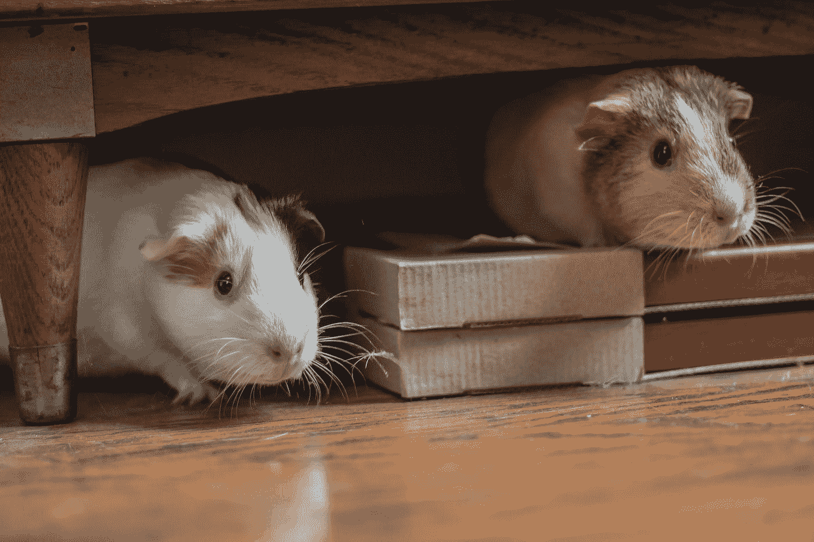
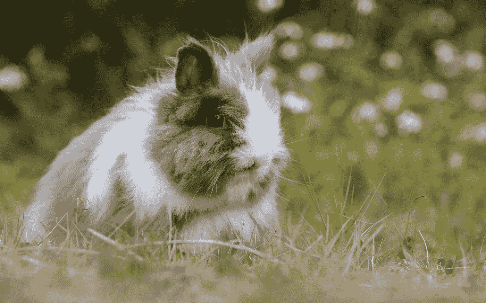

# JavaScript 事件处理程序—鼠标进入和离开事件

> 原文：<https://levelup.gitconnected.com/javascript-events-handlers-mouse-enter-and-leave-events-f04f6891828f>



Bonnie Kittle 在 [Unsplash](https://unsplash.com?utm_source=medium&utm_medium=referral) 上拍摄的照片

在 JavaScript 中，事件是应用程序中发生的动作。它们是由各种事情触发的，比如输入、提交表单、调整大小等元素变化，或者应用程序运行时发生的错误等。我们可以分配一个事件处理器来处理这些事件。发生在 DOM 元素上的事件可以通过为相应事件的 DOM 对象的属性分配一个事件处理程序来处理。在本文中，我们将看看`mouseenter`和`mouseleave`事件。

# onmouseenter

当鼠标之类的定点设备移动到分配了`onmouseenter`事件监听器函数的元素上时，触发`mouseenter`事件。它类似于`mouseover`事件，但是`mouseenter`事件不会冒泡，当指针从一个元素的后代的物理空间移动到它自己的物理空间时，它不会被发送到后代。

这意味着无论鼠标移动到另一个元素，无论它在层次结构中的位置如何，都会触发`mouseenter`事件。因此，`mouseenter`事件可能会被触发多次，这会导致严重的性能问题。如果当鼠标在一个有很多后代的大元素上时，我们需要监听整个元素树中的事件，那么最好使用`mouseover`事件。

当与鼠标离开元素时触发的`mouseleave`事件结合时，`mouseenter`事件的行为方式非常类似于 CSS `:hover`伪类。

例如，我们可以使用它在图像上创建一个偷窥效果，当鼠标指针悬停在图像的一部分上时，我们显示图像的一部分。

首先，我们添加图像的 HTML 代码和隐藏图像的黑盒。此外，我们添加了一个 circle div 元素来显示我们所悬停的图像的一部分。为此，我们放入以下代码:

```
<div class='container'>
  <div class="view" hidden></div>
  </div>
```

添加`.container` div 是为了显示遮盖图像的黑盒。`.view` div 是一个圆圈，当我们将鼠标悬停在它上面时，它会显示图像的一部分，而`img`元素则显示图像本身。

接下来，我们将 CSS 代码添加到样式`div`元素中，就像我们刚刚描述的那样，添加以下 CSS 代码:

```
.container {
  background: black;
  width: 500px;
}.view {
  position: absolute;
  width: 200px;
  height: 200px;
  background: white;
  border-radius: 50%;
}img {
  mix-blend-mode: darken;
  width: 500px;
}
```

最后，我们添加 JavaScript 代码来完成我们刚刚描述的工作:

```
const img = document.querySelector('img');
const view = document.querySelector('.view');
const container = document.querySelector('.container');const showView = (event) => {
  view.removeAttribute('hidden');
  view.style.left = event.clientX - 50 + 'px';
  view.style.top = event.clientY - 50 + 'px';
  event.preventDefault();
}const moveView = (event) => {
  view.style.left = event.clientX - 50 + 'px';
  view.style.top = event.clientY - 50 + 'px';
}container.onmousemove = moveView;
container.onmouseenter = showView;
```

在上面的代码中，我们通过使用`querySelector`方法获得了`.container`元素。我们对`img`和`.view`元素做了同样的处理。一旦我们这样做了，我们编写事件处理函数。

`.container` `div`元素的`onmouseenter`属性被设置为`showView`函数，该函数在鼠标按钮按下时运行。在函数内部，我们从`.view` `div`元素中移除了`hidden`属性，以显示`div`下面的图像。从拥有`Event`对象的`event`参数中，我们获得了`clientX`和`clientY`属性，它们拥有点击位置的鼠标坐标。我们将其设置为代表`.view`元素的`view` DOM 对象的位置。然后我们调用`event.preventDefault()`来停止默认动作，因为我们已经用它之前的代码进行了揭示。

`.container` `div`元素的`onmousemove`事件处理程序被设置为`moveView`函数，该函数处理`mousemove`事件。当鼠标移动时触发该事件。在函数中，我们将`.view`元素设置为鼠标指针当前所在的位置，同样使用`event`参数的`clientX`和`clientY`属性，该参数是`MouseEvent`对象。

一旦我们做了所有这些，当我们将鼠标悬停在黑盒上时，我们就会显示下面的那部分图像。



[陈天鹅](https://unsplash.com/@moyathebunny?utm_source=medium&utm_medium=referral)在 [Unsplash](https://unsplash.com?utm_source=medium&utm_medium=referral) 上拍照

# onmouseleave

DOM 元素的`onmouseleave`属性让我们分配一个事件处理程序来处理`mouseleave`事件。当鼠标之类的定点设备从附加了侦听器的元素上移开时，将触发该事件。

这意味着无论鼠标移动到另一个元素，无论它在层次结构中的位置如何，都会触发`mouseleave`事件。因此，`mouseleave`事件可能会被触发多次，这会导致严重的性能问题。如果当鼠标停留在一个有很多后代的大元素上时，我们需要监听整个元素树中的事件，那么最好使用`mouseout`事件。

例如，我们可以用它来跟踪鼠标是否在一个元素上。首先，我们添加一个 HTML div 元素，就像我们在下面的代码中做的那样:

```
<div id='log'></div>
```

然后我们添加一些 CSS 在 div 上添加一个边框并调整它的大小:

```
#log {
  width: 300px;
  height: 150px;
  border: 1px solid black;
}
```

最后，我们可以添加以下 JavaScript 代码，根据鼠标是否在`log` div 上来设置不同的文本:

```
const log = document.getElementById('log');
log.onmouseover = () => {
  log.textContent = 'Mouse over'
}log.onmouseleave = () => {
  log.textContent = 'Mouse left'
}
```

一旦我们这样做了，当我们的鼠标在盒子上时，我们应该在盒子里看到“鼠标在上面”的消息，当我们的鼠标指针离开盒子时，我们应该看到“鼠标离开”的消息。

使用`mouseleave`事件的另一个例子是根据鼠标是否在图像元素上来显示不同的图像。我们只需像在下面的代码中那样更改 HTML:

```

```

然后，我们将 CSS 更改为以下内容:

```
img {
  width: 300px;
}
```

最后，在 JavaScript 代码中，我们更改了`onmouseover`和`onmouseleave`事件处理函数中`img`元素的`src`，就像我们在下面的代码中所做的那样:

```
const img = document.querySelector('img');
img.onmouseover = () => {
  img.src = '[https://images.unsplash.com/photo-1503066211613-c17ebc9daef0?ixlib=rb-1.2.1&ixid=eyJhcHBfaWQiOjEyMDd9&auto=format&fit=crop&w=1500&q=80'](https://images.unsplash.com/photo-1503066211613-c17ebc9daef0?ixlib=rb-1.2.1&ixid=eyJhcHBfaWQiOjEyMDd9&auto=format&fit=crop&w=1500&q=80')
}img.onmouseleave = () => {
  img.src = '[https://images.unsplash.com/photo-1546182990-dffeafbe841d?ixlib=rb-1.2.1&ixid=eyJhcHBfaWQiOjEyMDd9&auto=format&fit=crop&w=740&q=80'](https://images.unsplash.com/photo-1546182990-dffeafbe841d?ixlib=rb-1.2.1&ixid=eyJhcHBfaWQiOjEyMDd9&auto=format&fit=crop&w=740&q=80')
}
```

之后，当我们将鼠标悬停或离开`img`元素时，我们将得到不同的图像。

当鼠标等定点设备移动到分配了`onmouseenter`事件监听器函数的元素上时，触发`mouseenter`事件。它类似于`mouseover`事件，但是`mouseenter`事件不会冒泡，并且当指针从元素的一个后代的物理空间移动到它自己的物理空间时，它不会被发送到后代。

DOM 元素的`onmouseleave`属性让我们分配一个事件处理程序来处理`mouseleave`事件。当鼠标之类的定点设备从附加了侦听器的元素上移开时，将触发该事件。

我们可以为这两个事件使用事件处理函数来做各种事情，比如当鼠标指针在某物上或不在某物上时显示或隐藏项目。