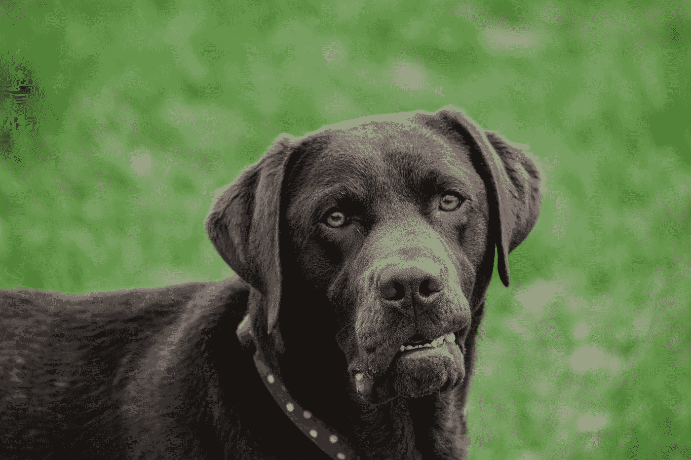

# JavaScript 事件处理程序:onended 和 ongotpointercapture

> 原文：<https://levelup.gitconnected.com/javascript-events-handlers-onended-and-ongotpointercapture-1890512971d>


由[罗曼·辛克维奇](https://unsplash.com/@synkevych?utm_source=medium&utm_medium=referral)在 [Unsplash](https://unsplash.com?utm_source=medium&utm_medium=referral) 拍摄的照片

在 JavaScript 中，事件是应用程序中发生的动作。它们是由各种事情触发的，比如输入、提交表单、调整大小等元素变化，或者应用程序运行时发生的错误等。当这些事件发生时，我们可以分配事件处理程序来执行操作。发生在 DOM 元素上的事件可以通过为相应事件的 DOM 对象的属性分配一个事件处理程序来处理。在本文中，我们将看看`onended`和`ongotpointercapture`事件处理程序。

# 统一的

我们可以将自己的事件处理函数分配给 DOM 节点对象的`onended`属性来处理`ended`事件。当回放或流式传输由于到达媒体的结尾或没有进一步的数据可用而停止时，触发`ended`事件。该事件由音频和视频等媒体元素触发。例如，我们可以用它来获取 HTML 媒体元素的回放何时结束，用下面的代码 HTML 来制作一个`video`元素:

```
<video width="320" height="240" controls id='video'>
  <source src="[https://sample-videos.com/video123/mp4/240/big_buck_bunny_240p_1mb.mp4](https://sample-videos.com/video123/mp4/240/big_buck_bunny_240p_1mb.mp4)" type="video/mp4">
  Your browser does not support the video tag.
</video>
```

然后，我们可以通过添加以下 JavaScript 代码为`video`元素创建自己的事件处理函数:

```
const video = document.getElementById('video');
video.onended = (e) => {
  console.log('Video playback ended');
  console.log(e);
}
```

在上面的代码中，我们获得了 ID 为`video`的元素，并通过为其分配一个事件处理函数来设置`video` DOM 对象的`onended`属性。在事件处理函数中，我们记录了“视频播放结束”和具有`Event`对象的`e`参数。当视频播放结束时，我们应该会看到`console.log`行运行。我们用参数`e`的`srcElement`属性获得了`video`的所有属性。或者，我们可以使用`addEventListener`方法附加一个事件监听器来监听`ended`事件，如下面的代码所示:

```
video.addEventListener('ended', (e) => {
  console.log('Video playback ended');
  console.log(e);
});
```

事件处理函数中的`e`参数，我们将它传递给上面的事件处理函数。唯一的区别是我们使用了`addEventListener`函数，而不是将`onended`属性赋给视频 DOM 对象，并且我们将一个字符串`'ended'`传递给了`addEventListener`方法的第一个参数。



照片由[哈里·谢尔顿](https://unsplash.com/@sheltonmedia?utm_source=medium&utm_medium=referral)在 [Unsplash](https://unsplash.com?utm_source=medium&utm_medium=referral) 上拍摄

# ongotpointercapture

DOM 元素的`ongotpointercapture`属性允许我们为它分配一个事件处理函数来处理`gotpointercapture`事件，该事件在元素使用`setPointerCapture`方法捕获指针时被触发。指针捕获是指当一个元素成为鼠标指针的目标时。`setPointerCapture`方法用于指定一个特定元素作为未来指针事件的捕获目标。

这意味着指针的后续事件将针对捕获事件，直到释放捕获。它接受一个参数，即`PointerEvent`对象的`pointerId`。我们可以从其他指针事件如`pointerdown`、`pointerup`或`pointermove`事件中获取`pointerId`。例如，我们可以通过添加以下 HTML 代码来跟踪鼠标指针是否被包含一个框的网页捕获，当单击该框时，该框会在页面上滑动:

```
<div id='slider-box'></div>
```

然后我们可以添加下面的 CSS 来设置框的背景和大小:

```
#slider-box {
  background-color: red;
  width: 100px;
  height: 100px;
}
```

之后，我们编写代码，通过分配一个处理`onpointerdown`事件的事件处理函数来捕获鼠标按钮按下时的指针。在函数内部，我们将`onpointermove`设置为一个翻译盒子的函数。然后我们从参数中的`Event`对象获取的`pointerId`调用`setPointerCapture`方法，将鼠标点击的目标设置为`slider-box`。

然后当鼠标按钮被按下时，运行另一个处理`pointerup`事件的事件处理函数。在里面，我们将`div`的`onpointermove`属性设置为`null`，并在第一个参数中用`pointerId`调用`releasePointerCapture`方法。为此，我们编写了以下 JavaScript 代码:

```
const beginSliding = (e) => {
  slider.onpointermove = slide;
  slider.setPointerCapture(e.pointerId);
}const stopSliding = (e) => {
  slider.onpointermove = null;
  slider.releasePointerCapture(e.pointerId);
}const slide = (e) => {
  slider.style.transform = `translateX(${e.clientX  + 20}px)`;
}const gotPointerCaptureHandler = (e) => {
  console.log('Captured pointer');
}const slider = document.getElementById('slider-box');slider.onpointerdown = beginSliding;
slider.onpointerup = stopSliding;
slider.ongotpointercapture = gotPointerCaptureHandler;
```

在上面的代码中，当鼠标在`slider-box` `div`元素上单击按钮时，我们让`slider` DOM 元素成为鼠标指针的目标。我们将`slider` DOM 对象的`onpointerdown`属性设置为我们编写的`slide`函数，以便在鼠标按钮按下时水平平移`slider-box` `div`元素。我们将`slider` DOM 对象的`onpointerup`属性设置为`stopSliding`函数，该函数移除了`slider` DOM 对象的`pointermove`事件的任何事件处理函数，并使用从`e`参数(一个传入的`Event`对象)获得的`pointerId`调用`slider`对象的`releasePointerCapture`方法。

结果是当我们点击`slider-box` `div`元素时，点击`div`会滑过屏幕。当我们停止点击`div`时，那么`slider-box`将停止滑动。我们将`gotPointerCaptureHandler`函数分配给`slider`的`ongotpointercapture`属性，以跟踪`gotpointercapture`事件何时被触发。当在`beginSliding`函数中调用`setPointerCapture`时，该事件将被触发。

我们可以将自己的事件处理函数分配给 DOM 节点对象的`onended`属性来处理`ended`事件。当回放或流式传输由于到达媒体的结尾或没有进一步的数据可用而停止时，触发`ended`事件。DOM 元素的`ongotpointercapture`属性允许我们为它分配一个事件处理函数来处理`gotpointercapture`事件，该事件在元素使用`setPointerCapture`方法捕获指针时被触发。指针捕获是指当一个元素成为鼠标指针的目标时。使用 DOM 对象可用的`setPointerCapture`方法，我们可以设置指针指向 DOM 元素，该元素表示我们想要将鼠标指针目标更改为的 HTML 元素。