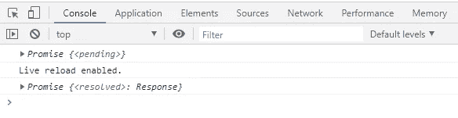
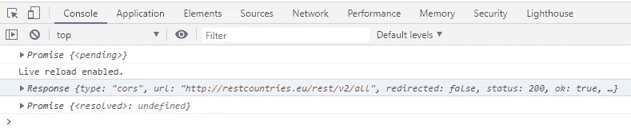
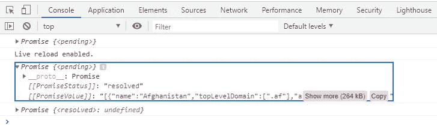
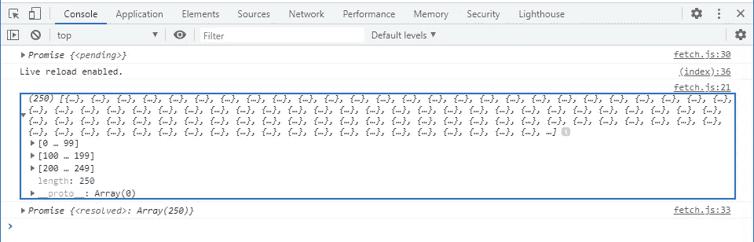
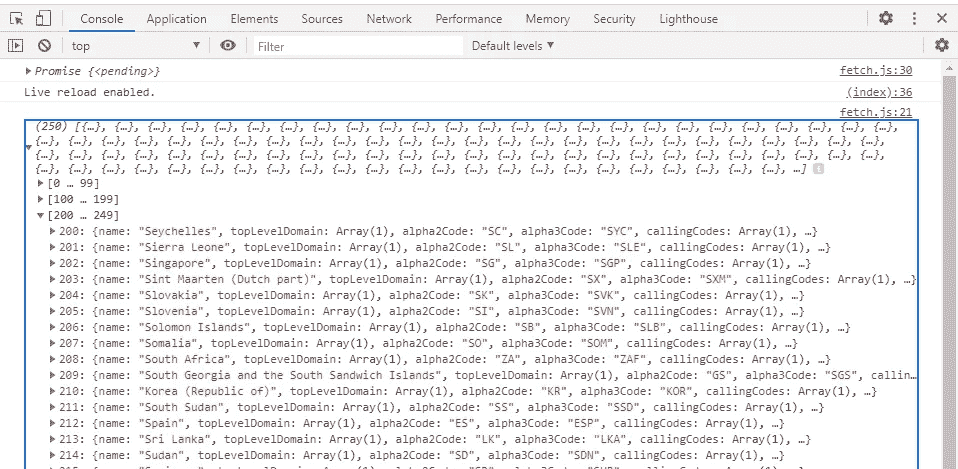
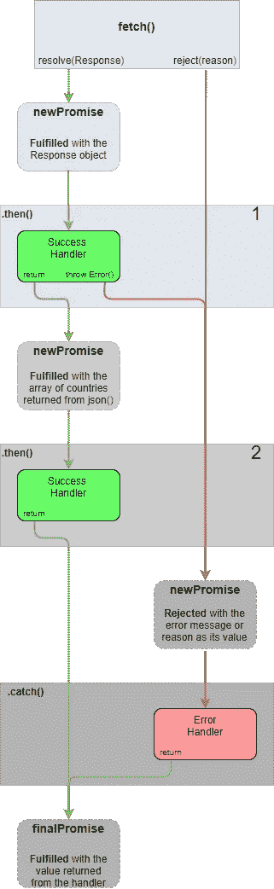

# JavaScript 获取 API —基础

> 原文：<https://levelup.gitconnected.com/javascript-fetch-api-basics-5b28b47cde74>

## 非常简单！Fetch API 解释了一个示例代码和一个图表。


Emile Perron 在 [Unsplash](https://unsplash.com?utm_source=medium&utm_medium=referral) 上的照片

在这篇短文中，我解释了开始使用 Fetch API 所必需的基本概念。我通过开发一个简短的示例代码并一步一步地解释它来做到这一点。您可以在本文末尾找到完整的示例。

在示例代码中，我将向 [restcountries.eu](https://restcountries.eu/) 发出一个 HTTP 请求，以获取国家列表及其详细信息，比如它们的首都、国家代码、货币等等。我写过一篇文章描述使用 *XMLHttpRequest()* 做同样的事情。

[](https://medium.com/swlh/javascript-xmlhttprequest-basics-3da6f7e99dcc) [## JavaScript XMLHttpRequest —基础知识

### 使用 XMLHttpRequest 发出 HTTP 请求比您想象的要简单——包括代码和图表

medium.com](https://medium.com/swlh/javascript-xmlhttprequest-basics-3da6f7e99dcc) 

# 获取 API —实际示例

先说显而易见的。Fetch 是一个基于承诺的接口，它允许我们从 JavaScript 代码发出 HTTP 请求。我会尽量让“基于承诺”的部分变得简单。然而，如果你想知道更多，那么在这篇文章的最后，我附上了我的另外两篇描述承诺和承诺链基础的文章的链接。

*fetch()* 方法有两个参数:

*   统一资源定位器
*   我们可以定义请求设置的 init 对象。

第二个参数是可选的，默认设置是基本 HTTP 请求所需要的，所以我将跳过它。我们可以提出这样一个基本要求…

```
const aThing = fetch('http://restcountries.eu/rest/v2/all', {})
```

问题是——我们从 *fetch()* 方法中得到什么？我们可以通过添加这几行来得到这个问题的答案…

```
console.log(aThing)setTimeout( () => {
    console.log(aThing)
}, 1000)
```

在这里，我们只是在 *fetch()* 发出请求后立即打印一个东西(返回的内容 *fetch()* ),然后在一秒钟后再次打印。这是我们在控制台中看到的内容(图 1)。



图一。从 fetch()返回的 Promise 对象

我们问题的答案是——它返回一个 Promise 对象。由 *fetch()* 创建的 Promise 对象是挂起的，直到我们得到服务器的响应。这就是为什么在控制台(图 1)中，我们首先得到*承诺{ <待决> }* ，然后经过一段延迟*承诺{ <已解决>:响应}* 。承诺通过代表响应的响应对象得到解析。

由 *fetch()* 创建的承诺被异步解析。意思是 *fetch()* 发送请求并马上返回，然后执行我们剩下的代码。在收到响应后，承诺被实现，并调用该承诺的成功处理程序。

## Then()方法

这就是你进来的地方。使用 *then()* 方法定义成功处理程序。你可以这样做:

```
fetch('URL')**.then(successHandler)**
```

其中 *successHandler()是*一个接受一个参数的函数。这个论点就是承诺解决的问题——响应对象。将使用响应对象作为参数调用 *successHandler()* 函数。这是您定义如何处理响应的地方。

你也可以这样做…

```
fetch('URL')**.then(successHandler, errorhandler)**
```

其中 *errorHandler()* 是一个接受一个参数的函数——被拒绝承诺的错误原因或值。然而，更常见的情况是只定义成功处理程序，并有一个 *catch()* 方法来捕捉和处理承诺链末端的所有错误。

在这个阶段，我们可以在控制台中打印响应对象，让我们开始吧。我将在 *then()* 方法的参数列表中将成功处理程序定义为匿名函数，如下所示…

```
const aThing = fetch('http://restcountries.eu/rest/v2/all', {})
**.then( (response) => {
    console.log(response)
})**console.log(aThing)setTimeout( () => {
    console.log(aThing)
}, 1000)
```

这是我们现在在控制台中看到的内容…



图二。响应对象

正如我们在图 2 中看到的，*‘Live reload enabled’。*标志着我们的同步代码结束的地方。之后的一切都被异步调用。在这种情况下，我们

*   首先使用 *fetch()* 发出请求
*   然后，我们使用 *then()* 注册成功处理程序
*   然后在控制台中打印一个东西(待定承诺)。
*   然后我们注册一个函数，它会在一秒钟后运行。这是我们的同步代码结束的地方。

接下来，响应到达，并调用成功处理程序。成功处理程序(在 *then()* 方法中定义)在控制台中打印响应并终止。这就是它的全部功能。一段时间后，我们的 1 秒钟延迟到期，我们再次打印一个东西。

但是为什么现在说*承诺{ <解决>未定义}* ？如果我们没有从 *then()* 方法返回任何东西，为什么会被解析？为什么*未定义*而不响应？

承诺周围的黑魔法是造成这种情况的原因。但我相信，所有的魔法都只是一种没有被完全理解的技术或物理现象。一个简单的解释是 *then()* 方法总是返回承诺。即使不返回任何东西， *then()* 方法也会自动生成并返回一个新的履行的承诺，其值为 *undefined* 。

在我们附加 *then()* 方法之前，aThing 正在从 *fetch()* 获得一个承诺。现在，这个承诺由 *then()* 方法接管，aThing 得到 *then()* 返回的任何内容。

我们可以通过在成功处理程序中添加下面一行来解决这个问题:

```
return response
```

## 反应

我们能够在控制台中打印响应对象的事实证明，我们从 [restcountries.eu](https://restcountries.eu/) 获得了一些响应，并且我们可以在 *then()* 方法中访问该响应。

现在让我们来看看我们的国家列表及其详细信息。让我们使用响应对象的 *text()* 方法将其作为字符串打印到控制台。

```
const aThing = fetch('http://restcountries.eu/rest/v2/all', {})
.then( (response) => {
    console.log(response**.text()**)
})console.log(aThing)setTimeout( () => {
    console.log(aThing)
}, 1000)
```

这给了…



图 3。响应体被困在承诺中

哦不！再次承诺。

> Response implements Body(…)
> Body . text()
> 获取一个响应流并读取它直到完成。它返回一个用 USVString(文本)解析的**承诺**。— MDN 网络文档

到处都是承诺。由 *text()* 返回的新承诺解析出我们感兴趣的字符串。怎样才能把世界各国从承诺的魔爪中解救出来？

我们可以通过将另一个 *then()* 方法附加到现在成为承诺链的方法上，并从第一个 *then()* 方法返回任何 *text()* 方法返回的内容，来拯救世界。

我刚刚意识到字符串相当长，我不知道如何在不占用整个屏幕高度的情况下方便地在控制台中打印它。我的解决方案是简单地从 *text()* 切换到 *json()* 方法。现在，我们将在控制台中看到一个对象数组，而不是一个字符串。

```
const aThing = fetch('http://restcountries.eu/rest/v2/all', {})
.then( (response) => {
    **return(response.json())**
})
**.then( (data) => {
    console.log(data)
})**console.log(aThing)setTimeout( () => {
    console.log(aThing)
}, 1000)
```

还有控制台…



图 4。响应主体—一组对象



图 5。响应正文—对象数组(展开)

正如我们在图 4 和图 5 中看到的，我们现在可以访问从 [restcountries.eu](https://restcountries.eu/) 接收的数据。

在第一个 *then()* 方法中，我们使用 *response.json()* 来解析响应的主体文本，然后我们返回它。黑魔法创造了一个新的承诺，它根据解析的结果进行解析，这就是第一个 *then()* 方法真正返回的内容。

第二个 *then()* 方法中的成功处理程序接收解析结果，这是我们可以处理响应数据的地方。

关于 *fetch()* 方法的另一个有趣的事实是，即使请求不成功，它返回的承诺也会解析为响应对象。这迫使我们首先检查响应对象的状态属性。我在下一节的最终演示代码中实现了这一点。

# 演示代码

下面的代码片段包含了我们在上面看到的所有代码

*   检查响应状态和
*   承诺链末端的 *catch()* 方法。

如果我们在读取不同于 200 的状态代码时抛出一个错误，那么 *then()* 方法将返回一个被拒绝的承诺，并以错误消息作为其值。被拒绝的承诺沿着链传播，直到被 *catch()* 方法捕获，在这种情况下，该方法只是将错误消息打印到控制台。

# 摘要

我们已经使用 Fetch API 发送请求并为响应提供服务。我们还使用了承诺和承诺链，因为 Fetch API 是基于承诺的。如果我们隐藏所有的函数定义，那么这就是我们所做的...

```
fetch(URL).then(successCb1).then(successCb2).catch(errorCb)
```

如果没有图表，这篇文章会是什么呢？图表比文字更能解释代码。下图总结了代码。



图 6。提取流程

我希望承诺不会让事情变得太难。如果是的话，那么你可以从这两篇文章中了解更多。

[](https://medium.com/swlh/javascript-promise-basics-d8465d70a54f) [## JavaScript Promise —基础知识

### 用示例代码和图表很好地解释。

medium.com](https://medium.com/swlh/javascript-promise-basics-d8465d70a54f) [](/javascript-promise-chaining-basics-e2618c5e74a9) [## JavaScript 承诺链—基础知识

### 没有看起来那么难。代码、图表和截图。

levelup.gitconnected.com](/javascript-promise-chaining-basics-e2618c5e74a9)