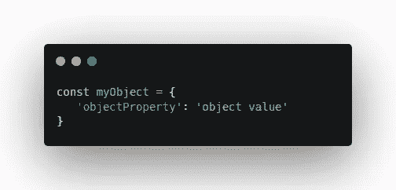
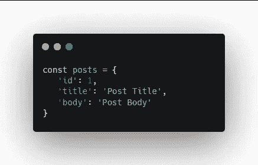
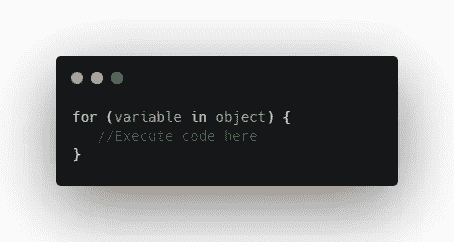
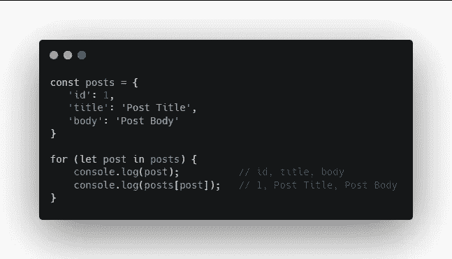
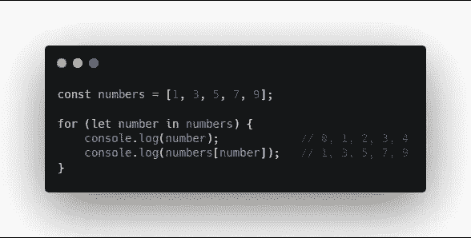
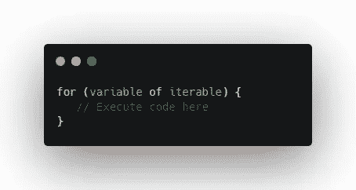
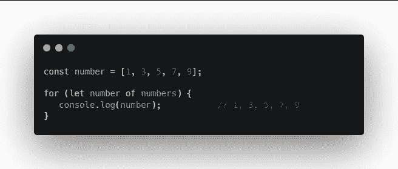

# JavaScript For In 和 For Of 循环

> 原文：<https://levelup.gitconnected.com/javascript-for-in-and-for-of-loops-8bd187603af5>

理解 JavaScript 中的`for…in`和`for…of`循环

照片由[Tine ivani](https://unsplash.com/@tine999?utm_source=medium&utm_medium=referral)在 [Unsplash](https://unsplash.com?utm_source=medium&utm_medium=referral) 上拍摄

`for…in`和`for…of`都是遍历对象和数组的方法。

# 对于…在循环中

`for…in`遍历一个对象的属性名。记住对象是由 ***属性*** 或 ***键值对*** 组成的。

我的对象

下面我们有一个对象叫做`posts`。在这个对象中，我们有`id`、`title`和`body`属性。旁边是每个的值。

名为帖子的对象

下面是一个`for…in`循环的基本语法。

For In 循环的基本语法

我们从关键字`for`开始，然后在括号内，我们创建一个变量。然后，我们有了关键字`in`，我们包括了我们正在迭代的对象。之后，在花括号之间会有执行代码。

因此，使用我们的 posts 对象，我们可以如下设置它。

迭代通过**发布**对象

我们正在创建的变量从`posts`中调用`post`，它是来自对象的键。然后，我们将对`post`变量进行`console.log`处理。我们正在获取所有的属性或键，然后用`posts[post]`引用那个键的值。

为了获得值，我们需要引用原始对象`posts`并使用方括号来定义属性。

`for…in`循环也可以在数组中工作。它将获得每个值的索引，而不是属性键名。所以这里我们得到了`0, 1, 2, 3, 4`。

用阵列形成

我们可以看到这些是每个值的索引。为了获得值，我们需要引用原始数组，并使用方括号来定义值的索引。

一个更好的数组解决方案是使用`for…of`循环。

# For…Of 循环

`for…of`循环遍历条目和一个集合，比如一个数组。

下面是一个`for…of`循环的基本语法。

For Of 循环的基本语法

它非常类似于一个`for…in`循环，除了这次我们使用了`of`关键字，并在一个 iterable 而不是一个对象中传递它。

如果我们在这个数组中使用`for…of`循环，那么我们将**而不是**必须引用原始数组索引。它会直接给我们数值。

注意`for…of`循环将**而不是**处理对象，因为它们是不可迭代的。

# 摘要

请记住:

`for…in` =物体

`for…of` =数组